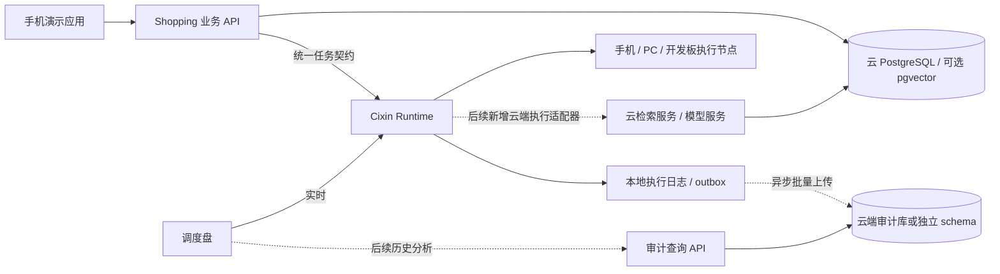

# 云端数据库改造方案

更新日期：2026-09-24。本文是待实施方案；本轮未创建云实例、修改旧库、迁移商品或上传用户数据。云数据库在调度盘上仍显示“未接入”。

## 1. 需要改的是哪一部分

| 数据 | 当前实际位置/实现 | 建议目标 |
|---|---|---|
| 商品、Embedding、查询会话、用户资料 | `shopping-assistant/services/api-server/prisma/schema.prisma`，Prisma SQLite | 云端 PostgreSQL，业务 API 持有数据库连接 |
| 商品相似度计算 | `AnnSearchService` 分批读取向量 JSON 后在服务端计算余弦 | 先保持精确检索基线，再实现 PostgreSQL/pgvector 检索适配器 |
| 新 Cixin 运行与执行尝试 | `cixin-agent/src/runtime/util.ts` 的 JsonStore，节点 dataDir | 保留本地执行日志，异步上传经过筛选的审计记录 |
| 调度成本和策略状态 | 每个节点、环境版本隔离的本地 policy 文件 | 本地实时使用，可选上传统计副本 |
| 图片与模型文件 | 业务对象存储/节点文件等独立路径 | 图片按业务迁入对象存储；模型按版本预置；数据库保存元数据 |

这两套存储不是同一层。把购物库放到云上可以增加“本地计算与云端数据访问”的真实网络测试；如果把调度器的所有状态读写都同步搬到云数据库，断网会阻断本地准入和执行确认，因此不建议这样改。

当前 `ANN_PROVIDER=sqlite_vec` 是配置名称，不能据此宣称已使用某个向量索引；实际 `AnnSearchService` 包含批量读取与余弦评分。新 Cixin 的 `catalog.vector_search` 接收完整输入向量，不连接 SQLite 或 PostgreSQL。只改 DATABASE_URL 不会自动让该工具变成云检索工具。

## 2. 建议架构

建议采用托管 PostgreSQL，具体云厂商和区域依据现有账号、接近测试设备的网络与 pgvector 支持情况决定。云凭据留在业务 API / 云服务，手机、调度盘和工具输入都不携带数据库密码。第一阶段先让业务库迁移成功，第二阶段再比较本地与云端检索路径。

## 3. 阶段一：迁移业务库

1. 备份现有 SQLite，记录每张表的行数、主键、外键关系和向量模型/维度统计。以最小真实商品子集先在测试库验收，原库保持可恢复。
2. 保持当前项目的 Prisma 6.x 依赖，另建 PostgreSQL schema 和迁移目录，建立新的迁移基线。SQLite 与 PostgreSQL 的迁移 SQL 不能直接共用，不能只替换 provider 再重放旧脚本。[Prisma v6 的迁移限制](https://www.prisma.io/docs/orm/v6/prisma-migrate/understanding-prisma-migrate/limitations-and-known-issues)。
3. 将 `db:init` 中 SQLite 初始 SQL 与 `patch-sqlite-schema.mjs` 从 PostgreSQL 部署流程中分离。明确保留本地 SQLite 测试还是统一使用本地 PostgreSQL；不要让同一个迁移目录服务不同 provider。
4. 检查日期、布尔值、JSON 字符串、金额、大小写与排序语义。第一步可保持现有 `*Json` 字符串契约，避免数据库迁移和业务字段改造同时发生。
5. 核对 `ProductPoolService.readStatsSnapshot/writeStatsSnapshot` 的原生 SQL、日期参数及异常码；优先改为 Prisma 的查询与 upsert，或者为 PostgreSQL 单独验证类型转换。
6. 写可恢复、按主键幂等导入脚本，按外键依赖顺序迁移；每批校验行数和摘要。重新读取代表性商品、会话及向量，确认数据一致后切换测试 API 的连接配置。
7. 用独立环境变量配置测试库 TLS、连接池与超时；在新库生成/校验迁移后部署，不对旧 SQLite 执行清库或覆盖操作。

阶段一验收：相同图片/查询向量、相同过滤条件与数据版本下，现有业务 API 的结果保持一致。远程库发生超时应返回可诊断的错误；不能在 UI 上伪装成本地检索成功。云数据库本身不提供图片理解和大模型推理。

## 4. 阶段二：让云库真正参与调度试验

先抽象业务侧 `CatalogRepository` / 现有 `AnnSearchPort`，实现明确的云检索适配器。禁止把全量向量库每次从云下载到开发板后再宣称是高效卸载；应把 query vector、过滤条件、数据集版本与 Top-K 参数发到拥有该数据集的执行服务，返回候选 ID 和分数。

选用 pgvector 时先采用精确余弦搜索，与现有精确实现做一致性对照，再根据数据规模引入 HNSW/IVFFlat。近似索引会在速度与召回之间取舍，不能沿用当前精确工具的“全量精确扫描 / minimumScore=1”声明。[pgvector 官方查询与索引说明](https://github.com/pgvector/pgvector#querying)。

新契约至少包含：datasetId、datasetVersion、Embedding 模型/维度、距离度量、过滤条件、允许的数据外发范围与质量下限。将本地索引版本和云端索引版本写入结果；过期缓存不可无提示替代最新商品库。

当前 Cixin Runtime 对 `cloud_only` 返回 `CLOUD_EXECUTOR_NOT_CONFIGURED`，只有已配置的通用 peer 节点协议，并没有独立云资源类别和云服务执行器。实施云检索时还需补齐：

- 云服务适配器与明确的云端数据访问权限。远端设备许可 `allowRemote` 不能直接替代云外发授权；当前 peer 协议也不应被当作隐私策略的绕过方式。
- 逻辑能力兼容性：节点间现有校验要求 ToolDescriptor 与 modelDigest 一致。精确与近似检索不能假装成完全同一执行契约，需要分别声明并通过业务质量验证后才允许选择。
- 数据位置和版本准入：本地没有指定索引或没有云库访问权的节点应被排除。现有契约不含完整数据集放置能力，需显式扩展。
- 成本观测：分别记录网络请求、云端检索执行、结果回传、反序列化与 App 展示用时；依据实测更新预测。HTTP snapshot 请求用时不是数据库查询延迟，不能混用。
- 外部服务超时、取消、重试幂等与未知状态。对纯只读检索也要明确重试次数及总 deadline，避免重试跨越用户时限。

建议先做受控路径 A/B 对照：固定本地精确检索、固定云端精确检索、随后才开启自动选择。自动策略只有在两条路径的版本、质量、授权和真实样本都满足条件时才能比较，否则保留缺失能力或样本不足的原因。

## 5. 阶段三：上传调度审计

本地执行的运行状态、幂等键、取消确认和成本反馈保持在本地可用。新增 outbox，在本地状态提交后异步发送到审计 API；断网缓存、退避重试，按 `deviceId + runId/attemptKey + revision` 幂等更新，禁止旧状态覆盖新状态。

建议的云审计表：

| 表 | 最小内容 |
|---|---|
| devices | deviceId、板型、OS/内核、运行时、environmentKey |
| runs / attempts | runId、attemptKey、状态、目标、版本、实测耗时 |
| decisions / candidates | 模式、准入原因、预测值、预测来源、样本数 |
| resource_samples | 原始采样时间、接收时间、CPU、可用内存、热等级、有效性 |
| experiment_sessions | 数据集/模型版本、路径、输入规模、实验标签 |

默认只上传结构化度量、版本及原因码。业务正文、图像、完整向量、账号与密钥不进入遥测表。当前调度盘 API 已显式移除结构化 input/output、graph goal 和 inputRef，可用作字段白名单的起点；自由文本错误信息仍需在正式云上传器中做原因码化审查。

多设备报告按 environmentKey、模型、数据集、输入规模分组。不要把不同设备的毫秒时间戳直接相减当耗时；阶段内用单调时钟测量，端到端以请求发起侧测量，跨设备排序另记录同步误差。先完成审计接入再为调度盘添加历史页；实时界面继续读当前 Runtime。

## 6. 新增的测试方向

| 对照实验 | 保持相同 | 关注指标 |
|---|---|---|
| 本地 SQLite 与远程 PostgreSQL | 商品数据、过滤、排序、查询输入 | API P50/P95、超时、结果一致性 |
| 本地精确搜索与云端精确搜索 | 模型、数据集版本、余弦定义、Top-K | 端到端延迟、传输大小、内存、结果误差 |
| 云端精确与近似索引 | 同一数据集与查询集合 | Recall@K、延迟、索引构建/内存成本 |
| 固定路径与受约束自动选择 | 质量门槛、截止时间、隐私条件 | deadline miss、阻断原因、实际选择与收益 |
| 网络延迟/丢包/断网 | 明确标注故障注入条件 | 超时、重复执行、离线队列、恢复幂等 |
| 实测高负载/并发 | 相同任务集合和设备版本 | App 时延、本地资源、云连接池排队 |

温度、功耗未采到的实验列保持缺失，不能凭 CPU 百分比推导成实测能耗。每项试验记录输入数据来源；手工测试向量与真实商品向量的报告分开。

## 7. 实施前需要的配置

进入实际迁移阶段需要确定云厂商/区域、测试实例地址、TLS 方式、库名与服务端凭据、是否支持所选 pgvector 版本、需要迁移的数据范围，以及离线缓存策略。凭据通过部署环境提供，不写入 App、调度盘或 Git。

优先顺序建议为：业务库测试迁移和一致性验收 → 云检索工具与路径对照 → 授权、数据位置和性能模型扩展 → 自动选择 → 云审计和历史统计。这样每一步都有可验证的结果，也不会把“数据库已上云”误写成“端云智能调度已经完成”。
