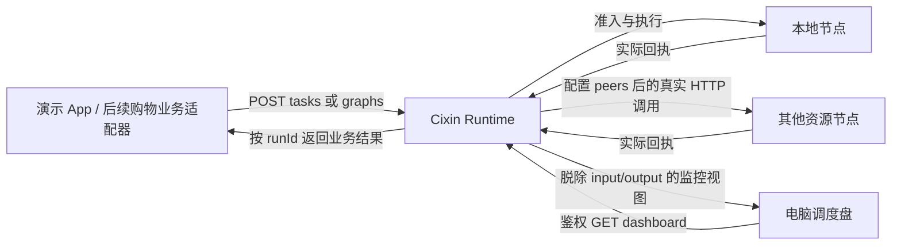

# 调度盘与演示 App 接入测试

更新日期：2026-09-24。

## 1. 当前交付与边界

调度盘采用原有 `harmony-agent/调度盘/code.html`、`screen.png` 的深色机架布局、金色铭牌、六联仪表、三列工作区和状态指示灯。运行版位于 `cixin-agent/web`，原始设计稿保持原样，运行版移除了模拟数值和随机抖动脚本，不依赖外网字体、Tailwind CDN 或第三方服务。

独立 Web 演示 App 负责选择真实注册工具、导入业务输入、提交任务、查询结果和取消任务；调度盘负责观察。两者直接连接同一个 Cixin Runtime，按 runId 对应。没有把演示业务写入调度算法。

当前可直接运行的工具是 `catalog.vector_search`，对调用方提供的向量进行真实 CPU 余弦检索。它不是图片识别模型，也不会读取购物数据库。原购物 App / Harmony ETS 的拍照识图全流程还没有改成调用这个新 Runtime，不能用本次 Web 联测替代该项验收。



## 2. 启动与操作

在 `cixin-agent` 目录执行：

```powershell
npm ci
npm run console
```

控制台脚本构建项目，并为没有设置令牌的节点生成随机令牌，打印在当前终端。默认读取 `config/host.example.json`。已配置 `CIXIN_NODE_TOKEN` 时沿用其值；正式部署仍可使用原 `npm start -- config/p1.example.json` 启动方式。

1. 电脑浏览器打开 `http://127.0.0.1:3200/dashboard/`，输入启动终端的令牌并连接。
2. 另开 `http://127.0.0.1:3200/demo/`，输入同一令牌并连接。
3. 在演示 App 导入 `examples/vector-task.json`，再提交任务。该文件是人工构造的测试向量，不应当作真实商品库；返回分数由执行器实际计算。
4. App 显示运行 ID、状态和实际结果。调度盘自动出现该运行 ID，点击查看候选节点、准入原因、预测来源及执行耗时。
5. 调度盘可暂停刷新、调整 2/5/10 秒刷新间隔。暂停和读取失败时界面变暗并保留最后采集时间，旧值不会继续标为实时数据。
6. 运行中的单任务有 attemptKey 后可以申请取消；未确认任务可以查询回执。请求超时不自动重发，避免重复计算。

页面令牌只保存在当前浏览器标签页会话的 sessionStorage；断开会清除。它仍是该 Runtime 的操作令牌，不是独立只读账号。这里是操作者调试入口；面向普通用户的 App 应通过业务后端代理持有 Runtime 凭据。

若 3200 端口被占用，把示例配置复制为忽略提交的 `config/local.console.json`，修改 `port` 与独立的 `dataDir`，运行 `npm run console -- config/local.console.json`。不要复用正在运行节点的数据目录。

无开发板时，`family=host` 使用电脑真实 CPU、内存、OS 和内核信息即可测试。要用手机浏览器访问，需将选定测试配置的 host 设为可访问的监听地址，并使用电脑局域网 IP；手机上的 `localhost` 不指向电脑。部署到实际 P1 时采用对应配置和真实 SDK Worker。

## 3. 每种数值的含义

| 显示内容 | 实际来源 | 缺失与范围约定 |
|---|---|---|
| CPU、总内存、可用内存 | LinuxBoardAdapter 的 OS 采样 | 不存在时显示 `--`；可用内存不是进程 RSS |
| 热状态 | 配置 thermal.path 后的温度分级 | 未配置或读取失败为 UNKNOWN，不编造摄氏度 |
| 执行后端 | 工具/模型 probe 后的能力集合 | 支持 NPU 不等于采到了 NPU 利用率 |
| 运行、排队、P95 | 协调节点 Scheduler 的当前窗口 | 本地执行端统计，不是全设备总量或 App 端到端时延；窗口无样本时延迟为 `--` |
| 远端节点状态 | 已配置 peer 的真实 HTTP snapshot | 读取失败与原因显式显示；不会用预设设备代替 |
| HTTP 快照请求用时 | 协调节点对本次请求的单调时钟计时 | 包含网络、鉴权和对端采集处理，不标成纯网络 RTT |
| 候选预测总耗时、传输耗时、余量 | 原 FleetDecision | 标明预测；被拒绝候选的初始零占位值转成 `null`，显示 `--` |
| 预测来源、样本数 | quote.plan.prediction | 样本为 0 时会保留 prior/uncalibrated 来源 |
| 实测排队、执行、总耗时 | 已落盘的执行器回执 | 与预测分别显示；不是 P1 实机结果，除非实际运行在 P1 |
| DAG | 持久化图节点、依赖、已有子任务回执 | 无子任务回执时写“尚无执行记录”，不推测阶段进度 |
| 功耗、GPU 利用率、云数据库 | 当前没有该采集或接入 | 显示未采集/未接入；不显示原稿的 TOPS、功耗、数据库延迟 |

调度盘读接口是 `GET /api/v1/runtime/dashboard`，需 Bearer 鉴权。静态页面和资源公开可读，但它们不包含运行数据或令牌。静态文件采用固定映射，不提供目录浏览。

后端合并并发浏览器读取并缓存 1.5 秒；读取不会创建任务，也不会为了展示而调用 plan 或提交测试负载。最近任务最多 40 条，执行尝试展示最近 12 条；轨迹只保存当前页面最近 60 次真实采样。审计文件当前仍由 JsonStore 扫描，长时间大规模运行需要另做分页索引与保留策略。

## 4. 多设备验证

给每台设备分别启动 Runtime 并配置独立的 deviceId、dataDir、token。协调节点的 peers 配置地址、对应令牌环境变量与经测量的保守带宽下界。调度盘会展示这些节点的快照，不把“已配置”当成“已连接”。

- LOCAL_ONLY：任务本地执行；调度盘仍可探测已配置节点以检查连接。
- SHADOW：计算候选建议，实际执行本地；界面分别展示建议节点与已选择节点。
- ACTIVE：在真实可用性、隐私、截止时间、模型契约与样本门槛通过后允许远端执行。

App 勾选“允许远端”只表达该任务的许可，不会把 LOCAL_ONLY 自动切换为 ACTIVE，不会跳过最低远端样本要求。样本不足或节点不可达会给出真实拒绝原因。远端需要先积累相应输入规模与执行档位的真实样本，不能以调度盘里出现节点为接入验收完成。

## 5. 自动验证

`npm test` 覆盖受约束调度、HTTP 派发、取消、持久化和调度盘 API。新增用例覆盖鉴权、静态资源白名单、真实执行回执对应、未采集资源、拒绝候选零占位处理、节点读取失败和嵌套 DAG input/output 脱除。

可选浏览器回归：Node 能解析 Playwright 且已安装其 Chromium，或设置 `CIXIN_BROWSER_EXECUTABLE` 指向已有 Chromium/Edge 可执行文件后，运行 `npm run test:console`。该脚本不依赖运行中的开发服务，在临时端口启动真实主机适配器，提交测试向量，验证桌面/手机布局、画布采样像素、暂停和断连。截图写入忽略提交的 `data/console-test/`。

此次已验证：27 个 Node 测试条目通过，真实主机浏览器链路通过，1536px 桌面及 390px 手机宽度检查通过。测试不会证明 P1/NOE 的实机性能，也不会证明旧购物 App 已迁入新执行链路。
