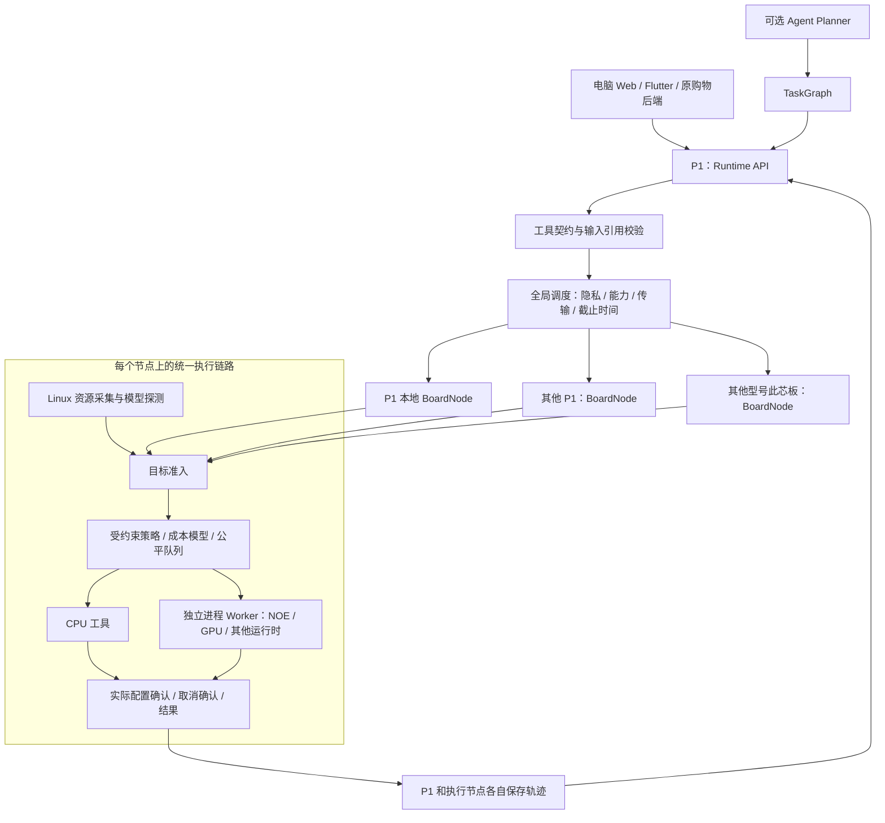

# 迁移后的 Cixin 项目架构

更新日期：2026-09-26。本文描述本目录实际代码，区分共享 Harmony 链路、宿主机验证和开发板验收。

## 1. 迁移位置与原则

调度核心最初迁移自 `harmony/mobile-scheduler`，当前共享基线已更新到 `codex/cixin-multi-device-runtime` 的 Harmony 实现；源提交和逐文件 SHA-256 记录在 [migration-manifest.json](../migration-manifest.json)。Cixin 保留 Node/Linux 必需的适配，但共享的调度语义、任务画像与云端遥测以 `harmony-agent` 为准。

```text
Cixin/                         内层 Git 仓库
├── harmony-agent/             共用 App、调度基线与 Zeabur 业务服务
├── shopping-assistant/         原 Cixin 购物应用，只读参考
└── cixin-agent/                P1 主控 / 多板 Runtime 扩展
```

共享 App 的正式购物链路现在由 `harmony-agent` 调度后调用 Zeabur。Cixin Runtime 继续增加真实开发板 HTTP 执行协议；本次没有把它虚构成已经注册到 Zeabur 的购物执行器。

本项目采用原 Cixin 文档的职责划分：**App 注册业务工具，Agent 提出任务图，P1 Runtime 校验与编排，Scheduler 选择资源，Platform Adapter 提供真实状态，Executor 完成计算，Telemetry 记录结果。** 购物只是一个插件，不进入调度算法。

## 2. P1 主控与多开发板架构



P1 可以同时担任主控和计算节点。第二块 P1 或其他此芯型号运行同一节点服务，通过不同 `deviceId`、`boardModel`、模型契约、运行时版本、资源状态参与调度。设备型号只是画像字段，不写进“优先选择 P1”的规则。

每个节点拥有独立调度器、执行器、状态目录和凭据。主控与工作节点可用同一程序；工作节点的 `peers` 留空即可。电脑开发期使用 `family=host`，获得真实主机 CPU/内存数据，不能冒充此芯板。`family=cix` 要求 Linux ARM64；`boardModel` 可以显式配置或从设备树读取，配置名称本身不是硬件鉴定。

云模型仍是独立 Executor/Planner 的扩展方向。本次未接任何云服务；`cloud_only` 明确阻断，自然语言规划接口返回 `AGENT_PLANNER_NOT_CONFIGURED`。P1 保持控制权，不把主控挪到云端。

## 3. 目录与职责

| 路径 | 职责 |
|---|---|
| `src/contracts/cixin.ts` | 从原 Cixin 拷贝的 ToolDescriptor、TaskGraph、TaskConstraints 等契约 |
| `src/contracts/fleet.ts` | 多板画像、执行尝试、节点配置、候选与回执；与旧平台枚举分离 |
| `src/scheduler/` | 由 23 个 `.ets` 文件转换的 `.ts` 调度核心，不依赖 HarmonyOS SDK |
| `src/platform/linux-board.ts` | Node/Linux CPU、内存、可配置 sysfs 温度采集 |
| `src/runtime/board-node.ts` | 板端探测、重新准入、本地排队、幂等执行与取消 |
| `src/runtime/fleet-runtime.ts` | 全局放置、端到端时限、跨板调用、TaskGraph、断联对账 |
| `src/runtime/transport.ts` | 节点 HTTP 通信，超时、凭据与响应体限额 |
| `src/runtime/tool-registry.ts` | 工具契约、模型摘要及隐私约束 |
| `src/runtime/http-server.ts` | Runtime API 和 Node API |
| `src/runtime/util.ts` | 原子替换 JSON 轨迹文件；不是数据库事务引擎 |
| `src/plugins/vector-search.ts` | 真实 CPU 全量余弦检索示例 |
| `src/plugins/process-worker.ts` | 可配置 SDK Worker、模型 SHA-256 校验和真实子进程取消 |
| `config/` | 开发机、P1、其他型号板的启动示例 |
| `examples/` | 任务请求及旧购物后端接入客户端 |
| `deploy/` | Linux systemd 服务示例 |
| `test/` | 原算法回归、跨节点协议和平台/Worker 测试 |

Runtime 使用框架无关 TypeScript 核心与轻量 HTTP 服务，便于在 ARM64 板端独立运行。没有复制旧购物工程的 Flutter、ArkUI、数据库和全部业务服务。原 NestJS 购物后端可用 [客户端示例](../examples/shopping-runtime-client.cjs) 调用该 Runtime，后续也可将 `src/index.ts` 暴露的服务嵌入 NestJS。

这是工具与任务图层面的兼容，不是旧 Runtime REST 返回格式的无改动替换。新 `snapshot` 返回节点画像与调度指标；旧页面需要消费新字段，不能直接把原页面地址改为 3200 就视为接入完成。

## 4. 调度算法如何保留与适配

### 4.1 板内策略

- `ConstrainedPolicy`：先检查质量、后端、热状态、内存与截止时间，再选择合法配置；保留 OBSERVE/SHADOW/CANARY/ACTIVE、灰度门槛、滞回与熔断。
- `AdaptiveCostModel`：保留输入规模、线程、批大小、维度的保守先验，以及 EWMA、偏差和有限窗口分位数。模型没有样本时明确标注 `PROFILE_PRIOR_UNCALIBRATED`。
- `WorkflowPlanner`：区分 DAG 关键路径和串行剩余工作量，不把并行理论下限当成当前执行时长。
- `MarginalAllocation`：只有基线和候选都有实际样本，才给予有界的加速收益奖励。
- `InterferenceModel`：保留以单任务基线和重叠样本学习干扰的方式；默认单槽，原 SDK 最多支持两个显式 `concurrentSafe` 任务。
- `TaskQueue`：保留优先级、老化与公平性；取消不会提前释放尚未停止的运行槽。
- `SchedulerClient`：保留本地模板、工作流、重复任务策略、检查点和反馈接口；这些接口可以通过代码嵌入使用。

本次转换修正 Node.js 定时器句柄与 ArkTS 数字句柄的差异，并启用严格 TypeScript 编译。新增成本桶环境隔离，包含设备型号、架构、内核、Node 版本、模型摘要及模型运行时版本；不把不同板型或 SDK 的样本混用。

开发板没有手机电池时使用 `batteryApplicable=false`，保留电量为 `null`。电池缺失不再单独阻止所有自适应，但未知温度和内存仍按保守策略处理。没有 GPU/NPU 运行时的探测证据就不暴露相应执行能力。

### 4.2 全局放置

`GlobalPlacementPolicy` 保留源算法的硬约束与成本分解，并扩展设备环境键、多个合法后端和最多 64 个设备。其自身仍是影子决策器；`FleetRuntime` 在源端明确的全局模式下决定能否派发，避免修改一个布尔字段就让原影子算法获得执行权。

```text
候选总时长 = 链路往返 + 输入/输出传输 + 排队 + 模型加载 + 计算
保守远端成本 = 候选总时长 + 不确定性余量
正常切换要求：远端保守成本 + 10ms < 本机成本
```

当前 Quote 直接使用目标节点的最新本地预测，单次进程 Worker 的启动/模型加载已计入完整执行时长，因此不再重复添加加载耗时。传输预算按实际输入字节数和 512 KiB 输出上限计算。RTT 是真实 Quote 请求往返耗时，包含目标处理开销；带宽来自部署者实测后填写的保守下界，不伪装成自动测速结果。

资源 TTL：CPU/内存、心跳证明与链路为 3 秒，温度为 30 秒。网络侧使用目标样本相对年龄和本机接收时间，不要求各板时钟同步。当前每次 Quote 兼做按需存活探测，没有后台自动发现或广播心跳服务。

温度未知时，只有已通过本地策略、质量验证且 `safeUnderPressure` 的 CPU 保守配置能作为远端候选；GPU/NPU 远端候选仍要求有效温度观测。忙碌节点不假设一个虚构的排队上界，返回 `TARGET_BUSY_RETRY_AFTER_COMPLETION`。HTTP 多板路径当前保守地拒绝忙碌候选；两槽能力保留在底层 SDK，不能宣称 HTTP 派发已经充分利用双槽。

| 全局模式 | 行为 |
|---|---|
| LOCAL_ONLY | 只考虑主控本地 |
| SHADOW | 评估其他板，但实际执行仍在本地 |
| ACTIVE | 可派发至通过所有检查的远端板 |

全局模式与板内 OBSERVE/SHADOW/CANARY/ACTIVE 是两套配置。全局 ACTIVE 只授权选设备，不自动授权板内降质或调参。默认 P1 配置为全局 SHADOW、板内 OBSERVE。板内受控配置可通过 SDK 的 `SchedulerConfig.constrainedPolicy` 接入，当前 HTTP API 不开放远程修改策略。

默认远端需至少 3 个同环境、同输入桶的真实成功样本，才允许 ACTIVE 放置。样本不是跨状态的速度承诺。目标板可先以 LOCAL_ONLY 处理真实同类任务积累样本，再启用主控 ACTIVE。进程重启后在线成本样本清空，需要重新积累；持久化策略熔断和运行记录不等于持久化了全部学习参数。

无本机可行候选时，ACTIVE 可以选择唯一满足授权、质量、时限和样本门槛的远端，不伪造本机基线收益；SHADOW 则保持 blocked。

## 5. 跨板执行协议

1. 应用发送工具 ID、业务输入和约束；远端默认不允许，必须显式 `allowRemote=true`。
2. 主控发送不含业务输入的 Quote，比较工具契约摘要、模型摘要、资源、预测和剩余预算。
3. 主控持久化本次派发目标和 attempt key，然后发送业务输入。
4. 目标按 `originDeviceId + epoch + attemptId` 去重，并校验 `targetDeviceId + bootId`；重复 ID 换了参数直接拒绝。
5. 目标再次探测模型和资源，先写入准入记录，再交给本地 Scheduler；真正开始前原 Scheduler 仍重新评估配置。
6. Executor 返回实际配置。本地审计核对 profile、后端、线程和质量档位，只有确认匹配才成功并训练成本模型。
7. 主控轮询同一 attempt 的回执。源端预算耗尽后丢弃迟到输出，发送取消请求；取消未确认则保持 unknown。

`local_only`、高隐私、禁止远端、设备白名单、契约或模型不匹配、无运行时、过期资源和无预算都会阻断。DAG 会把上游隐私、local-only 和设备白名单限制传递到下游，后续节点不能通过把隐私改成 public 来绕过。

断联不等于目标已经停止。网络响应丢失时不会自动改派到 P1 重跑，状态为 `unknown`；`reconcile` 只查询原尝试并保存审计，不执行重试，也不把迟到输出变成成功结果。持久化文件中的未完成尝试在节点重启后同样变为 unknown，不自动恢复副作用任务。

当前基于单进程、本地文件系统的去重与原子文件替换，不承诺断电下的数据库级 exactly-once。启动锁防止两个进程共用一个数据目录；崩溃后的无主 PID 锁可以恢复。记录不自动过期，以免删除幂等证据；长期运行需运维归档磁盘数据。部署目录应使用本地盘，不能多主共享网络盘。

## 6. P1 与其他此芯型号的部署

仓库已有 P1 资料以 Debian 12 / ARM64、NOE 为目标平台，见 [原 Cixin 技术路径](../../harmony-agent/docs/reference/cix/26-参赛作品设计-通用端云协同Runtime.md)。本次没有连接真实开发板，发行版、驱动、SDK、温控阈值和具体型号能力必须以拿到的板卡核对。不能将桌面 CUDA Worker 当成此芯 NPU 实现。

每块板安装适用于其 Linux ARM64 环境的 Node.js 22+，复制本目录并安装独立依赖：

```sh
npm ci
npm run build
export CIXIN_NODE_TOKEN="<为本节点生成并保管的随机令牌，至少24字符>"
npm start -- config/p1.example.json
```

使用 `config/board.example.json` 接其他型号，填写实际 `deviceId` 和 `boardModel`。模型和可用后端由探测决定，不要把文件名或板型当成支持 NPU 的证据。默认监听 loopback；局域网部署时自行在本地配置副本中填可达地址，并配置访问网络或 HTTPS 反向代理。

主控配置的 peers 例子：

```json
{
  "deviceId": "cix-board-02",
  "url": "http://192.168.10.22:3201",
  "tokenEnv": "CIXIN_BOARD02_TOKEN",
  "bytesPerSecond": 5000000
}
```

上面地址和速率仅说明字段，需替换为实际地址和测速下界。将此对象放入主控配置的 `peers` 数组，主控环境变量 `CIXIN_BOARD02_TOKEN` 对应目标板令牌。节点令牌授权节点的 Runtime API，应只交给受信任服务端，不能写进网页前端。默认示例没有远端地址和密钥。

温度接口按板卡实际传感器配置：

```json
"thermal": {
  "path": "/sys/class/thermal/thermal_zone0/temp",
  "warmC": 60,
  "hotC": 75,
  "criticalC": 85
}
```

路径和阈值仅为格式示例，不是 P1 通用安全温度标准。读取单位为毫摄氏度；读不到或不合法返回 UNKNOWN，不伪造温度正常。内存优先读取 Linux `/proc/meminfo` 的 MemAvailable；CPU 使用连续系统累计计数差值，无新计数时不刷新旧时间戳。

[systemd 模板](../deploy/cixin-agent.service) 使用 `/opt/cixin-agent`、`/etc/cixin-agent.json`、`/etc/cixin-agent.env` 和 `cixin` 用户。部署时创建服务用户，为其配置可写的独立 `dataDir` 和 SDK 所需设备权限；本次没有安装系统服务或更改本机系统配置。

## 7. 模型与 NOE/GPU Worker 接口

`ProcessWorkerConfig` 指定管理员预装的可执行程序和固定参数，任务不能传 shell 命令。子进程直接启动、`shell=false`，stdin/stdout 使用一个 JSON 请求和一个 JSON 回执。Worker 必须前台运行，不得派生脱离父进程的后台任务；取消会结束子进程并等待 close，之后才释放调度槽。

```json
"workers": [{
  "manifestPath": "../models/image-embedding.manifest.json",
  "command": "/opt/cixin-workers/noe-embedding",
  "args": []
}]
```

可执行程序是部署者用实际 NOE/其他 SDK 实现的协议桥，仓库没有捏造 NeuralONE 的 SDK 调用。当前已实现进程管理、模型摘要验证、探测与回执校验，尚未交付某个特定 NOE 模型的厂商 SDK 实现。协议见 [Worker 接入契约](worker接入契约.md)。

每个 Worker manifest 包含逻辑工具描述、一个合法本地执行配置、模型文件路径和 SHA-256、运行时名称及版本。只有文件摘要正确，且 Worker 探测回报的后端、模型摘要、运行时版本一致，才可用。更换模型或 SDK 会隔离成本桶；CPU fallback 不能伪报为 NPU 成功。

支持新增 CPU/GPU/NPU 实现，前提是各板上的逻辑 ToolDescriptor 与模型摘要兼容。主控需要注册同一逻辑工具契约，但不要求主控本机也能成功加载该模型；本机 probe 失败可以被排除，由已配置的远端执行。

## 8. 应用接入与 API

除 `/healthz` 和调度盘/演示 App 的静态页面资源，所有数据及操作接口均要求 `Authorization: Bearer <节点令牌>`。

| 接口 | 用途 |
|---|---|
| `GET /api/v1/runtime/tools` | 已注册工具契约与模型摘要 |
| `GET /api/v1/runtime/snapshot` | 本节点画像、可用工具、资源和调度指标 |
| `GET /api/v1/runtime/dashboard` | 本地/peer 真实快照、候选决策与脱除业务输入输出的近期回执 |
| `POST /api/v1/runtime/plan` | 单工具全局候选评估，不执行任务 |
| `POST /api/v1/runtime/tasks` | 异步提交单工具任务，返回 runId |
| `POST /api/v1/runtime/graphs` | 提交 Cixin TaskGraph 与 inputs 绑定 |
| `GET /api/v1/runtime/runs/:runId` | 查询/重启后回放持久化轨迹 |
| `POST /api/v1/runtime/runs/:runId/cancel` | 取消已派发的单任务尝试 |
| `POST /api/v1/runtime/runs/:runId/reconcile` | 对账原尝试；不重跑 |
| `POST /api/v1/runtime/agent/plan` | 未配置 Agent 时返回 blocked |
| `GET /api/v1/node/snapshot` | 节点发现/探测 |
| `POST /api/v1/node/quote` | 目标准入预评估，不传业务输入 |
| `POST /api/v1/node/attempts` | 接收已绑定目标的任务 |
| `GET /api/v1/node/attempts/:key` | 尝试回执 |
| `POST /api/v1/node/attempts/:key/cancel` | 目标执行取消 |

先从 [向量任务](../examples/vector-task.json) 验证端到端链路。它真实执行调用方提供的向量，不读取原购物项目数据库。要替换原购物检索链路，购物后端将 query 向量和候选向量交给该工具，然后按回执更新 UI；使用 [客户端示例](../examples/shopping-runtime-client.cjs)。当前未修改原应用调用点，因此不会改变现有购物系统行为。

TaskGraph 保留原 `graphId / goal / nodes`，每节点使用 `taskId / toolId / inputRef / dependencies / constraints`。`inputs` 是请求内的具名输入字典；`inputRef` 指向该字典，或使用 `task:<上游taskId>` 取上游完整输出。后者必须声明对应依赖，拒绝循环和缺失引用。当前按拓扑顺序串行执行，传递工作流共同截止预算；未实现分布式 DAG 并行、HTTP 工作流暂停恢复或自动重试，显式请求这些功能会拒绝。运行中的图可按子 runId 取消已派发节点；父图没有全图取消接口。

一次输入、输出各限 512 KiB，请求体限 1 MiB。大模型、图片和大索引应预装到板端，后续再扩展经过授权的 artifact 引用协议，不通过当前 JSON 接口发送完整权重。`minimumQuality` 必须有工具已验证的质量声明；无法计量的能耗/货币预算会明确拒绝。

独立 Web 演示入口为 `/demo/`，电脑调度盘为 `/dashboard/`，两者与 Runtime 同端口。运行 `npm run console` 可启动并取得访问令牌。调度盘沿用原 `harmony-agent/调度盘` 设计，显示真实数据，具体来源和测试步骤见 [调度盘与演示App接入测试](调度盘与演示App接入测试.md)。

## 9. 验证结果与实际边界

本次在 Windows、Node.js v24.16.0 上完成：

| 检查 | 结果 |
|---|---|
| 严格 TypeScript 构建 | 通过 |
| 自动化测试 | 27 个测试条目通过，其中 3 个条目包含原算法的 22 项子检查 |
| 调度盘/演示 App 浏览器联测 | 真实主机适配器、真实 CPU 回执、1536px/390px 布局、画布采样、暂停与断连通过 |
| 本地 CPU 完整调度、回执审计 | 通过 |
| 两个 HTTP 节点真实远端执行 | 通过，测试使用受控资源 fixture |
| `npm run demo` | 通过，真实主机资源采集、双 localhost 服务、真实 CPU 向量检索 |
| 隐私/型号环境隔离/模型摘要/状态过期/取消/去重/断联 | 覆盖自动化回归 |
| P1 Debian ARM64 安装与运行 | 待实际板卡验收 |
| NOE/GPU SDK 及模型性能 | 待实际 Worker、驱动和模型验收 |

没有宣称降低了多少能耗、提升了多少 NPU 吞吐，也没有把桌面双节点试验当作多板实测。下一步板端验收应记录板型、OS/内核、SDK/驱动、模型摘要、冷启动与热启动时延、模型回退和温度行为，再比较本地固定策略、影子建议和实际多板派发。

`npm run migration:verify` 核对原分支引用、原项目差异和源文件哈希；迁移目录后续可以独立演进。所有运行数据写在本目录配置的 `dataDir`，与旧项目配置、依赖和数据库隔离。
