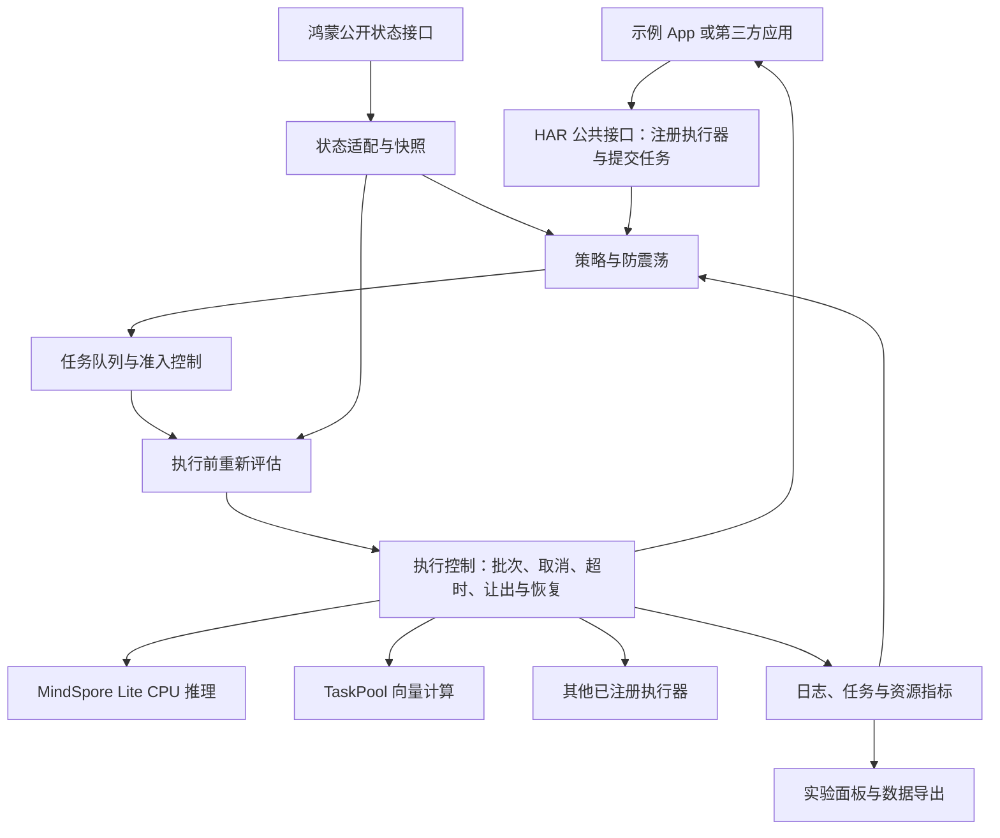

# 鸿蒙手机 AI 任务资源感知调度中间件

作品说明与开发基线 V1.0 · 2026-09-19

> 实施更新（2026-09-20）：旧原生工程已迁入当前目录。本文现状表保留基线制定时事实，后续完成状态以 [分阶段开发与验证记录](03-分阶段开发与验证记录.md) 为准。

适用对象：团队开发、协作分工、演示设计、技术方案与答辩材料。

本文确立后续开发的产品与技术基线；“目标”不代表已经完成。比赛正式任务书若有新增约束，应记录差异并修订本文。

## 1. 用一句话说明作品

**面向鸿蒙手机 AI 任务的资源感知调度中间件，通过任务优先级、推理线程配置、计算档位和后台任务让出机制，改善前台响应与资源使用效率。**

我们交付一个可被鸿蒙应用集成的调度库（HAR）、一个展示调度效果的原生示例应用（HAP），以及可复现的测试数据和说明文档。

购物检索是首个示例场景；调度库的接口不应依赖商品、品牌或购物页面。其他应用也可以通过执行器接入自己的 AI 计算任务。

作品不要求部署端侧生成式大语言模型。现有轻量文本 Embedding 模型和向量计算可以作为真实 AI 负载。复杂语言生成及远程服务属于可选扩展，不是核心离线演示的前置条件。

## 2. 解决什么问题，服务于谁

### 2.1 典型问题

手机应用可能同时处理用户搜索、AI 推理、后台索引和缓存更新。如果所有任务采用固定配置并按到达顺序执行，就可能出现：

- 用户点击搜索时，正在进行的后台计算导致长时间等待。
- 手机热状态变差时，已经排队的任务仍按照原来的高负载计划执行。
- 所有任务都采用同样的线程和计算规模，无法平衡响应速度与资源开销。
- 页面显示任务已取消或超时，底层计算却继续运行。
- 各业务分别实现队列、状态判断和日志，难以复用和验证。

### 2.2 使用者

| 使用者 | 如何使用作品 | 获得什么 |
|---|---|---|
| 应用开发者 | 集成 HAR、注册执行器、提交任务 | 统一调度接口，减少重复实现 |
| 手机用户 | 正常使用集成中间件的应用 | 目标是减少前台等待、降低后台干扰 |
| 团队与评委 | 使用演示 App 和实验面板 | 看到决策依据、真实执行配置和对照数据 |

这里的收益是需要验证的目标，不能预先写成已获得的性能提升。

## 3. 能力边界：我们控制什么

手机具有 CPU，现代机型通常具有 GPU，部分机型具有可用的 AI 加速硬件。但硬件存在、应用能访问、模型能运行、运行结果可验证，是不同条件。

| 层次 | 本作品的范围 |
|---|---|
| 应用内任务调度 | 核心：执行顺序、准入、暂停、恢复、取消、超时与优先级 |
| 推理运行时配置 | 核心：在已验证接口下设置 CPU 推理线程数和计算档位 |
| 应用计算组织 | 核心：拆分后台工作批次，设置检查点，限制提交量 |
| OS 公开状态接口 | 核心：读取可用的电量、充电、热档位、应用生命周期状态 |
| GPU／NPU 后端 | 可选：设备、SDK、模型均验证通过后再增加 |
| 内核、频率与跨应用资源控制 | 当前不做：不声称控制全系统线程调度、CPU 频率或其他 App |

CPU 4 线程配置不表示独占 4 个物理核心；TaskPool 的 4 个分区也不表示系统一定同时运行 4 个线程。最终物理资源分配由操作系统决定。

对外称“应用级、资源感知的 AI 任务调度中间件”，不称“已实现 CPU／GPU／NPU 全系统调度器”。OS 方向的特点来自状态感知、任务生命周期、资源配置、并发控制和可测量的运行效率改善。

## 4. 两套现有代码的关系

| 代码位置 | 实际内容 | 后续角色 |
|---|---|---|
| `C:\Users\17321\Desktop\harmonyOS\HarmonyOS--\shopping-assistant\apps` | 旧参赛作品的原生 entry、scheduler HAR、模型与数据 | 手机端实现的主要来源 |
| 当前 `harmony-agent` 目录 | 从此芯项目分离出的 NestJS、Web、Python 等代码 | 可选工具和历史参考，不作为手机调度核心 |
| 当前 `apps/harmony` | 原生工程预留目录 | 后续接收经过核对的旧原生工程 |

**基线制定时仅确立文档；2026-09-20 已启动原生迁移与独立开发，详见阶段记录。** 后续迁移应包含旧工作区的有效未提交修改，记录来源版本和文件清单，排除签名密钥、缓存、SDK 与构建产物。

旧工程配置为 HarmonyOS 6.0.2(22)、Phone。先以此作为已有工程的开发起点；最终系统兼容范围以实际手机、SDK 与测试结果确定。

当前目录原先以通用端云 Runtime 为主的定位被本文替代。此芯设计中的技能编译、P1 主控、云端全局规划等不进入本版本必做范围。

## 5. 旧作品现状：哪些可以直接继承

以下依据 2026-09-19 对旧工作区源码、资源、现有产物和历史报告的检查。已实现指有实际实现，不代表已完成真机验收；本次未重新运行构建与手机测试。

| 模块 | 已有基础 | 缺口与限制 |
|---|---|---|
| 原生应用 | ArkTS／ArkUI，首页、商品卡片、详情弹层、调度面板 | 部分页面说明超过实际计算能力 |
| HAR 接口 | 初始化、任务提交、执行器注册、状态与日志回调 | 接口取消与暂停语义需完善 |
| 状态适配 | 电量、充电、热档位、前后台；真实与注入状态区分 | 缺真机验证，部分状态未参与决策 |
| 策略 | 固定性能、固定省电、自适应加权规则、防震荡 | 尚未以手机数据校准；不是已训练的智能策略 |
| 队列 | 单任务串行执行、优先级、等待老化、排队取消与暂停 | 运行中后台任务不能让出；无完整限速机制 |
| 本地模型 | 约 5.8MB `.ms` Embedding 模型，MindSpore Lite CPU 推理 | 模型质量与线程收益待实测 |
| 计算档位 | CPU 1/2/4 线程，256/64/16 维检索 | 同一模型的计算配置，不是三个独立模型 |
| 数据与检索 | 2700 条商品及向量、数据库查询、TaskPool 向量计算 | 结构化筛选与最终向量候选未完全衔接 |
| 后台任务 | 归一化缓存重建 | 不是完整商品新增、删除、更新的索引维护 |
| 图片与详情任务 | UI 与任务入口 | 部分执行器只返回输入，没有检测或重排计算 |
| 日志与指标 | 任务时间、状态、计划与基础统计 | P95 目前主要反映执行时间；缺端到端和资源指标 |
| 云端增强 | HTTP 代理、隐私判断和本地回退 | 开发地址、手机部署和执行策略尚未完善 |
| 测试与包 | 测试源码、历史报告、未签名 HAP、HAR | 历史成功记录不等于当前版本真机验收 |

旧根 README、项目简介和部分架构内容落后于源码。后续能力说明应使用本文的现状表与最新验证记录，不能把历史“已完成”直接搬入提交材料。

## 6. 目标架构

下图描述目标结构，不代表所有模块已经具备。运行中让出、重新评估、资源统计及实验导出等仍需补齐。



### 6.1 模块职责

| 模块 | 输入 | 输出／责任 |
|---|---|---|
| App | 用户操作 | 任务意图和展示，不自行决定线程档位 |
| 公共 API | 任务描述、执行器 | 校验请求、返回任务句柄、隔离业务 |
| 状态适配 | 系统事件、公开接口 | 带来源、时间和未知值的状态快照 |
| 策略 | 快照、任务属性、同类任务历史 | 线程配置、计算档位、优先级、准入和原因 |
| 队列 | 待执行任务 | 排序、防饥饿、暂停、出队；保持状态一致 |
| 执行控制 | 最终计划、执行器 | 执行、检查点、实际停止确认、结果回传 |
| 工作负载适配 | 通用执行协议 | 将计划转换为具体推理与计算调用 |
| 观测与实验 | 决策与执行事件 | 原始记录、统计和可复现对照结果 |

手机核心链路离线运行。若保留远程任务，应使用单独的远程执行适配，不把远端算力显示为手机 CPU／GPU／NPU；远程慢请求也不应无条件阻塞本地可执行任务。远程能力不作为 V1 验收条件。

## 7. 必须实现的功能与实现方法

### 7.1 任务描述与接入

业务提交任务时声明：任务 ID、执行能力、输入、前台实时／用户触发／后台批处理类别、时延目标、质量底线、是否允许降档、取消与让出能力、超时约定。

执行器声明：支持的计算档位、CPU 线程配置、输入输出类型、是否支持分块、取消检查与检查点恢复。没有声明或未验证的能力不可由调度器假定存在。

示例流程：注册 `text_embedding_search` 执行器 → 提交查询 → 获得任务句柄 → 订阅状态 → 获取结果或取消。

### 7.2 状态感知

继承现有电量、充电、热档位与前后台适配。补充每个状态的更新时间和有效性判断；未知值采用明确的保守策略。

真实状态和调试注入状态在日志中显式区分。注入“高热”能验证策略分支，不能证明设备真实降温。电量百分比变化也不能单独作为准确能耗测量。

### 7.3 策略与计算档位

第一版保持可解释规则，不增加训练调度模型的交付负担。

| 模式 | 预期行为 |
|---|---|
| 固定性能 | 采用较高计算档位，仍遵守必要保护约束 |
| 固定省电／低开销 | 采用较低计算档位和后台预算；是否节能需实测 |
| 自适应 | 根据状态、优先级、时延目标、质量底线和实测耗时选择配置 |

CPU 线程数与检索维度应是两个可独立配置的维度，避免把“降线程”强行等同于“降质量”。可以先提供已验证的配置组合，再根据数据调整。

现有模型先输出完整向量，再截取部分维度用于相似度计算。因此降低检索维度主要减少后续向量计算量，不能自动宣称模型前向推理也按比例减少。

每次决策保留状态快照、计划版本和原因。任务出队前重新评估；已经运行的任务只在执行器支持的安全边界更新配置。

### 7.4 优先级与后台让出

前台任务优先，但通过等待老化或后台最低服务预算避免后台永远得不到执行机会。

后台任务拆成有上限的小批次：执行一批 → 保存游标或检查点 → 查看是否有前台任务／保护状态 → 让出或继续。调度器管理后续批次准入，不能一次把全部后台任务都提交给 TaskPool 后再声称可控让出。

对于不能中断的单次模型推理，明确标为不可抢占；可以在调用前排队、控制并发、在调用后停止后续步骤。V1 不要求中断底层推理内核。

### 7.5 取消、超时与资源释放

建议目标状态：

```text
QUEUED → RUNNING → SUCCEEDED / FAILED
            ↓
       YIELDING → PAUSED → QUEUED
            ↓
       STOP_REQUESTED → 实际停止确认 → CANCELLED / TIMED_OUT
```

排队任务可立即移除。运行任务先发出停止请求，由执行器在可中断位置确认。无法中断的计算必须继续计入占用，不能仅靠 Promise 超时就释放并发名额。

分别记录结果承诺何时超时、底层工作何时停止；丢弃过期结果，阻止其覆盖新请求结果。区分排队截止时间和执行超时，避免任务长期排队却永不超时。

### 7.6 日志与指标

每条任务至少记录：任务与运行批次 ID、状态来源、策略版本、计划和实际配置、提交／开始／结束时间、让出与恢复、取消确认、结果或错误。

统计端到端延迟（包括排队）、排队时间、执行时间、成功率、后台吞吐、截止时间违约率及质量指标。CPU／内存等资源指标只报告实际可测的数据，并记录采样方法和局限。

保留有限内存日志并支持导出 JSON／CSV。首次加载与预热后运行分开统计，避免把冷启动开销混入稳定态比较。

## 8. 演示 App 应该展示什么

### 8.1 核心演示：前台搜索与后台缓存计算竞争

1. 本地载入商品与模型，显示真实 CPU 执行后端。
2. 启动可分批的后台归一化缓存重建任务。
3. 用户输入查询，提交前台 Embedding 与向量检索任务。
4. 后台在批次边界让出，前台开始执行。
5. 返回结果后，后台从检查点继续。
6. 面板显示任务时间线、等待时间、实际线程配置与让出事件。
7. 使用相同工作负载切换固定策略和自适应策略，比较结果。

如果 2700 条数据不足以产生稳定干扰，可以增加明确标注的压力测试数据或批次数；不能用人工等待冒充推理耗时，也不能把重复测试称为业务数据增长。

### 8.2 状态变化演示

展示状态正常 → 高热或低电量 → 恢复时，排队计划和后续批次如何调整。调试状态用于可重复演示，真机状态用于验证，两者分别记录。

### 8.3 稳定性演示

运行中取消、超时、应用退到后台、重新进入、执行器异常，均应有清晰结果；验证没有悬挂任务和虚假的资源释放。

图片识别、完整商城、多平台实时比价不是核心演示要求。若没有真实实现，就移除相应成功描述或明确标为未实现示意。

## 9. 必做、可选与不做

| 范围 | 内容 |
|---|---|
| V1 必做 | 可复用 HAR；真实本地 AI 负载；状态感知；线程与计算配置；优先队列；后台分块让出恢复；可靠取消超时；日志导出；手机对照实验 |
| 时间允许再做 | 第二个独立示例 App；第二类模型；可用加速后端；远程增强；多步骤依赖图 |
| 当前不做 | 端侧生成式大模型训练或部署；修改系统内核；跨应用全局调度；自建商城；此芯板适配；为展示效果伪造硬件能力 |

HAR 是应用集成库，不是独立常驻系统服务。“通用”在 V1 指执行器协议能承接不同任务，不表示已经具备完整 Agent 规划和工具执行平台。

## 10. 旧代码优先修复清单

| 优先级 | 问题 | 修复验收 |
|---|---|---|
| P0 | 恢复任务更新了 `task.plan`，执行闭包仍引用旧计划 | 实际执行参数与记录的最终计划一致 |
| P0 | 状态更新没有完整驱动待执行任务重评估 | 排队后状态变差，出队按新状态执行或暂停 |
| P0 | 超时后计算可能继续，但队列已进入下一任务 | 实际计算占用、停止确认与并发名额一致 |
| P0 | 原生工程尚未迁入当前目录，且旧工作区有未提交修改 | 来源清单可追溯；迁移后干净构建与最小运行通过 |
| P1 | 后台仅能暂停排队任务 | 真实分批计算可让出并正确恢复，无遗漏和重复写入 |
| P1 | THROTTLE 等计划缺少完整执行行为 | 限制批次／准入的效果可观察，或删除不支持的能力 |
| P1 | P95 不含排队；相似度分数命名像准确率 | 指标口径准确；质量由独立标注查询评测 |
| P1 | 查询候选未约束最终向量结果 | 品牌、价格等已支持约束在最终结果中生效 |
| P2 | 图片、详情重排占位与旧文档描述混杂 | 文档、UI 与实际能力一致 |

## 11. 验证方法与完成标准

### 11.1 功能验证

- 入队优先级、防饥饿、排队期间状态改变、恢复后配置一致。
- 分块让出与恢复、重复取消、执行超时、异常路径、销毁与资源清理。
- 真实模型推理和检索结果正确，执行配置传入运行时。
- 未知状态、不可用能力有明确回退；日志不把注入状态显示为真实状态。

测试既覆盖策略输出，也验证真实执行器收到什么、完成什么。Mock 测试证明状态机逻辑，不能代替真实计算验证。

### 11.2 手机实验

以同一手机、系统、模型、数据和查询集，比较固定性能、固定低开销、自适应三种策略；记录充电状态、热档位、前后台干扰及运行顺序。每种条件重复多轮，保留原始记录并报告波动。

实验应包含无后台任务与有后台干扰两组。最少比较端到端 P50/P95、前台成功率、后台完成时间／吞吐、质量变化；可获得可靠数据时再报告 CPU、内存和能耗。

目标是证明明确场景下的取舍，而不是承诺所有条件下都更快、更省电、质量不变。性能提升阈值在首次真机基准后由团队写入版本化验收表；目前不虚构百分比。

### 11.3 V1 完成判据

1. HAR 可被示例应用独立依赖，购物业务不进入调度核心。
2. 手机核心链路离线可用，不依赖 GPU 服务器或云端 LLM。
3. 真实推理、后台让出、恢复与取消超时语义均有可复现验证。
4. 有固定与自适应策略的真实对照数据；未达预期的结果如实记录。
5. 可安装 HAP 完成签名与手机验证，HAR、源码和接入说明齐备。
6. 提交材料中的每项已实现能力，都能对应源码、演示或测试证据。

## 12. 建议开发顺序与分工

以下是四周工作安排建议，不代表赛事官方期限或保证交付时间。

| 阶段 | 工作 | 阶段产物 |
|---|---|---|
| 第 1 周 | 核对并迁移旧原生工程；修复计划与状态一致性；建立手机运行基线 | 可构建工程、可安装示例、首轮基准 |
| 第 2 周 | 执行器协议、分块让出、取消确认、超时占用管理 | 真实前后台竞争演示及回归测试 |
| 第 3 周 | 指标导出、策略校准、质量与性能对照 | 原始数据、实验脚本与结果表 |
| 第 4 周 | 稳定性、HAR 接入说明、能力清理、视频与答辩材料 | 可复现交付包 |

工作可按“调度核心”“执行器与模型”“原生应用与状态适配”“测试与材料”划分；人数不足时合并角色。修改公共接口必须同步调用方和测试，不能各自维护不同语义。

## 13. 协作与文档规则

- 本文确定范围；后续技术选择在文末决策记录追加，避免口头变化造成两套目标。
- 能力状态统一为“已实现、待验证、规划中、暂不做”；测试结果附日期、版本和设备。
- 计划配置和实际配置分别记录；未确认的硬件执行结果不进入展示。
- 旧初赛目录保留为来源，迁移后的统一开发位置为当前 `harmony-agent/apps/harmony`。
- 不为维持旧名称而夸大能力：相似度不是准确率，检索维度不是模型大小，任务优先级不是内核优先级。
- 本文更新产品基线，不授权自动改动旧目录或发布、提交代码；迁移和实现另按后续开发任务推进。

## 14. 决策记录与待验证事项

### 已确定

- 面向鸿蒙手机，核心产物为应用级 HAR 调度中间件。
- 不需要端侧生成式语言模型；保留轻量模型作为真实负载。
- CPU 路径优先，GPU／NPU 作为可选扩展。
- 首要工作是调度执行闭环与手机实验，购物只是示例。
- 旧原生工程为主要实现来源，此芯迁移代码为可选参考。

### 后续需要验证，不阻塞文档基线

- 可使用手机的型号、系统版本、签名与调试条件。
- 热状态等接口在该手机的实际可用性。
- 1/2/4 线程与不同检索维度的真实性能、质量差异。
- 后台批次大小、让出时延、恢复开销和实验负载规模。
- 赛事最新任务书对提交物、设备和演示方式的具体要求。

## 15. 源码与证据索引

2026-09-21 范围决策：V1 使用真实分块让出、保护暂停及拒绝准入，不承诺速率预算型 THROTTLE 或硬件降频；无执行语义的 THROTTLE 策略输出已撤销。新增真实实验文件导出和电脑统计，手机验收按文档 11 执行。检查点恢复限定进程内，手机性能/能耗收益仍须实测。

下列路径均相对于旧项目的 `shopping-assistant`；它们是历史现状依据，不表示已迁移。

| 路径 | 说明 |
|---|---|
| `apps/build-profile.json5` | SDK、产品与模块配置 |
| `apps/scheduler/src/main/ets/api/SchedulerService.ets` | 调度入口、计划、队列执行、超时和日志 |
| `apps/scheduler/src/main/ets/policy/SchedulerPolicy.ets` | CPU 档位、自适应规则和保护分支 |
| `apps/scheduler/src/main/ets/queue/TaskQueue.ets` | 排序、老化、排队暂停 |
| `apps/scheduler/src/main/ets/state/HarmonyDeviceStateAdapter.ets` | 电池、充电、热档位适配 |
| `apps/entry/src/main/ets/services/MindSporeEmbeddingEngine.ets` | 真实 CPU 模型加载与推理 |
| `apps/entry/src/main/ets/services/NeuralEmbeddingIndex.ets` | 检索分区、维度、缓存重建 |
| `apps/entry/src/main/ets/pages/Index.ets` | 业务接入和现存占位任务 |
| `apps/scheduler/src/test` | 现有逻辑测试 |
| `docs/03-提交前测试报告-2026-07-26.md` | 历史构建、测试与未验证事项 |
