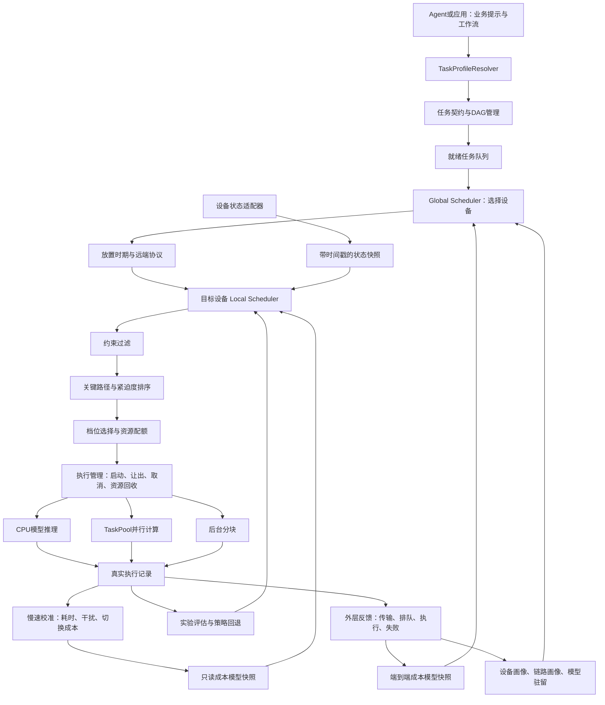

# 调度算法与成本模型设计方案：多设备分层调度修订版（待审核）

> 日期：2026-09-22
>
> 状态：团队已要求按本文启动实现；阶段 1/2 的安全基础进度见 [文档 15](15-分层调度首阶段实现与验证.md)。其余阶段仍是设计，性能尚未验证。
>
> 代码基线：`harmony/mobile-scheduler` 分支，功能基线 `8884faa`；本次修订前文档提交 `212bf38`。
>
> 适用范围：面向鸿蒙多设备 AI 任务的分层调度 Runtime，保留手机本地资源调度。
>
> 修订依据：协作者提供的《Harmony Agent：多设备 AI 语义调度设计建议》。附件作为设计输入，不作为已实现功能或已验证系统 API 的证据。

## 1. 方案摘要与审核范围

建议采用：**双画像、两级调度、双层反馈闭环**。任务画像描述任务需求，设备画像描述可用能力；全局放置层决定在哪里运行，目标设备的本地层决定怎样运行。两层均使用轻量预测，学习与实时决策分离。

全局层新增“任务与设备匹配 + 数据位置与模型驻留感知 + 端到端成本比较”；本地层保留“工作流关键路径感知 + 并发干扰预测 + 边际加速收益分配”。目标是在质量、隐私、内存和温度约束内提高有效吞吐并减少用户等待。

建议多设备首版范围：

- 兼容现有任务接口，增加半自动任务画像、本机设备画像和一个模拟远端画像。
- 先只有本机候选，随后启用 Shadow Placement；模拟远端只产生建议，不执行任务、不传输输入。
- 首个真实远端候选任务为 `text_encode`，待显式授权可信设备传输、能力与版本验证完成后，在两台设备上受控测试。
- 不做任意代码远程传输、透明运行中迁移或云服务自动接管；远端节点必须预装兼容执行器与模型。

原本地算法优化作为内层工作包继续保留，不是启动影子放置的前置条件：

- CPU 后端；通过运行时线程配置、TaskPool 分区、计算任务准入和后台分块控制应用内资源使用。
- 每台设备最多两个计算任务同时运行，先验证一个前台任务与一个后台分块的组合；此限制不是设备池的总配额。
- 轻量统计成本模型，不引入深度网络、强化学习或语言模型参与实时调度。
- 关键路径感知、并发干扰预测、动态后台分块、可审计决策和保护回退。
- 质量降档必须经过独立验证；性能对照默认使用相同结果质量。

本文等待团队确认后再实施，不覆盖协作者正在进行的手机适配与模拟工作。性能指标均为待验证目标，不是现有成绩。

## 2. 当前实现与需要解决的问题

当前实现已经具备：

- 应用通过 `TaskTemplate`、`TaskContext`、`ExecutionProfile` 声明任务和合法配置。
- 购物工作流为文本预处理、文本编码、向量检索；另有可检查点恢复的后台缓存构建。
- 设备状态采集、硬约束过滤、任务优先级、取消、过期、后台让出及执行审计。
- 基于声明先验和 EWMA 的耗时预测，以及有样本门槛的用户反馈校准。
- OBSERVE、SHADOW、CANARY、ACTIVE 策略框架；干净启动默认 OBSERVE。

当前主要不足：

1. 成本预测尚不能充分解释不同线程配置、冷启动和并发争用的差异。
2. 单个运行任务槽限制安全利用剩余资源的能力。
3. 现有调度对工作流剩余关键路径的利用不足。
4. 新受约束策略与旧三模式入口并存，现有三模式实验不能直接证明新策略优劣。
5. 缺少统一的独立测试集、真实设备校准、干扰测量和调度自身开销数据。
6. 多设备画像、设备放置与远端执行协议属于本次设计新增项，不能因接口存在远端枚举就认为已经实现。

### 2.1 边界

中间件控制应用内部的任务和运行时配置，不是内核调度器。不承诺 CPU 调频、物理核心预留、大小核绑定或跨应用资源控制。当前真实后端为 CPU；GPU/NPU 不纳入本期实现承诺。

Agent 或应用负责提交工作流和任务语义，中间件不自动理解任意自然语言目标。当前 256/64/16 维是检索计算档位，不是三套不同大小的语言模型。

设备发现、连接和跨设备通信优先适配目标系统允许的原生机制；具体 HarmonyOS/OpenHarmony 版本、SDK、权限与设备组合要先验证。QoS、加速器负载和硬件能力只有实际可获取、可设置且已验证时才对外声明；未知值不是零负载，CPU 回退不能违反任务要求必须使用某后端的硬约束。

## 3. 优化目标与约束

采用分层目标，避免用一个综合分数抵消重要约束。

| 层级 | 目标 | 决策方式 |
| --- | --- | --- |
| 第一层 | 信任与隐私、执行安全、结果质量、配置合法 | 硬约束，不以速度收益换取违反约束 |
| 第二层 | 前台响应、工作流截止时间 | 优先降低超时风险和用户等待 |
| 第三层 | 有效吞吐、后台进展 | 利用剩余资源，避免长期饥饿 |
| 第四层 | 决策开销、切换开销、资源消耗 | 收益相近时选择成本较低的方案 |

截止时间不可满足时，按任务契约取消、返回过期状态或尽力执行，不修改截止时间来掩盖超时。预测内存预算是准入依据，不构成系统内存隔离或硬实时保证。

## 4. 总体架构：两级调度与快慢路径

### 4.1 本地快速路径

由任务提交、任务完成、资源释放、取消和重要状态变化触发。只读取内存快照，检查约束，评估有限候选，下发决策。

不得执行网络请求、模型加载、文件读写、模型训练或大批量日志整理。状态采集与模型更新不能阻塞快速路径。

### 4.2 慢速路径

整理执行样本、校准模型、计算误差、评估策略和持久化。采用批量、可让出的处理方式，受前台活动约束。必要时放入独立工作任务，不能仅依靠异步函数名称假定不会阻塞事件循环。

每次发布不可变的模型快照，快速路径在一轮决策内使用同一版本，避免读到半更新状态。

### 4.3 外层放置与内层调节的区别

Global Scheduler 在任务开始前、阶段边界、目标拒绝或明显状态恶化时触发，使用缓存画像进行有界决策；发现、探测和跨设备传输异步进行，不嵌入本地快速路径。

Local Scheduler 在执行设备上高频响应队列与资源变化，拥有最终准入和档位决定权。全局建议不是资源预留；目标必须复核实际状态，接受、拒绝或提出新的预计完成时间。

两级调度是职责划分，快慢路径是计算组织方式，不能把 Global Scheduler 与后台模型训练混为一体。首版由工作流源设备协调，目标节点不再转发，避免多层转派循环。

## 5. 任务契约与执行能力声明

保留现有接口，增补以下信息。具体字段命名在接口实施阶段确定。

| 信息 | 用途 |
| --- | --- |
| 工作流依赖关系 | 判断就绪节点、关键路径和分支汇合 |
| 工作流响应目标及截止时刻 | 共享剩余预算，避免子任务重复获得完整预算 |
| 经验证的执行档位 | 声明线程、分区、分块、质量与内存需求 |
| 可中断性和检查点 | 判断让出时机、恢复和重做成本 |
| 最长不可中断工作段的估计 | 评估前台阻塞时间 |
| 执行器重入能力与互斥资源标识 | 防止模型实例或共享缓冲区不安全并发 |
| 模型驻留状态 | 区分冷启动与热运行 |
| 取消、过期及降级规则 | 明确可采取的动作和结果语义 |

候选配置必须同时通过应用契约和执行器支持检查。未经质量验证的检索降档只能用于明确标记的独立质量实验，不能进入正式自动选档。

### 5.1 四类对象分离与半自动画像

| 对象 | 内容 | 不应混入 |
| --- | --- | --- |
| Task Profile | 任务身份、意图、质量、隐私、依赖、数据位置与重试约束 | 指定设备的预测耗时和最终线程数 |
| Device Profile | 能力、Runtime、驻留模型、队列、可观测资源、信任与有效期 | 其他 App 的业务内容 |
| Execution Estimate | Task × Device × 可行档位的耗时、成本、不确定性 | 被当作实际执行结果 |
| Execution Config | 目标节点确认的线程、分区、档位和分块配置 | 被当作开发者必须手填的需求 |

`TaskProfileResolver` 按以下顺序补全：开发者硬约束 → 已验证的执行器能力 → 实际 Runtime 元数据 → 页面/调用上下文提示 → 历史预测 → 保守默认值。每个推断字段记录来源、时间、置信度与版本；冲突时硬约束优先并取更严格的可行交集，无交集则拒绝。

隐私、可重试性、副作用与可中断性不能由历史或“后台任务”标签自动放宽。上下文只能提供交互意图提示，不能仅凭前台状态断言用户正在等待。推理后端支持与可中断性由执行器验证，任务画像不能自动赋予能力。

开发者提供少量业务 Hint；执行器适配者仍需声明合法档位与执行能力。降低应用接入成本不等于免除执行器契约。

### 5.2 现有字段的兼容映射

以下映射依据 `SchedulerTypes.ets`、`ShoppingTaskService.ets` 和 `SearchPreferences.ets`，是兼容改造设计，尚未新增这些类型。

| 当前字段或来源 | 新画像用途与处理 |
| --- | --- |
| `TaskTemplate.capability/taskType` | 任务能力与类型；结合模型、执行器和输入规模桶生成 `taskSignature`，不把原始查询写入签名 |
| `workflow[].dependsOn`、`outputNodeId` | 保留 DAG 与结果节点，增加阶段数据位置和传输边 |
| `TaskContext.deadlineMs/freshnessMs/targetLatencyMs/softDeadlineMs` | 源端统一计时预算，不在目标重新获得完整时限 |
| `userVisible/userWaiting/businessImportance` | 来源端业务意图；与目标节点自己的前后台状态分开 |
| `accuracyFloor/highQuality`、`qualityLevels` | 质量硬下限与合法能力；跨设备需验证输出与模型版本等价 |
| `resourceHints.modelVersion/modelSizeMb` | 模型信息，补充模型制品摘要、输入输出协议和执行器版本 |
| `inputTokens/inputShape/candidateCount/batchSize` | 输入规模；新增序列化输入/输出字节估计，条数不等于字节数 |
| `interruptibility`、`TaskCheckpoint` | 保留本地语义；检查点可本地恢复不等于可跨设备迁移 |
| `duplicatePolicy/deduplicationKey` | 保留业务去重；另外引入远端 attempt/epoch 去重，二者不能共用 |
| `privacyPolicy`、`networkAllowed`、`inputSanitized` | 与新增设备允许列表、可信设备范围取交集；缺失权限不扩大范围 |
| `DeviceState` | 本机动态画像来源，保留逐字段来源、时间戳和未知值 |
| `ResourcePrediction`、`ExecutorTelemetry` | 分别归入预测和实际结果，补齐设备、链路、策略版本与运行标识 |

现有 `PrivacyPolicy` 为 `LOCAL_ONLY/SANITIZED_REMOTE/REMOTE_ALLOWED`，没有明确的“可信设备”枚举；新增可信设备范围需版本化适配，不能将既有允许远端自动解释为允许所有邻近设备。当前购物模板为 `LOCAL_ONLY`，搜索 `networkAllowed=false`，因此真实远端候选必须为空，直到应用明确修改授权契约。

Shadow 可显示“隐私阻止远端”的真实结论。若要比较多设备算法，用单独的、显式允许可信设备的合成任务画像做模拟；不能绕过真实任务隐私再把模拟建议显示成其有效方案。

### 5.3 Device Profile 与链路画像

设备画像包括：设备/会话标识、能力与 Runtime 版本、可用后端、兼容模型、实际驻留模型、可用内存、负载、温度、电量、节点健康、运行任务、排队工作量、信任和可接收的数据范围。

RTT、吞吐与稳定性属于“源设备→目标设备”的有向链路画像，不能用一个全局带宽字段描述所有设备对。队列长度不等于等待时间，还需要任务成本或目标估计的可接纳时间。

静态能力、动态资源、驻留状态、信任分别设 TTL，并记录 `REAL/MOCK/REPLAY` 来源。远端字段用接收端单调时钟计算缓存年龄，结合传输年龄和误差保守判断，不能直接相减不同设备的墙钟时间。默认排除过期或可信状态不明的远端；实际派发前再次校验身份和权限。可信连接不自动授权传输任意数据。

### 5.4 首个跨设备任务边界

真实购物链路仍为 `query_prepare → text_encode → vector_retrieve`；不按附件的图像示例虚构已实现的视觉任务。

优先选择纯计算 `text_encode` 试点：源端清理输入，目标预装同版本编码器并调用自己的 Local Scheduler，返回向量，源端继续检索。保留商品数据与检索在源端，避免首版复制整个商品索引。验证分词、模型摘要、输出维度、精度容差与序列化协议。

这类短文本编码可能因网络开销没有卸载收益。试点首先证明协议与两级执行正确，不保证提速；若端到端成本不合算必须选择本机。后台缓存依赖本机索引，不作为首个可迁移任务。

## 6. 成本模型设计

采用**结构化成本模型 + 在线残差校准**。首版重点是少样本可用、计算便宜、可解释和能够回退。

### 6.1 单任务耗时模型

预测形式：

`预计独占耗时 = 固定开销 + 输入规模相关工作量开销 + 加载开销 + 档位切换开销`

特征包括任务类型、输入规模、档位、线程或分区数、温度区间、CPU 负载和模型驻留状态。

实现路线：

1. 使用微基准建立各档位的初始性能表。
2. 按任务类型拟合小型正则化线性模型；参数数量保持有限，不在快速路径训练。
3. 对实际耗时与预测耗时之间的残差进行 EWMA 校准。
4. 样本不足、特征越界或模型版本不匹配时使用保守先验。

线程数使用独立档位特征或独立基准，不假设线性加速。1/2/4 线程分别测量，4 线程只有证明有效且执行器支持后才开放。

### 6.2 并发干扰模型

`预计并发耗时 = 预计独占耗时 × (1 + 预计干扰系数)`

干扰系数按任务组合、总并行配额和设备状态估计。首版只标定有限组合：编码与缓存、检索与缓存，以及两个独立工作流的就绪任务。

需要配对测量独占与并发运行，记录启动时间、实际重叠区间和完整执行时间。不能将“某任务刚好变慢”直接归因于另一个任务。没有足够样本的组合默认不开放计算并发。

### 6.3 不确定性与保守预测

输出预计耗时、保守耗时、样本量、预测来源和误差水平。截止时间判断使用保守耗时。

保守余量由独立残差数据校准并检查覆盖率，不能将“均值加两倍波动”直接命名为经过验证的 P95。超出已有数据范围时增加保守余量或回退。

### 6.4 切换、让出与重做成本

单独记录模型加载、配置切换、任务分区创建、检查点保存、恢复以及取消重做的耗时。只有预期收益超过这些成本和安全余量，才改变配置。

不同线程配置可能对应不同模型实例；模型缓存需要计入内存预算、互斥约束和淘汰规则，不能无限缓存。

### 6.5 数据治理与用户反馈

- 按设备、模型版本和执行器版本隔离数据；版本变化后不得直接混用旧样本。
- 记录实际执行配置与请求配置，回退或配置不一致的样本不能按原配置训练。
- 取消、失败、混合配置和冷启动样本分别标记；不能将未完成任务视为完整耗时样本。
- 用户反馈只作为满足样本门槛后的有界偏好校准，不能覆盖质量硬约束或作为客观性能标签。
- 没有可靠功耗测量时，只报告资源代理指标，不输出虚构的毫瓦或节能比例。

### 6.6 多设备端到端成本模型

本地成本模型保留在各节点。全局模型组合下列**互不重复**的阶段成本：

`端到端耗时 = 放置决策 + 协议控制 + 输入序列化/传输 + 目标排队 + 模型加载 + 计算/本地切换 + 结果序列化/回传`

第 6.1 节的本地预测已包含加载和切换；全局汇总必须拆分或直接使用该整体，不能再加一次。排队、传输和冷启动也不能在延迟总项与综合分数中无意重复惩罚。

- 传输预测使用链路 RTT、有效吞吐、输入/输出字节和协议开销；没有测量时采用保守值，不能默认零传输成本。
- 目标排队预测包括目标前台任务保护及资源互斥，远端业务紧迫度不授予抢占目标用户前台的权限。
- 目标输出少量可接受配置的成本摘要，带画像/模型版本与有效期；最终配置由目标节点决定。
- 模型不存在且首版未支持部署时，直接判定能力不满足；模型已安装但未加载时计入冷启动。首版不隐式传输模型文件。
- 任务签名、模型/执行器版本、设备实例和状态用于计算模型分桶；链路对单独用于传输模型。设备类型只可提供低置信度先验，不将不同设备的实测混为同一真值。
- 全局保守耗时由端到端残差校准。各阶段 P95 的和不自动构成端到端 P95，更不能假设阶段误差独立。

来源端负责记录完整往返和工作流耗时；目标端上报本地单调时钟下的各阶段时长。源端使用本机截止计时器作最终结果有效性判断；目标采用扣除已耗时与保守传输余量的剩余预算。跨设备绝对时间只用于审计，不能未经同步保证就用于 deadline 运算。

### 6.7 双层反馈的归因

内层更新任务在实际配置下的计算、干扰和切换成本；外层更新传输、排队、驻留收益、拒绝率及端到端误差。通过 `workflowId/taskId/epoch/attemptId` 关联，同时保存全局与本地策略/模型版本、预测配置和实际配置。

Shadow 的远端预测没有真实标签，不能用本地实际耗时训练成远端执行样本。记录选择偏差，只能在授权的基准或受控试验中采集未选设备的真实样本。超时属于删失数据，离线或拒绝属于失败观测，不能作为完整推理耗时。

原始查询和数据不作为画像广播内容；跨设备共享必要的版本化摘要。两个反馈环独立校准，目标本地短暂调档不应立即触发重新放置。

## 7. 两级调度算法

### 7.0 全局设备放置

1. Resolver 形成任务需求及不可放宽的约束；源端取得有限、带有效期的候选画像。
2. 过滤信任、隐私、数据可传输性、Runtime/模型兼容、后端、质量与内存条件；本机同样必须可行。
3. 结合数据位置、驻留、排队和双向链路成本，估计各设备的端到端耗时及不确定性。
4. 优先满足质量与时限，然后比较保守完成时间；收益相近时优先本机或当前设备，再考虑可观测资源成本。能耗、热风险和数据传输惩罚如使用权重，必须归一化并公布配置，缺失值不能制造优势。
5. 只有收益超过传输/切换后仍有的误差余量及最小收益阈值，才换设备；设置最小驻留时期与冷却。无可行设备则按契约延迟、拒绝或尽力执行，不保证本机总能兜底。
6. 输出 `PlacementDecision`：设备、理由、预测分解、画像版本、预算与时期；目标准入确认后才认定已接纳。拒绝或超时只进行有界重评估，不无限探测所有节点。

首版最多评估 4 台设备（包括本机），每台最多 4 个兼容成本摘要。上限不计网络等待，候选轮换与过载处理显式记录。一个本机候选时直接委托原 Local Scheduler，不增加不必要的网络或模型学习步骤。

#### 跨设备 DAG 与数据位置

关键路径新增依赖边传输成本，按每个输入的当前位置计算，必要时倾向将相邻阶段放在同一节点。源端与目标各阶段最终回传位置需明确，不能每节点强制回源又在预测中假设数据留在远端。

首版按就绪阶段放置，计算一跳后继的数据传输代价，不做全 DAG 全设备组合的指数搜索。已有顺序依赖不因有多台设备就能并行。不可迁移阶段执行期间固定目标，阶段边界才允许重新放置。

### 7.1 约束处理

以下 7.1～7.5 在目标设备 Local Scheduler 内执行。形成就绪集合，先处理取消、过期、配置合法性、质量下限、资源互斥、内存预算和设备保护。保护动作不等待普通候选评分。源端传入的紧迫度要受目标节点的远端请求配额和本地前台保护约束，不能信任任意高优先级声明。

### 7.2 关键路径与紧迫度

根据 DAG 估计从就绪节点到结果完成的剩余关键路径。顺序依赖累加，独立分支汇合取最长路径；资源竞争另行计入预计等待，不能把理想 DAG 并行时间当成真实完成时间。

`余量 = 工作流截止时刻 − 当前时刻 − 预计剩余关键路径耗时`

余量越小，任务越紧迫。模型或执行状态更新后重估，但通过缓存和受影响节点增量更新控制成本。大型或超限 DAG 需要限制或回退，不能进入无界计算。

### 7.3 排序

采用分层排序：用户等待的关键任务优先，同层按余量排序，再结合重要性与等待老化。保留现有防饥饿机制，记录后台最长等待与实际执行时间。

后台获得进展的机制不能越过保护条件，也不能声称在持续过载下同时保证所有前台截止时间和后台等待上限。

### 7.4 档位选择与边际资源分配

枚举少量合法配置，预测完成时间、对其他任务的延迟影响、内存与切换成本。

`边际收益 = (预计关键路径缩短时间 − 切换成本) / 新增资源配额`

在满足前述分层目标后，优先考虑边际收益高的资源扩张。收益很小或不确定性过大时保留当前档位。不能单纯按比值牺牲截止时间或质量。

典型行为：

- 1→2 线程显著缩短关键路径，可以扩张。
- 2→4 线程收益很小，保留 2 线程。
- 后台并发会明显拖慢前台，暂不启动后台块。
- 两个独立任务并行能提升吞吐且不破坏前台目标，允许并发。

### 7.5 有界搜索

首版建议每轮最多评估 8 个优先候选，每个最多 4 个档位，同时最多运行 2 个计算任务。采用贪心分配与有限组合检查，不穷举全队列组合。

超出窗口的任务仍参与后续排序和等待老化，不能被永久排除。队列、DAG 及日志需要容量上限与明确的过载处理。各上限应配置化并纳入压力测试。

## 8. 执行管理、并发与后台让出

将单个运行任务槽改为受控的运行任务集合，管理 CPU 并行配额、活跃计算任务数、预计内存和互斥资源。

配额是应用内部准入预算，不是 OS 保留核心。TaskPool 分区数与推理线程数也不等于同等物理资源，需通过测量建立成本映射。

开放顺序：安全串行与资源记账 → 一个前台任务加一个后台分块 → 其他经过验证的组合。

### 8.1 动态分块

根据最近每条数据处理耗时选择下一块大小，目标使单块预计耗时落在预算内。初始以 5～10 ms 为待验证目标，并限制最小、最大块大小和单次调整幅度。

前台到来时停止发放新后台块，等待在途块结束，再在资源真正释放后启动前台任务。不可中断模型推理不适用分块让出目标，必须如实记录可能的阻塞时间。

### 8.2 生命周期安全

资源申请、任务启动与释放需要一致的状态机。完成、取消、超时回调只能释放一次。取消未确认时仍保留占用记账；超时执行器应隔离，不通过虚假释放预算掩盖仍在运行的工作。

同一模型实例与共享缓冲区默认互斥，只有声明并验证重入安全后才允许并发。

### 8.3 远端执行协议与 Execution Epoch

定义放置时期 `epoch` 与尝试标识 `attemptId`。发送的是预注册能力、模型摘要、输入和受限预算，不发送任意可执行代码。

协议主线：`DISPATCH → ACK_ACCEPTED/REJECTED → RUNNING → RESULT/FAILED`，另有 `CANCEL → CANCEL_ACK`、状态查询与超时。ACK 表示目标经过本地准入，不表示完成；需要计入队列预算。目标在实际运行前重新校验条件，配置改变超出承诺预算时报告而非静默执行。

- 相同 attempt 的重发在目标去重，返回已有状态，不重复启动；目标重启后的去重持久化/保留期要有协议定义，过期状态返回未知，不能伪装从未执行。
- 源端只有当前 epoch 的有效结果可提交。通过协议版本、输入摘要、模型/能力版本检查后原子提交一次；迟到、重复和已替换结果丢弃并记录。
- 网络超时或设备离线不证明计算已经停止。取消确认前不能声称资源释放，也不能保证跨节点只执行一次。
- 首个试点只允许纯计算、可重试任务：断联时可显式记录未知在途副本并按有界重试预算本机重算，最多提交一次结果，但可能重复消耗算力。不可幂等、有副作用任务禁止这种自动回退，需应用确认执行状态或补偿协议。
- 设置消息大小、在途任务、重试次数、派发时间与源端全局 deadline 上限；阶段换设备不会重置时限。源端重启后未恢复有效时期的结果不得直接展示。

可信发现和传输由系统适配层实现；应用层继续校验身份、能力与数据权限。远端节点实际调用自己的 Local Scheduler，记录其决策与执行配置，才能证明两级调度，而非固定参数 RPC。

### 8.4 两级控制稳定性

同一时期内优先由目标调线程、排队或让出；仅在目标拒绝、保护持续、断联或阶段边界时触发外层重评估。每个时期限定重评估次数、冷却时间和最小净收益，避免两层同时追逐短期波动。停止确认和副作用规则优先于重新放置。

## 9. 调度自身的性能预算

| 指标 | 定义 | 首轮工程目标 |
| --- | --- | --- |
| 决策计算耗时 | 一轮调度自身的执行耗时 | 约定候选规模下 P95 ≤ 1 ms，P99 ≤ 3 ms |
| 事件到决策延迟 | 请求到来至决策完成，包括事件排队 | 无资源阻塞场景 P95 ≤ 5 ms |
| 决策到实际启动 | 决策完成至执行器开始工作 | 单独报告，区分加载与资源等待 |
| 后台让出延迟 | 前台到来至后台实际释放资源 | 按分块与不可中断任务分别统计 |
| 调度累计开销 | 决策累计耗时与受管任务执行时间之比 | 初始目标 ≤ 2%，同时报告绝对值与测量口径 |
| 全局放置计算 | 使用缓存画像评估最多 4 台设备、各 4 个摘要 | 独立目标 P95 ≤ 2 ms，P99 ≤ 5 ms，待测 |
| 派发至确认/结果 | 含网络、远端排队及实际执行 | 按链路和任务报告，不套用本地 1 ms 目标 |

以上均需真机验证。测量必须说明任务规模、计时方式和设备状态；并发任务时间之和与墙钟时间不同，不能混淆开销分母。对极短任务单独报告，避免比例被较长任务掩盖。

快速路径限制日志和分配，缓存状态与预测；状态过期时保守处理。普通重复事件合并，取消和保护事件优先。若目标未达到，先定位事件排队、复制和日志开销，再评估原生实现必要性。

新增画像解析、全局计算、画像同步字节量/频率分别测量；缺缓存不应阻塞本地安全执行。只有本机候选的兼容入口需测试相对旧路径的新增开销。上述耗时目标是各组件预算，不能将分项 P95 直接相加称为端到端 P95。

## 10. 受控启用与回退

继续使用现有 OBSERVE、SHADOW、CANARY、ACTIVE 框架。

- OBSERVE：采集真实基线，不由未验证模型接管。
- SHADOW：记录建议方案和基线差异，不宣称建议方案获得了真实执行收益。
- CANARY：仅在已验证配置、足够样本及限定实验范围内实际执行。
- ACTIVE：达到预先冻结的验收门槛后启用，仍受保护、冷却和回退约束。

版本化保存策略与模型信息，配置切换需防抖。出现配置不一致、连续失败、取消无法确认、明显性能退化或状态不可用时，回退到已验证串行保守方案。回退不能中断执行器清理流程。

全局放置模式与现有本地模式分开配置、记录和回退。首版为 LOCAL_ONLY/SHADOW_PLACEMENT；后续才开放受控真实远端。Local ACTIVE 不自动授权远端，全局 SHADOW 也不强制改变本地策略。模拟画像永远不得接入真实派发器。

## 11. 创新点表述与研究参考

建议表述：**通过半自动任务画像与设备画像匹配，结合数据位置、模型驻留和端到端成本进行设备放置；目标节点以关键路径、并发干扰和边际收益进行本地资源调度，形成双层反馈闭环。**

三个可验证贡献：

1. 知道加速哪里有用：资源分配围绕工作流完成时间，而不只看单个任务优先级。
2. 知道并行何时有害：用干扰预测选择并行、串行或缩小后台块。
3. 知道何时值得调整：把切换成本和预测误差纳入决策，避免频繁切档。
4. 知道放在哪里才划算：比较整个工作流的数据传输、排队和冷启动，而非只比较芯片性能。
5. 降低接入成本并保持约束：用少量 Hint、实际 Runtime 观测和历史补全画像，硬约束不由预测覆盖。

预测驱动推理调度和端到端流水线目标已有研究基础，可参考 [Clockwork（OSDI 2020）](https://www.usenix.org/conference/osdi20/presentation/gujarati) 与 [InferLine](https://arxiv.org/abs/1812.01776)。本项目聚焦鸿蒙应用内 Agent 工作流、协作式执行与有限资源接口，不能仅凭组合宣称学术首创，也不能套用这些研究的服务器性能结果。

## 12. 实验与验收方案

### 12.1 对照和消融

| 方案 | 验证问题 |
| --- | --- |
| 固定配置、串行执行 | 比简单方案改善多少 |
| 固定线程预算、有限并发 | 收益是否只是来自开放并发 |
| 现有规则调度 | 新方案相对现状的增量价值 |
| 新算法去掉关键路径 | 工作流感知是否有效 |
| 新算法去掉干扰模型 | 并发预测是否有效 |
| 完整方案 | 综合收益与自身开销 |
| 同一 Local Scheduler，始终本机与两级放置对照 | 隔离跨设备选择的增量收益 |
| 固定远端与两级放置对照 | 是否能避免不划算的卸载 |
| 去掉传输/驻留感知或去掉冷却的模拟消融 | 是否分别导致错误选择和抖动；不得关闭隐私保护做消融 |

所有实验记录实际策略版本、实际档位和实际执行路径，先修复旧模式与新策略入口不一致的问题。

### 12.2 工作负载

- 单次搜索与连续请求替换。
- 搜索与后台缓存同时进行。
- 两个独立工作流交错到达。
- 真实独立分支汇合的 DAG；不能将有数据依赖的编码与检索强行并行。
- 冷启动和热运行。
- 状态未知、资源压力上升与恢复。
- 队列突发、取消、故障、超限和持续过载。
- 本机唯一候选的行为兼容；真实 LOCAL_ONLY 任务被排除远端。
- 远端计算快但网络慢、模型未加载、队列突增和画像过期。
- 目标拒绝、ACK 丢失、重复派发、断联、取消丢失、迟到结果、节点重启与时钟偏差。
- 目标自己的前台请求到达后，远端任务不能挤占其保护配额。

### 12.3 数据与判据

性能对比保持结果质量一致，低维检索质量单独评估。使用独立轮次训练和测试，不允许样本泄漏。模拟注入用于逻辑验证，真实设备用于性能结论。

记录响应 P50/P95、截止时间违约率、有效吞吐、后台进展、预测误差与保守预测覆盖率、调度开销和取消确认时间。随机化实验顺序、多轮重复，报告样本量和波动，控制冷热缓存与温度影响。

初始研发目标：混合负载前台 P95 降低 15% 或有效吞吐提升 10%，且质量、失败率、后台进展等关键指标无明显退化。完成基线测量后冻结具体门槛和允许退化范围，不能根据实验结果事后修改口径。若未达到，报告结果并收缩策略，不虚构收益。

外层另报放置理由、可行候选数、错误卸载率、重放置次数、传输量、派发/确认耗时、拒绝与回退率、迟到结果数、重复计算次数和最多一次结果提交。Shadow 只验证可解释性与逻辑，不能证明远端加速；模拟画像也不能作为真实设备测量。真实实验采用相同输入、质量及本地策略分层对照，报告网络和驻留状态；不承诺短文本编码跨设备一定更快。

## 13. 分阶段实施计划

| 阶段 | 工作内容 | 通过条件 |
| --- | --- | --- |
| 1. 兼容画像与统一测量 | Resolver、字段映射、统一策略入口、本机候选直通与原流程计时 | 隐私/质量不放宽，本机唯一候选保持旧行为 |
| 2. 设备画像与影子放置 | 本机/模拟画像、TTL、链路模型、成本分解、有界评分 | 无真实外发；过期、未知、隐私和错误卸载场景通过 |
| 3. 本地算法与模型优化 | 原计划的冷热成本、残差、关键路径、边际收益；有条件开放两槽与干扰学习 | 预测与调度开销通过，本地保护/取消回归通过；可与阶段 2 独立验证 |
| 4. 系统适配与双节点协议 | 验证目标 SDK/设备通信能力；只开放授权的 text_encode；派发、确认、去重、取消和回退 | 两节点真实闭环；目标使用本地调度；故障不导致重复结果提交 |
| 5. 双层反馈与受控启用 | 独立版本、端到端误差校准、冷却、分层对照与消融 | 达到冻结的指标；证明可行场景收益，不划算时保持本机 |

每阶段提交独立的代码、测试和验证记录。手机暂不可用时可先完成接口、确定性测试和模拟逻辑，但不能跳过真机性能门槛直接宣称阶段收益成立。

## 14. 代码映射与团队协作

| 现有模块 | 建议处理 |
| --- | --- |
| `SchedulerTypes`、任务模板与档位契约 | 保留并增补 DAG 预算、互斥、驻留和中断相关信息 |
| `SemanticPolicy` | 演进为可版本化的轻量成本预测与校准接口 |
| `ConstrainedPolicy` | 保留硬约束和受控启用；调整候选选择与收益判断 |
| `TaskQueue` | 加入余量排序、工作流紧迫度与可验证公平性 |
| `SchedulerService` | 从单执行槽演进为有预算、互斥和明确生命周期的执行管理 |
| 设备适配、检查点、执行审计 | 保留，补充时间戳和实际配置证据 |
| `ShoppingTaskService` 与执行器 | 声明并验证能力，购物仍作为示例负载 |
| 实验服务及手机验证手册 | 对齐统一策略入口、实验版本与新增测量字段 |
| 新增 `TaskProfileResolver` | 兼容旧接口，合并 Hint、Runtime 和历史来源；不扩大业务权限 |
| 新增设备注册/画像与链路适配接口 | 本机与远端摘要、TTL、信任、来源标签及实际能力验证 |
| 新增 `GlobalScheduler` 与放置成本模型 | 只负责设备选择、成本分解、时期与重评估 |
| 新增远端协议与节点服务 | 能力派发、准入确认、去重、取消、结果提交；节点委托本地调度 |

建议分工：调度开发侧负责接口、模型、执行管理和确定性测试；手机适配侧负责 SDK/运行时兼容、模型真实执行和基准数据回传；双方共同冻结任务输入、质量基准与指标定义。具体人员和日期由团队安排。

接口优先共同冻结 `ResolvedTaskProfile`、`DeviceProfile/LinkProfile`、`ExecutionEstimate`、`PlacementDecision` 与派发消息的版本和字段。以上是拟议名称，不要求协作者直接重命名现有代码。系统适配侧提供真实节点能力、通信与故障事件，算法侧不把模拟设备当作已接通的节点。

相关文档：

- [作品说明与开发基线](02-作品说明与开发基线-鸿蒙手机资源感知调度中间件.md)
- [受约束策略闭环实施方案](09-HarmonyOS受约束策略闭环实施方案.md)
- [手机验证操作手册与结果回传](11-手机验证操作手册与结果回传.md)

## 15. 审核结论记录

当前结论：**待审核，未启动本方案的算法实施。**

待团队确认：

- 是否批准先本机兼容与影子放置，再对授权的 text_encode 开放两台设备真实执行。
- 是否采用“双画像、两级调度、双层反馈”，保留轻量成本模型、关键路径、干扰与边际收益作为本地算法主线。
- 是否保留每台 CPU 节点最多两个计算任务的渐进并发范围，不将 GPU/NPU/QoS 等未验证能力纳入承诺。
- 是否按修订后的五阶段实施，以真机测量作为真实远端、并发和策略接管的开放前提。
- 是否接受本文指标为研发目标，基线测量后冻结正式验收标准。

审核人、日期、修改意见及最终批准范围：待补充。

### 15.1 本次修订摘要

- 原单机算法保留为 Local Scheduler，新增全局放置层及半自动画像。
- 拆分任务需求、设备状态、执行预测与实际配置，补齐真实代码映射。
- 新增链路/模型驻留/目标排队成本、跨设备 DAG 数据位置与两层模型归因。
- 补齐时期、准入、取消、重试、迟到结果和节点重启约束，不承诺透明迁移或跨节点恰好执行一次。
- 首版改为本机直通及 Shadow Placement，真实卸载须显式授权并验证两级执行。
- 本次只修订设计文档，附件中的建议不自动视为开发授权或已经实现的事实。
