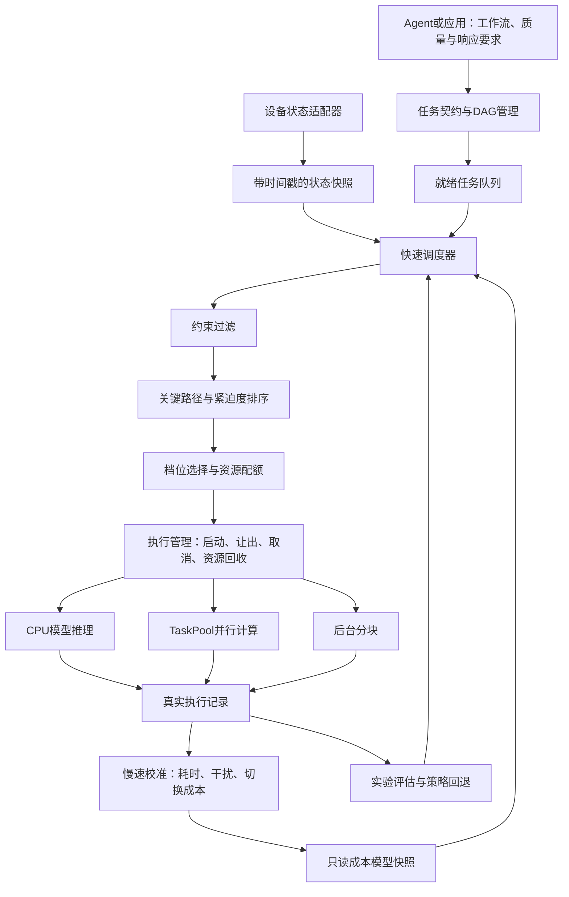

# 调度算法与成本模型设计方案（待审核）

> 日期：2026-09-22
>
> 状态：供团队审核，尚未批准实施。本文提交不代表算法已经实现或性能已经验证。
>
> 代码基线：`harmony/mobile-scheduler` 分支，`8884faa`（上层链路）。
>
> 适用范围：鸿蒙手机 AI 任务资源感知调度中间件。

## 1. 方案摘要与审核范围

建议采用：**面向 Agent 工作流的双时间尺度资源调度，用轻量成本模型预测资源投入的收益，用快速调度器决定执行顺序、执行档位和是否允许并行。**

核心机制是“工作流关键路径感知 + 并发干扰预测 + 边际加速收益分配 + 快慢路径分离”。目标是在结果质量、内存和温度约束内，提高有效吞吐并减少用户等待，而不是单纯提高 CPU 占用率。

建议首版范围：

- CPU 后端；通过运行时线程配置、TaskPool 分区、计算任务准入和后台分块控制应用内资源使用。
- 最多两个计算任务同时运行，先验证一个前台任务与一个后台分块的组合。
- 轻量统计成本模型，不引入深度网络、强化学习或语言模型参与实时调度。
- 关键路径感知、并发干扰预测、动态后台分块、可审计决策和保护回退。
- 质量降档必须经过独立验证；性能对照默认使用相同结果质量。

本文等待团队确认后再实施，不覆盖协作者正在进行的手机适配与模拟工作。性能指标均为待验证目标，不是现有成绩。

## 2. 当前实现与需要解决的问题

当前实现已经具备：

- 应用通过 `TaskTemplate`、`TaskContext`、`ExecutionProfile` 声明任务和合法配置。
- 购物工作流为文本预处理、文本编码、向量检索；另有可检查点恢复的后台缓存构建。
- 设备状态采集、硬约束过滤、任务优先级、取消、过期、后台让出及执行审计。
- 基于声明先验和 EWMA 的耗时预测，以及有样本门槛的用户反馈校准。
- OBSERVE、SHADOW、CANARY、ACTIVE 策略框架；干净启动默认 OBSERVE。

当前主要不足：

1. 成本预测尚不能充分解释不同线程配置、冷启动和并发争用的差异。
2. 单个运行任务槽限制安全利用剩余资源的能力。
3. 现有调度对工作流剩余关键路径的利用不足。
4. 新受约束策略与旧三模式入口并存，现有三模式实验不能直接证明新策略优劣。
5. 缺少统一的独立测试集、真实设备校准、干扰测量和调度自身开销数据。

### 2.1 边界

中间件控制应用内部的任务和运行时配置，不是内核调度器。不承诺 CPU 调频、物理核心预留、大小核绑定或跨应用资源控制。当前真实后端为 CPU；GPU/NPU 不纳入本期实现承诺。

Agent 或应用负责提交工作流和任务语义，中间件不自动理解任意自然语言目标。当前 256/64/16 维是检索计算档位，不是三套不同大小的语言模型。

## 3. 优化目标与约束

采用分层目标，避免用一个综合分数抵消重要约束。

| 层级 | 目标 | 决策方式 |
| --- | --- | --- |
| 第一层 | 执行安全、结果质量、配置合法 | 硬约束，不以速度收益换取违反约束 |
| 第二层 | 前台响应、工作流截止时间 | 优先降低超时风险和用户等待 |
| 第三层 | 有效吞吐、后台进展 | 利用剩余资源，避免长期饥饿 |
| 第四层 | 决策开销、切换开销、资源消耗 | 收益相近时选择成本较低的方案 |

截止时间不可满足时，按任务契约取消、返回过期状态或尽力执行，不修改截止时间来掩盖超时。预测内存预算是准入依据，不构成系统内存隔离或硬实时保证。

## 4. 总体架构与双时间尺度

### 4.1 快速路径

由任务提交、任务完成、资源释放、取消和重要状态变化触发。只读取内存快照，检查约束，评估有限候选，下发决策。

不得执行网络请求、模型加载、文件读写、模型训练或大批量日志整理。状态采集与模型更新不能阻塞快速路径。

### 4.2 慢速路径

整理执行样本、校准模型、计算误差、评估策略和持久化。采用批量、可让出的处理方式，受前台活动约束。必要时放入独立工作任务，不能仅依靠异步函数名称假定不会阻塞事件循环。

每次发布不可变的模型快照，快速路径在一轮决策内使用同一版本，避免读到半更新状态。

## 5. 任务契约与执行能力声明

保留现有接口，增补以下信息。具体字段命名在接口实施阶段确定。

| 信息 | 用途 |
| --- | --- |
| 工作流依赖关系 | 判断就绪节点、关键路径和分支汇合 |
| 工作流响应目标及截止时刻 | 共享剩余预算，避免子任务重复获得完整预算 |
| 经验证的执行档位 | 声明线程、分区、分块、质量与内存需求 |
| 可中断性和检查点 | 判断让出时机、恢复和重做成本 |
| 最长不可中断工作段的估计 | 评估前台阻塞时间 |
| 执行器重入能力与互斥资源标识 | 防止模型实例或共享缓冲区不安全并发 |
| 模型驻留状态 | 区分冷启动与热运行 |
| 取消、过期及降级规则 | 明确可采取的动作和结果语义 |

候选配置必须同时通过应用契约和执行器支持检查。未经质量验证的检索降档只能用于明确标记的独立质量实验，不能进入正式自动选档。

## 6. 成本模型设计

采用**结构化成本模型 + 在线残差校准**。首版重点是少样本可用、计算便宜、可解释和能够回退。

### 6.1 单任务耗时模型

预测形式：

`预计独占耗时 = 固定开销 + 输入规模相关工作量开销 + 加载开销 + 档位切换开销`

特征包括任务类型、输入规模、档位、线程或分区数、温度区间、CPU 负载和模型驻留状态。

实现路线：

1. 使用微基准建立各档位的初始性能表。
2. 按任务类型拟合小型正则化线性模型；参数数量保持有限，不在快速路径训练。
3. 对实际耗时与预测耗时之间的残差进行 EWMA 校准。
4. 样本不足、特征越界或模型版本不匹配时使用保守先验。

线程数使用独立档位特征或独立基准，不假设线性加速。1/2/4 线程分别测量，4 线程只有证明有效且执行器支持后才开放。

### 6.2 并发干扰模型

`预计并发耗时 = 预计独占耗时 × (1 + 预计干扰系数)`

干扰系数按任务组合、总并行配额和设备状态估计。首版只标定有限组合：编码与缓存、检索与缓存，以及两个独立工作流的就绪任务。

需要配对测量独占与并发运行，记录启动时间、实际重叠区间和完整执行时间。不能将“某任务刚好变慢”直接归因于另一个任务。没有足够样本的组合默认不开放计算并发。

### 6.3 不确定性与保守预测

输出预计耗时、保守耗时、样本量、预测来源和误差水平。截止时间判断使用保守耗时。

保守余量由独立残差数据校准并检查覆盖率，不能将“均值加两倍波动”直接命名为经过验证的 P95。超出已有数据范围时增加保守余量或回退。

### 6.4 切换、让出与重做成本

单独记录模型加载、配置切换、任务分区创建、检查点保存、恢复以及取消重做的耗时。只有预期收益超过这些成本和安全余量，才改变配置。

不同线程配置可能对应不同模型实例；模型缓存需要计入内存预算、互斥约束和淘汰规则，不能无限缓存。

### 6.5 数据治理与用户反馈

- 按设备、模型版本和执行器版本隔离数据；版本变化后不得直接混用旧样本。
- 记录实际执行配置与请求配置，回退或配置不一致的样本不能按原配置训练。
- 取消、失败、混合配置和冷启动样本分别标记；不能将未完成任务视为完整耗时样本。
- 用户反馈只作为满足样本门槛后的有界偏好校准，不能覆盖质量硬约束或作为客观性能标签。
- 没有可靠功耗测量时，只报告资源代理指标，不输出虚构的毫瓦或节能比例。

## 7. 快速调度算法

### 7.1 约束处理

形成就绪集合，先处理取消、过期、配置合法性、质量下限、资源互斥、内存预算和设备保护。保护动作不等待普通候选评分。

### 7.2 关键路径与紧迫度

根据 DAG 估计从就绪节点到结果完成的剩余关键路径。顺序依赖累加，独立分支汇合取最长路径；资源竞争另行计入预计等待，不能把理想 DAG 并行时间当成真实完成时间。

`余量 = 工作流截止时刻 − 当前时刻 − 预计剩余关键路径耗时`

余量越小，任务越紧迫。模型或执行状态更新后重估，但通过缓存和受影响节点增量更新控制成本。大型或超限 DAG 需要限制或回退，不能进入无界计算。

### 7.3 排序

采用分层排序：用户等待的关键任务优先，同层按余量排序，再结合重要性与等待老化。保留现有防饥饿机制，记录后台最长等待与实际执行时间。

后台获得进展的机制不能越过保护条件，也不能声称在持续过载下同时保证所有前台截止时间和后台等待上限。

### 7.4 档位选择与边际资源分配

枚举少量合法配置，预测完成时间、对其他任务的延迟影响、内存与切换成本。

`边际收益 = (预计关键路径缩短时间 − 切换成本) / 新增资源配额`

在满足前述分层目标后，优先考虑边际收益高的资源扩张。收益很小或不确定性过大时保留当前档位。不能单纯按比值牺牲截止时间或质量。

典型行为：

- 1→2 线程显著缩短关键路径，可以扩张。
- 2→4 线程收益很小，保留 2 线程。
- 后台并发会明显拖慢前台，暂不启动后台块。
- 两个独立任务并行能提升吞吐且不破坏前台目标，允许并发。

### 7.5 有界搜索

首版建议每轮最多评估 8 个优先候选，每个最多 4 个档位，同时最多运行 2 个计算任务。采用贪心分配与有限组合检查，不穷举全队列组合。

超出窗口的任务仍参与后续排序和等待老化，不能被永久排除。队列、DAG 及日志需要容量上限与明确的过载处理。各上限应配置化并纳入压力测试。

## 8. 执行管理、并发与后台让出

将单个运行任务槽改为受控的运行任务集合，管理 CPU 并行配额、活跃计算任务数、预计内存和互斥资源。

配额是应用内部准入预算，不是 OS 保留核心。TaskPool 分区数与推理线程数也不等于同等物理资源，需通过测量建立成本映射。

开放顺序：安全串行与资源记账 → 一个前台任务加一个后台分块 → 其他经过验证的组合。

### 8.1 动态分块

根据最近每条数据处理耗时选择下一块大小，目标使单块预计耗时落在预算内。初始以 5～10 ms 为待验证目标，并限制最小、最大块大小和单次调整幅度。

前台到来时停止发放新后台块，等待在途块结束，再在资源真正释放后启动前台任务。不可中断模型推理不适用分块让出目标，必须如实记录可能的阻塞时间。

### 8.2 生命周期安全

资源申请、任务启动与释放需要一致的状态机。完成、取消、超时回调只能释放一次。取消未确认时仍保留占用记账；超时执行器应隔离，不通过虚假释放预算掩盖仍在运行的工作。

同一模型实例与共享缓冲区默认互斥，只有声明并验证重入安全后才允许并发。

## 9. 调度自身的性能预算

| 指标 | 定义 | 首轮工程目标 |
| --- | --- | --- |
| 决策计算耗时 | 一轮调度自身的执行耗时 | 约定候选规模下 P95 ≤ 1 ms，P99 ≤ 3 ms |
| 事件到决策延迟 | 请求到来至决策完成，包括事件排队 | 无资源阻塞场景 P95 ≤ 5 ms |
| 决策到实际启动 | 决策完成至执行器开始工作 | 单独报告，区分加载与资源等待 |
| 后台让出延迟 | 前台到来至后台实际释放资源 | 按分块与不可中断任务分别统计 |
| 调度累计开销 | 决策累计耗时与受管任务执行时间之比 | 初始目标 ≤ 2%，同时报告绝对值与测量口径 |

以上均需真机验证。测量必须说明任务规模、计时方式和设备状态；并发任务时间之和与墙钟时间不同，不能混淆开销分母。对极短任务单独报告，避免比例被较长任务掩盖。

快速路径限制日志和分配，缓存状态与预测；状态过期时保守处理。普通重复事件合并，取消和保护事件优先。若目标未达到，先定位事件排队、复制和日志开销，再评估原生实现必要性。

## 10. 受控启用与回退

继续使用现有 OBSERVE、SHADOW、CANARY、ACTIVE 框架。

- OBSERVE：采集真实基线，不由未验证模型接管。
- SHADOW：记录建议方案和基线差异，不宣称建议方案获得了真实执行收益。
- CANARY：仅在已验证配置、足够样本及限定实验范围内实际执行。
- ACTIVE：达到预先冻结的验收门槛后启用，仍受保护、冷却和回退约束。

版本化保存策略与模型信息，配置切换需防抖。出现配置不一致、连续失败、取消无法确认、明显性能退化或状态不可用时，回退到已验证串行保守方案。回退不能中断执行器清理流程。

## 11. 创新点表述与研究参考

建议表述：**结合 Agent 工作流关键路径、并发干扰预测与边际加速收益的资源调度机制，并通过快慢分离实现低开销在线适应。**

三个可验证贡献：

1. 知道加速哪里有用：资源分配围绕工作流完成时间，而不只看单个任务优先级。
2. 知道并行何时有害：用干扰预测选择并行、串行或缩小后台块。
3. 知道何时值得调整：把切换成本和预测误差纳入决策，避免频繁切档。

预测驱动推理调度和端到端流水线目标已有研究基础，可参考 [Clockwork（OSDI 2020）](https://www.usenix.org/conference/osdi20/presentation/gujarati) 与 [InferLine](https://arxiv.org/abs/1812.01776)。本项目聚焦鸿蒙应用内 Agent 工作流、协作式执行与有限资源接口，不能仅凭组合宣称学术首创，也不能套用这些研究的服务器性能结果。

## 12. 实验与验收方案

### 12.1 对照和消融

| 方案 | 验证问题 |
| --- | --- |
| 固定配置、串行执行 | 比简单方案改善多少 |
| 固定线程预算、有限并发 | 收益是否只是来自开放并发 |
| 现有规则调度 | 新方案相对现状的增量价值 |
| 新算法去掉关键路径 | 工作流感知是否有效 |
| 新算法去掉干扰模型 | 并发预测是否有效 |
| 完整方案 | 综合收益与自身开销 |

所有实验记录实际策略版本、实际档位和实际执行路径，先修复旧模式与新策略入口不一致的问题。

### 12.2 工作负载

- 单次搜索与连续请求替换。
- 搜索与后台缓存同时进行。
- 两个独立工作流交错到达。
- 真实独立分支汇合的 DAG；不能将有数据依赖的编码与检索强行并行。
- 冷启动和热运行。
- 状态未知、资源压力上升与恢复。
- 队列突发、取消、故障、超限和持续过载。

### 12.3 数据与判据

性能对比保持结果质量一致，低维检索质量单独评估。使用独立轮次训练和测试，不允许样本泄漏。模拟注入用于逻辑验证，真实设备用于性能结论。

记录响应 P50/P95、截止时间违约率、有效吞吐、后台进展、预测误差与保守预测覆盖率、调度开销和取消确认时间。随机化实验顺序、多轮重复，报告样本量和波动，控制冷热缓存与温度影响。

初始研发目标：混合负载前台 P95 降低 15% 或有效吞吐提升 10%，且质量、失败率、后台进展等关键指标无明显退化。完成基线测量后冻结具体门槛和允许退化范围，不能根据实验结果事后修改口径。若未达到，报告结果并收缩策略，不虚构收益。

## 13. 分阶段实施计划

| 阶段 | 工作内容 | 通过条件 |
| --- | --- | --- |
| 1. 统一入口与测量 | 统一新旧策略入口；完善工作流、排队和执行计时；建立固定基线 | 日志还原任务全过程，实验真正切换目标策略 |
| 2. 成本模型 | 档位基准、冷热模型、残差校准和误差评估 | 独立样本预测优于当前声明常量，开销符合预算 |
| 3. 快速调度 | 关键路径、余量排序和边际资源分配 | 确定性场景通过，取消和保护回归通过 |
| 4. 有限并发 | 多执行槽、预算、互斥、动态分块和干扰模型 | 无预算泄漏或重复执行，混合负载收益得到验证 |
| 5. 受控启用 | 影子比较、小范围执行、回退及消融实验 | 达到预先冻结的质量、性能和开销标准 |

每阶段提交独立的代码、测试和验证记录。手机暂不可用时可先完成接口、确定性测试和模拟逻辑，但不能跳过真机性能门槛直接宣称阶段收益成立。

## 14. 代码映射与团队协作

| 现有模块 | 建议处理 |
| --- | --- |
| `SchedulerTypes`、任务模板与档位契约 | 保留并增补 DAG 预算、互斥、驻留和中断相关信息 |
| `SemanticPolicy` | 演进为可版本化的轻量成本预测与校准接口 |
| `ConstrainedPolicy` | 保留硬约束和受控启用；调整候选选择与收益判断 |
| `TaskQueue` | 加入余量排序、工作流紧迫度与可验证公平性 |
| `SchedulerService` | 从单执行槽演进为有预算、互斥和明确生命周期的执行管理 |
| 设备适配、检查点、执行审计 | 保留，补充时间戳和实际配置证据 |
| `ShoppingTaskService` 与执行器 | 声明并验证能力，购物仍作为示例负载 |
| 实验服务及手机验证手册 | 对齐统一策略入口、实验版本与新增测量字段 |

建议分工：调度开发侧负责接口、模型、执行管理和确定性测试；手机适配侧负责 SDK/运行时兼容、模型真实执行和基准数据回传；双方共同冻结任务输入、质量基准与指标定义。具体人员和日期由团队安排。

相关文档：

- [作品说明与开发基线](02-作品说明与开发基线-鸿蒙手机资源感知调度中间件.md)
- [受约束策略闭环实施方案](09-HarmonyOS受约束策略闭环实施方案.md)
- [手机验证操作手册与结果回传](11-手机验证操作手册与结果回传.md)

## 15. 审核结论记录

当前结论：**待审核，未启动本方案的算法实施。**

待团队确认：

- 是否批准 CPU 后端、最多两个计算任务并发的首版范围。
- 是否采用轻量成本模型、关键路径、并发干扰与边际收益作为算法主线。
- 是否按五阶段实施，并以真实测量作为开放并发和策略接管的前提。
- 是否接受本文指标为研发目标，基线测量后冻结正式验收标准。

审核人、日期、修改意见及最终批准范围：待补充。
