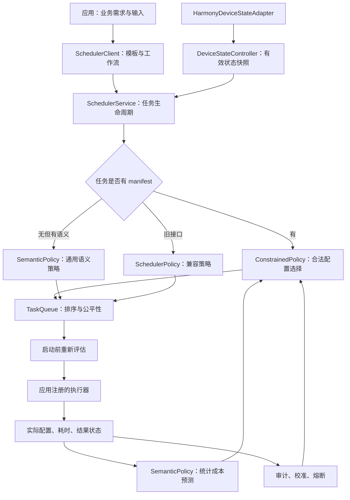

# 调度算法源码导读与跨设备、跨内核适配

> 核对日期：2026-09-22。
>
> 代码位置：`Cixin/Cixin/harmony-agent`，分支 `harmony/mobile-scheduler`，核对时 HEAD 为 `04cf2cc`。本文依据当前工作区实际源码，不把设计方案当作已实现功能。
>
> 本轮只增加研究资料，不修改算法、策略默认值或执行行为。已有电脑监控界面改动保持不变。

## 1. 先给结论

当前调度件是**应用内、资源感知、具有业务语义的任务调度中间件**，不是操作系统内核调度器，也不是一个训练好的神经调度模型。

核心方法是：应用声明任务和合法执行配置，调度器结合设备状态过滤不可行方案，使用轻量统计预测估算代价，再按策略模式决定执行配置和排队顺序，最后依据实际执行记录做校准、审计和熔断。

| 对象 | 当前作用 | 不应理解为 |
| --- | --- | --- |
| 商品 Embedding 模型及商品向量 | 查询编码、商品相似度检索，是被调度的业务负载 | 理解任意任务、分配优先级的调度模型 |
| `ConstrainedPolicy`、`SemanticPolicy` 等源码 | 约束决策、轻量代价预测、业务优先级 | 内核线程调度算法或端侧大语言模型 |
| [文档 14：多设备分层调度设计](14-调度算法与成本模型设计方案-待审核.md) | 待审核的下一阶段方案 | 已实现的设备池、远端执行或并发干扰模型 |

**不同系统内核可能影响时延和可用能力，但通常不需要每种内核重写一套业务调度算法。应共享决策逻辑，分别适配接口和执行器，并按设备与运行环境校准参数。**“共享算法”不等于一个 ArkTS 包能原样运行在所有设备上。

## 2. 源码位置与阅读顺序

以下链接指向仓库中的真实文件。研究包保留相同目录结构，解压后也可使用这些相对链接。

### 2.1 最重要的文件

| 顺序 | 文件 | 重点关注 |
| --- | --- | --- |
| 1 | [SchedulerTypes.ets](../apps/harmony/scheduler/src/main/ets/api/SchedulerTypes.ets) | `TaskTemplate`、`TaskContext`、`ExecutionProfile`、`DeviceState`、`ResourcePrediction`、`PolicyDecisionAudit` |
| 2 | [ShoppingProfiles.ets](../apps/harmony/entry/src/main/ets/services/ShoppingProfiles.ets) | 应用声明的默认、保守及候选配置，质量验证标记 |
| 3 | [ConstrainedPolicy.ets](../apps/harmony/scheduler/src/main/ets/policy/ConstrainedPolicy.ets) | 主策略：`evaluate`、`utility`、`matches`、`observe`、`checkRegression` |
| 4 | [SemanticPolicy.ets](../apps/harmony/scheduler/src/main/ets/policy/SemanticPolicy.ets) | `predictProfile`、`predict`、`observe`、`key`，以及无 manifest 任务的策略 |
| 5 | [SchedulerService.ets](../apps/harmony/scheduler/src/main/ets/api/SchedulerService.ets) | `evaluate` 分流、`refreshQueuedPlans`、`drainQueue`、`executeTask`、`protectRunningTask` |
| 6 | [TaskQueue.ets](../apps/harmony/scheduler/src/main/ets/queue/TaskQueue.ets) | 排序、老化、暂停任务与等待过久任务的处理 |

只读三个文件时，先看 `ConstrainedPolicy`、`SemanticPolicy`、`SchedulerService`。算法不是集中在一个文件里：选择、预测、执行管理分别承担不同职责。

### 2.2 接入、适配与验证文件

| 文件 | 用途 |
| --- | --- |
| [SchedulerClient.ets](../apps/harmony/scheduler/src/main/ets/api/SchedulerClient.ets) | 模板/执行器注册，工作流提交，依赖顺序、去重与上下文信号 |
| [ShoppingTaskService.ets](../apps/harmony/entry/src/main/ets/services/ShoppingTaskService.ets) | 购物应用接入示例；业务输入交给执行器，SDK 不依赖商品类型 |
| [SearchPreferences.ets](../apps/harmony/entry/src/main/ets/services/SearchPreferences.ets) | 搜索目标、软截止、硬截止及质量要求 |
| [ProfileContract.ets](../apps/harmony/scheduler/src/main/ets/policy/ProfileContract.ets) | 配置校验、默认 OBSERVE 设置与稳定分组 |
| [HarmonyDeviceStateAdapter.ets](../apps/harmony/scheduler/src/main/ets/state/HarmonyDeviceStateAdapter.ets) | 鸿蒙电量、热等级、CPU、内存采集与归一化 |
| [DeviceStateController.ets](../apps/harmony/scheduler/src/main/ets/state/DeviceStateController.ets) | 真实/注入状态、字段有效期与未知状态 |
| [HysteresisController.ets](../apps/harmony/scheduler/src/main/ets/policy/HysteresisController.ets) | 配置冷却，以及无 manifest 路径的升档稳定窗口 |
| [FeedbackController.ets](../apps/harmony/scheduler/src/main/ets/policy/FeedbackController.ets) | 是否值得提问、问题优先级、授权与频率限制 |
| [FeedbackCalibration.ets](../apps/harmony/scheduler/src/main/ets/policy/FeedbackCalibration.ets) | 按反馈维度有界调整权重，不直接改安全约束 |
| [SchedulerPolicy.ets](../apps/harmony/scheduler/src/main/ets/policy/SchedulerPolicy.ets) | 旧兼容策略，不是当前 manifest 主路径 |
| [NeuralEmbeddingIndex.ets](../apps/harmony/entry/src/main/ets/services/NeuralEmbeddingIndex.ets) | 实际向量检索、TaskPool 分区与后台分块缓存 |
| [MindSporeEmbeddingEngine.ets](../apps/harmony/entry/src/main/ets/services/MindSporeEmbeddingEngine.ets) | CPU 模型运行时与线程配置，不负责调度决策 |
| [ConstrainedPolicy.test.ets](../apps/harmony/scheduler/src/test/ConstrainedPolicy.test.ets) | 观测/影子模式、配置一致性、熔断、反馈等测试 |
| [SemanticScheduler.test.ets](../apps/harmony/scheduler/src/test/SemanticScheduler.test.ets) | 隐私、质量底线、工作流、取消、过期与检查点测试 |

## 3. 运行链路和各层职责



应用负责“想做什么、什么结果才有用”；调度器负责“何时做、用哪个允许的配置做、何时不该继续”；执行器负责实际运算及遥测；操作系统最终负责线程何时获得 CPU、内存管理和硬件资源管理。

电脑仪表盘是遥测展示端，不是手机算法的执行位置。关闭仪表盘不应改变调度决策。

## 4. 算法的输入：业务信息与系统信息

### 4.1 应用提供业务契约

| 信息 | 含义与用途 |
| --- | --- |
| `userWaiting`、`userVisible` | 用户是否正在等、结果是否在当前交互中可见 |
| `businessImportance` | 应用估计的重要性，不是操作系统线程优先级 |
| `targetLatencyMs` | 期望响应目标，用于代价和优先级计算 |
| `softDeadlineMs` | 体验观测和慢响应参考线，不等于立即停止线 |
| `deadlineMs` | 请求的硬截止预算；“硬”指业务契约，不代表硬实时保证 |
| `freshnessMs` | 超过多久结果不再有用 |
| `accuracyFloor`、`highQuality` | 质量底线，不能用更快来抵消违反底线 |
| 输入规模、模型版本 | 估算工作量，区分历史样本 |
| `interruptibility`、检查点 | 能否在安全边界让出，恢复时从哪里继续 |
| 输入替换、离页、结果展示/消费 | 识别无用工作、废弃结果及是否有必要提问 |
| 隐私策略、网络许可 | 约束允许的执行位置与数据处理方式 |

这比单纯“根据温度调线程”更有价值：操作系统知道线程繁忙，却通常无法直接判断某次商品检索是否已被新输入替代、某个后台缓存块是否可以稍后再算。应用也能把部分意图上报给系统，因此不能绝对说操作系统永远无法知道；中间件的作用是统一、细粒度地使用这些业务契约。

当前不是模型自动从任意自然语言中生成这些字段。工作流和执行配置主要由应用开发者声明。

### 4.2 适配器提供状态观测

目前采集电量/充电、系统热等级、系统与应用 CPU 使用率、系统总/空闲/可用内存。周期刷新约 1 秒，并监听热状态和电池事件。

- 热信息是系统热等级，不是完整芯片温度曲线。
- 内存压力是适配器按可用量和比例计算的等级，不是所有设备统一提供的原生信号。
- 内存占用与 CPU 使用率不能等同于界面掉帧；当前这条链路没有实际帧时延采集。
- 真实可用推理后端只声明 CPU，GPU/NPU 枚举不代表已接通。
- 读取失败返回 `null`/`UNKNOWN`，不假装是零负载。CPU/内存有效期为 3 秒，电量/充电/热等级为 30 秒；受约束策略还检查关键观测的 10 秒陈旧门槛。

## 5. 主算法：受约束的执行配置选择

`SchedulerService.evaluate()` 分流如下：

```text
有 template + context + manifest -> ConstrainedPolicy.evaluate()
有 template + context，无 manifest -> SemanticPolicy.evaluate()
旧 TaskProfile 接口 -> SchedulerPolicy.evaluate()
```

旧 `FIXED_PERFORMANCE / FIXED_POWER_SAVING / ADAPTIVE` 与新 `OBSERVE / SHADOW / CANARY / ACTIVE` 不是同一组开关。改变旧三模式不能证明受约束主策略发生变化。

### 5.1 第一关：必须满足的约束

`ConstrainedPolicy.evaluate()` 考虑：

1. 请求是否被替代，是否超过截止时间或结果有效期。
2. 热等级是否 CRITICAL；内存压力是否 CRITICAL，或可用内存是否低于 192 MB。
3. 候选配置是否满足质量底线、后端可用性、前后台支持条件。
4. 高温、高内存压力、可用内存低于 512 MB，或未充电且电量不高于 20% 时，只保留允许在压力下执行的配置。
5. 预测耗时是否放得进剩余截止/有效期预算；预测内存若已知，是否不超过可用内存的 50%。

没有合法候选就拒绝，不靠降低质量底线或隐瞒超时制造成功。上述数字是工程默认值，**不是适用于所有设备的物理安全标准**。

manifest 当前只允许本地叶子任务，不能直接用于远端任务或整个工作流。远端隐私检查在其他接口/语义路径中，不应把本地策略说成已实现全局设备放置。

### 5.2 第二关：建立保守基线

先找应用声明的 `defaultProfileId`。状态未知、资源承压或默认配置不可行时，优先使用仍满足约束的 `fallbackProfileId`。必要时寻找转换图中的相邻合法配置。

**fallback 也必须经过可行性检查，不是任何情况下都能强制执行的配置。**

### 5.3 第三关：候选效用评分

```text
score = waiting + visibility + importance
        - targetPressure - freshnessRisk - qualityLoss
        - energyCost - thermalRisk - memoryRisk - feedbackPenalty

waiting       = 前台且用户等待 ? 30 : 0
visibility    = 前台且结果可见 ? 15 : 0
importance    = businessImportance * 20         // 未填时为 10
targetPressure = min(20, (已用时间 + 预测耗时) / 目标耗时 * latencyWeight)
freshnessRisk  = min(15, 预测耗时 / max(1, 剩余有效期) * 15)
qualityLoss    = (2 - 质量档位排名) * qualityWeight
energyCost     = 相对能耗代价 * 0.2
thermalRisk    = 预测中的热风险分值 * 2
memoryRisk     = 预测内存 / max(1, 可用内存)      // 任一未知时为 1
```

质量排名为 HIGH_ACCURACY=2、BALANCED=1、LIGHTWEIGHT=0。未声明目标耗时/有效期时，相应罚项为 0。反馈未达到门槛时，`latencyWeight=5`、`qualityWeight=3`、`feedbackPenalty=0`。

分数越高通常越优，但候选还受相邻配置转换、策略允许列表等限制；合法 `preferredProfileId` 可以优先于纯分数最高项。这是可解释的工程启发式，不是已证明最优的数学求解器。

### 5.4 第四关：模式决定建议能否执行

| 模式 | 当前行为 |
| --- | --- |
| OBSERVE | 执行基线，继续资源保护和观测，不执行新的优化候选 |
| SHADOW | 计算并记录候选，仍执行基线 |
| CANARY | 按比例试验；候选须质量已验证、低风险、后台任务且支持 CHECKPOINT |
| ACTIVE | 允许已批准的策略执行；仍受比例、样本、冷却、质量及熔断限制 |

干净启动默认 `local-observe-v1` / OBSERVE，比例 0，最少样本数 10，冷却 30 秒，观测窗口 50，连续失败阈值 3。ACTIVE 需宿主声明验证通过；CANARY/ACTIVE 都需明确试验窗口和退化阈值。这些门禁不自动构成真机效果证明。

当前初始化配置没有把受约束模式切到 ACTIVE。准确描述是：**已有受约束闭环框架，默认保守观测，安全回退仍会生效**，而非“安装后已持续学习最优调参”。

## 6. 成本模型：分桶统计预测，不是大模型

### 6.1 没有历史样本时

`SemanticPolicy.predict()` 使用声明先验：

```text
预测耗时 = 声明耗时 * 输入规模系数 * CPU负载系数 * 热系数 * 1.5
CPU负载系数 = CPU使用率未知 ? 1.2 : 1 + CPU使用率 / 100
热系数      = HOT ? 1.8 : WARM ? 1.2 : 1
```

输入规模系数取 token 数、候选数和输入形状元素数相对基线的最大比例，乘批大小，最小值为 0.25。这是粗略工作量缩放，不是计算图精确建模。

例如声明 40 ms、基准输入、CPU 使用率 50%、热等级 WARM，先验为 `40 * 1 * 1.5 * 1.2 * 1.5 = 108 ms`。这是公式示例，不是真机实测。

### 6.2 有实际执行样本时

指数加权移动平均 EWMA 更新：旧均值为 `m`，旧绝对偏差估计为 `d`，新切片耗时为 `x`。

```text
d_new = 0.75 * d + 0.25 * abs(x - m)
m_new = 0.75 * m + 0.25 * max(1, x)
保守估计 = m_new + max(2 * d_new, 0.15 * m_new)
最终 latencyMs = max(1, 保守估计, 窗口P95)
```

`d` 是平滑绝对偏差，不是标准差。每个桶最多保存最近 50 个耗时样本，最多保留 256 个桶。少于 5 个样本时，P50/P95 字段使用公式替代值，不是可靠的实测分位数。

桶键包含任务能力、模型版本、profile/质量档位、后端、线程数、输入规模、热状态、CPU 桶、真实/注入来源、内存压力、前后台及电量桶。

### 6.3 必须注意的局限

- `relativeEnergyCost` 是相对代价，不是测得的焦耳、功率或续航收益。
- `thermalRisk` 是当前热状态到固定分值的映射，不是未来温度轨迹预测。
- `deadlineMissRisk` 是耗时/预算比值，不是校准后的违约概率。
- `confidence` 随样本数增加，不是统计置信区间。
- 线程数和 profile 区分历史桶，但冷启动先验没有独立的并行加速、模型冷加载或跨任务干扰模型。同一质量级下 1/2 线程可能使用相同先验。
- 观测主要训练执行切片耗时，未完整预测整个工作流的未来排队、后续阶段和界面呈现耗时。
- 观测 Map 在进程内，重新初始化会清空；持久化熔断不等于持久化全部成本学习结果。
- 当前桶键没有设备型号、OS 构建或内核版本。每台设备独立运行不会天然共享样本，但未来汇集数据时必须增加环境隔离。

当前是“轻量在线统计校准”初版，不是“预测未来若干秒系统轨迹并优化整段计划”的预测控制系统。

## 7. 优先级和排队：与配置评分分开

受约束路径的优先级分数为：

```text
priorityScore = (userWaiting ? 30 : 0)
                + (userVisible ? 15 : 0)
                + businessImportance * 20
                + min(20, (已用时间 + 预测耗时) / 目标耗时 * 5)
```

没有目标耗时或可执行预测时，最后一项为 0；importance 未填按 0.5。至少 60 为 CRITICAL，至少 40 为 HIGH；其余后台任务为 LOW，其他为 NORMAL。这是 SDK 内部等级，不直接变成内核实时线程优先级。

`TaskQueue` 有 utilityScore 时按 `utilityScore / 25 + 老化加分` 排序，否则按优先级排名加老化分。每等待 30 秒增加一档，最多三档；同分按入队顺序。另有公平性规则：可运行任务等待达到 30 秒后，最早等待的任务优先获得下一空闲槽。保护暂停不能被老化绕过。

这不是严格的最早截止时间优先 EDF。无 manifest 的 `SemanticPolicy.evaluate()` 另有包含任务类型先验、截止压力和消费历史的效用公式，不能把两条路径的权重混为一谈。

## 8. 执行、保护和反馈

### 8.1 执行前重评估，当前只有一个运行槽

`drainQueue()` 刷新排队任务计划，检查过期、最新资源状态及执行器支持情况，然后 `await executeTask()`。当前同一 SchedulerService 同时只有一个运行任务槽。

单个任务内部仍可使用 MindSpore 多线程或 TaskPool 分区，但不等于两个独立计算任务并发。工作流按拓扑顺序逐节点等待，也没有并行 DAG 调度与剩余关键路径成本模型。

### 8.2 计划必须与实际执行一致

执行完成后校验 profile、档位、后端、worker 数，以及声明的候选数、检索维度、批大小等。`serial_fallback` 不被当作原计划成功执行。通过后才将 `actualConfirmed` 置为 true，并在适当条件下学习耗时。

这是执行器遥测层确认，不代表观测到每条物理 CPU 核心的运行。配置线程数也不代表操作系统保证分配相同数量的核心。

### 8.3 停止和回退的真实含义

- 运行中出现临界热/内存状态，会请求停止并熔断相关配置。
- 取消/超时先进入 STOP_REQUESTED。执行器真正结束前不释放运行槽；约 2 秒仍未确认会记录取消未确认并熔断。
- 不可中断的模型调用可能只能等返回后丢弃结果，不能承诺瞬间终止。
- CHECKPOINT 任务能在分块边界保存进度并重新入队，让前台任务先运行；目前检查点仅在进程内。
- 策略回退指恢复合法保守配置，不是回滚整个 App、系统内存或任意外部副作用。撤销业务写入仍需业务事务或补偿机制。

连续失败，以及同类状态分层下 P95、失败率、取消率、负反馈退化，可触发停止使用某配置。现有比较是描述性观测，不是严格因果证明或统计显著性检验。

### 8.4 只问系统不能直接判断的主观信息

优先在客观慢响应迹象后问“等待是否可以接受”；其次在应用上报质量不确定时问结果是否符合需求。不问温度、内存和卡顿，指标缺失也不以问卷补齐。

须授权、任务成功且结果展示后才有机会提问。每 UTC 日最多 2 次、同能力每日最多 1 次、间隔至少 30 分钟、邀请 2 分钟失效。优先级不会绕过频控。

同一分层/profile 的等待与质量反馈分别积累。达到样本门槛后，时延权重范围 5..10、质量权重范围 3..9、profile 罚分范围 0..3；不因一次回答突破硬约束。OBSERVE 下记录和校准也不会自动将候选投入执行。

## 9. 用购物任务串起来理解

当前真实搜索链路是：

```text
文字查询 -> query_prepare -> text_encode -> vector_retrieve -> 展示商品
```

这不是已接通的相机识图链路。`query_prepare` 做文本预处理；`text_encode` 调用本地 Embedding 模型；`vector_retrieve` 做向量检索及业务过滤。调度器不解析图片，也不自动拆解任意自然语言任务。

搜索上下文默认目标 500 ms、软截止 1500 ms、硬截止 3000 ms、有效期 4000 ms，重要性 0.8，用户可见且等待，网络关闭。这是工程配置，不是实测性能承诺。所有节点继承工作流提交时间，后续节点没有重新获得一整份截止预算。

| 任务 | 默认配置 | 保守配置 | 其他候选与限制 |
| --- | --- | --- | --- |
| 文本编码 | ENCODE_DEFAULT：CPU、2 线程、高质量 | ENCODE_SAFE：CPU、1 线程、同质量 | 两个配置使用同一模型 |
| 向量检索 | SEARCH_HIGH：2700 候选、256 维、2 分区 | SEARCH_SAFE：2700 候选、256 维、1 分区 | SEARCH_BALANCED：64 维/2 分区；SEARCH_FAST：16 维/1 分区，尚未标记质量验证通过 |
| 后台缓存 | WARMUP_128：每块 128 行、1 worker | WARMUP_32：每块 32 行、1 worker | 低风险、支持检查点；承压且允许暂停时可能直接暂停 |

256/64/16 是检索维度，不是三种语言模型。OBSERVE 采用基线；资源压力下可用保持质量的保守配置。低维候选不能仅凭速度快就自动开放到受控试验。

## 10. 不同内核是否影响调度决策

### 10.1 校正“鸿蒙选择多个内核”的理解

OpenHarmony 官方架构说明采用 Linux/LiteOS 等多内核设计，由 KAL 屏蔽差异、提供基础能力。这是系统面向不同产品裁剪和适配的架构，不应理解成 App 每次任务都选择或切换一次内核。[OpenHarmony 官方架构说明](https://docs.openharmony.cn/)

还需区分 OpenHarmony 和不同代际的商用 HarmonyOS。华为 HarmonyOS 5 官方页面明确提到鸿蒙内核，不能将旧 Linux/LiteOS 描述无条件套到所有当前华为手机、电脑和手表。具体组合需按设备、系统版本及官方能力信息核实，不能只看设备类型。[HarmonyOS 5 官方说明](https://consumer.huawei.com/cn/harmonyos-next/)

### 10.2 会影响什么

以下是针对本项目的工程分析，不是对某种内核必然更快的性能结论。

| 差异 | 可能影响 | 中间件应对 |
| --- | --- | --- |
| 线程调度、唤醒与优先级机制 | 启动等待、抢占、尾延迟和抖动 | 测量等待/执行分布，只使用已开放且验证的优先级或 QoS 能力 |
| 定时器与时钟 | 回调精度、计时是否受校时影响 | 分开单调耗时计时与日志墙上时间，不把回调准时性当硬保证 |
| 内存管理与分配器 | 页错误、分配峰值和观测口径 | 统一单位，按设备内存等级校准准入预算 |
| 驱动、模型运行时、TaskPool | 并行收益、初始化开销和取消边界 | 用执行器契约和真实配置遥测建模 |
| 后台/电源管理与权限 | 任务能否运行，接口/持续采样是否可用 | 适配生命周期，允许 UNKNOWN，必要时暂停 |
| 芯片、散热、内存带宽和负载 | 耗时、能耗与持续性能 | 设备级校准，区分冷/热启动与热状态 |

很多差异属于**系统服务、运行时或硬件**，不能全归因于内核。相同内核的两款设备也可能差异很大；不能根据内核名称用固定倍率换算耗时。

业务截止目标与设备预测也要分开：任务要求 500 ms，慢设备仍是这个目标。可以换合法配置、拒绝不可行任务，或由应用明确协商新的体验模式；不能暗中放宽 deadline 让统计达标。

### 10.3 不建议按内核复制完整算法

```text
通用决策核心
  任务契约、隐私/质量约束、候选筛选、优先级、公平性、审计和熔断
        |
能力与执行适配层
  状态采集、时钟、生命周期、执行器、取消/检查点、存储
        |
设备与运行环境配置
  实际后端、线程/分块候选、内存预算、热策略、成本参数和样本
```

能力探测应优先于 `if (kernel == ...)`。官方 SysCap 文档说明设备具备不同系统能力，可用 `canIUse` 检查相应能力。[华为 SysCap 文档](https://developer.huawei.com/consumer/cn/doc/harmonyos-references-V14/js-apis-syscap-V14)

SysCap 不等于调用必然成功，也不等于速度保证；还须核对 SDK/API 版本、权限、运行时初始化和执行器自检。没有接口或权限就报告未知，不把缺失信息解释为安全空闲。

### 10.4 哪些情况需要不同实现

| 目标情况 | 合理做法 |
| --- | --- |
| 运行环境兼容的手机/平板/电脑 | 尽量复用 ArkTS 策略，适配能力、执行器与设备参数，分别测试 |
| 不提供相同 ArkTS/Kit/模型运行时的轻量设备 | 精简或移植运行时，可能采用 C/C++；复用契约和策略思想，不直接部署当前 HAR |
| 权限/后台策略不同的设备 | 单独实现状态与执行适配，不假设手机接口普遍可用 |
| 要求硬实时的控制系统 | 独立分析最坏执行时间、抢占、隔离和系统可调度性；经验 P95 不构成保证 |

不能认定所有手表都是轻量内核设备，也不能认定所有电脑都能运行当前手机工程，需要按具体产品验证。

## 11. 当前距离跨设备复用还差什么

以下是建议，不是本轮实现：

1. **显式能力画像**：验证过的运行时/后端、线程候选、检查点/取消能力、可观测字段与权限。现有 `DeviceState` 偏动态状态，不是完整跨设备画像。
2. **参数化保护边界**：统一抽离 192/512 MB 等阈值，结合总内存比例、应用预算和设备实验确定；不能把手机绝对值原样用于小内存设备。
3. **设备级成本隔离**：记录性能类别、OS/API 构建、运行时、模型、profile、输入规模和冷启动状态；可获取的内核版本作为诊断信息，不是唯一分组依据。
4. **时间适配层**：当前较多使用 `Date.now()`。短时预算宜用平台支持的单调时钟，绝对策略有效期和日志日期另行处理，不能一概替换。
5. **完整预测与评估**：区分排队、初始化、计算、切换、后台干扰和 UI 呈现；支持远端后再计入序列化、传输、远端排队与返回成本。
6. **跨环境测试矩阵**：同质量比较 P50/P95、违约率、取消确认时间、峰值内存、后台吞吐及调度开销；真实/注入数据分开，不用模拟器代表所有设备。
7. **独立设备放置层**：本地策略决定“这台设备怎么运行”，设备池层决定“交给哪台设备”；远端发现、信任、模型驻留、传输与故障处理仍需实现，参考文档 14 待审核方案。

系统变化后应让旧成本数据失效或降低置信度并重新校准，而非重新训练一个巨型调度模型。首选轻量基准加在线统计；只有现有方法在独立测试集上明显不足，再评估更复杂模型。

## 12. 研究与验证建议

先跟一次文字搜索：`ShoppingTaskService.search()` 查看上下文，跟到 `SchedulerClient.execute()`，再读 `SchedulerService.evaluate()` 分流，最后看 `ConstrainedPolicy` 如何产生计划。

推荐阅读已有测试：

- `observeExecutesDefaultAndOmitsRawInput`：默认观测与输入隔离。
- `shadowRecordsAlternativeWithoutExecutingIt`：建议不等于实际执行。
- `legacyPolicyModesDoNotOverrideManifestObservationBaseline`：旧三模式不覆盖主策略。
- `retainsExecutionSlotUntilTimedOutWorkSettles`：超时请求不冒充真正停止。
- `letsInteractiveWorkRunBetweenCheckpointSlices`：后台分块让出。
- `rejectsPredictedDeadlineMissAndMemoryOvercommit`：预测准入约束。

主机测试入口：[test-semantic-scheduler.ps1](../scripts/test-semantic-scheduler.ps1)。需要相应 DevEco/SDK 环境，不能作为普通 Node TypeScript 执行。源码研究包不包含完整 SDK、依赖、模型权重或可安装产物，不是独立构建工程。

本轮核查调用关系、公式、默认配置与文档链接；未修改 `.ets`，未重跑原生构建、测试套件或真机性能实验。历史测试见项目日志，不能理解为本轮新增的跨设备验证。

最终定位：**当前是可解释、有业务契约与执行保护的手机应用内调度初版；跨设备复用应通过通用核心、平台适配和设备校准扩展，而不是按内核名称复制多套算法。**
