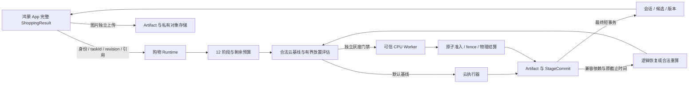

# 鸿蒙架构改造实施与验收记录

更新：2026-09-29。原协作仓库 `fangluyang7-debug/Cixin`，分支 `codex/cixin-multi-device-runtime`。开工前已 fetch 并 fast-forward 至 `67a6738`。依据《最终架构修改方案》和《鸿蒙AI多设备调度_对话整合与改进策略》推进。

仅修改鸿蒙工程。保留先前真机调试修复和用户签名；Cixin 作品未纳入修改。没有部署、调用付费模型、生产数据库迁移或恢复真机调试。提交与推送状态以本分支 Git 记录为准；本记录的测试证据对应本轮架构改造。

## 实施内容

| 工作包 | 代码与本地验证 | 实际部署/设备边界 |
|---|---|---|
| S0 | 原分支基线、隔离测试、保留既有改动 | 生产状态未改 |
| S1 | 通用 Task/Artifact 协议；16 个购物家族契约；同源生成 TS/ArkTS 类型和校验器；字段 fixtures、真实候选 HTTP 回归 | 仍需真实模型返回样本覆盖；未知元数据不伪造 |
| S2 | 图片独立上传/复用；真实字节 hash；JSON canonical 化；owner/版本/依赖校验；pins、7 天保留及可选逻辑过期 GC；worker staging+manifest | 业务拥有的 COS 原图不自动物理删除；COS 孤儿对象清理还需部署侧生命周期策略 |
| S3 | 12 阶段不可变引用；WorkflowExecution/TaskAttempt/StageCommit；持久化 TaskInstance；epoch fence；最终业务写入与 StageCommit 同一短事务；模型调用不占数据库事务 | 图像主流程具备原子最终提交；旧会话修改若中途失败进入隔离/待对账，不宣称已自动回滚 |
| S4 | 手机/服务端单调时延；prepare/上传/规划扣减预算；恢复不刷新到期；事实分段时延与 workflow/attempt/placement 关联 | 手机调度器仍有兼容墙钟字段，跨机时钟不用于推导单程延迟 |
| S5 | 配置式可信 CPU worker；实际裁剪/分块归一化；原子租约；取消→物理结算；迟到 fence；重启回执；撤销与配额 | 已测本机独立进程；无新增真实手机/PC 双机派发证据 |
| S6 | 真实云基线、有界 DAG/beam/预算；数据位置与方向成本；缓存副本避免重复传输；裁剪正式路径评估剩余云阶段；独立灰度门禁；本地 batch 与方向干扰修正 | 缺少完整实测样本时不开放优化派发；不报告加速比 |
| S7 | 阶段提交恢复、归一化完整块恢复；实际 index 内容 hash；模型/配置指纹；价格时效；取消不恢复；恢复/重算成本选择器接入纯裁剪失败后的合法重算 | 默认恢复关闭；不支持任意模型进程热迁移；未上传检查点不视为可用 |
| S8 | 完整 ShoppingResult、Product 显式投影；会话版本/修订；画像/主体/继续提问/分页/价格/云清单入口；错误不伪装空列表 | 真机全业务链和真实双机网络/性能门禁尚未验收 |

## 会话一致性与对账边界

新开关 `SESSION_REVISION_ENABLED` 开启后，所有带 sessionId 的旧 REST 路径经过身份保护和并发门禁；新 shopping/tasks 的主体、画像、筛选、turn、more 路径也使用同一门禁。支持 `idempotency-key`、`x-session-version`、`x-request-revision`；新任务接口对应 taskId/baseVersion/requestRevision。兼容客户端不提供版本时，服务端分配串行 revision。

- 成功回执与会话版本一起持久化，重复 key 返回原结果；同 key 不同请求、旧版本、重复 revision 拒绝。
- 未确认完成的旧操作不能因锁超时被另一请求接管。
- 图像最终结果使用短事务；旧业务服务在多步修改期间失败可能已有局部写入，因此保留锁并返回 `SESSION_RECONCILIATION_REQUIRED`。读取也阻止展示半成品。当前没有自动修复这些旧操作的通用补偿器，须核对写入后再处理；不能直接删锁后重放。
- 新 App 防止旧版本/旧 generation 覆盖当前视图；分页按候选身份追加。清单保存成功后才更新本地状态。

## 恢复、模式和保留

ARTIFACT_PROTOCOL_ENABLED、WORKFLOW_PROTOCOL_ENABLED、WORKFLOW_RECOVERY_ENABLED、SESSION_REVISION_ENABLED、ARTIFACT_GC_ENABLED 独立，示例默认关闭；PLACEMENT_POLICY_JSON 默认 OBSERVE + kill switch。开关只控制新路径，关掉开关不删历史证据。

阶段恢复先查最终提交；取消或到期不重试。新 epoch 拦截旧提交，保留首次截止时间，最多 3 个协调 epoch。SHOPPING_PIPELINE_VERSION 必须明确冻结实现版本；未配置时指纹含当前进程标识，跨重启不冒险复用。实际向量内容、模型名称/类型/预处理纳入兼容指纹。超过 30 秒的价格阶段检查点要求新请求，不承诺价格实时性。

Artifact 7 天期限用于工作流回执，不替代业务数据保留。pins 阻止逻辑 GC；终态工作流达到保留期后释放其 pins。GC 不删除原有会话、商品和 COS 原图。Worker 有独立存储/回执配额，满额时拒绝而非擅自丢弃幂等证据。

## 可复现检查

在 harmony-agent 根目录运行：

```powershell
npm run contracts:generate
npm run architecture:test
npm run api:build
npm run api:test:e2e
npm run scheduler:typecheck
npm run cloud-shopping:typecheck
npm run algorithm:test
npm run concurrency:test
.\scripts\native-check.ps1 -StudioHome 'D:\Users\17321\AppData\DevEco Studio' -Task all
```

`architecture:test` 包含真实独立 CPU worker、协议、空/旧隔离 SQLite 增量与重复迁移、上传/完整结果、放置回放及全部服务端单元测试。阶段测试使用真实 SQLite/提交事务和受控模型替身，不能描述为真实视觉模型验收。

最新结果在本文件末尾更新；本机完整日志在忽略目录 `artifacts/architecture-change/`，不把私有配置、签名、图片或数据库打包进 Git。

## 尚需完成的整体验收

1. 已签名独立测试工程与最新代码同步，重新完成手机文字/图片/主体/画像/继续提问/分页/清单/价格/取消流程。
2. 模型暂不接入时验证明确不可用提示；接入模型后再验证真实识别/向量维度、质量和整个购物链。
3. 配置真实第二设备、TLS 与可信凭证，收集双方向传输、质量/可靠性、P95 及失败样本，再判定 CANARY，不能直接开启 ACTIVE。
4. 部署侧确定 COS 孤儿对象生命周期，旧多步会话操作的人工对账流程先演练；无对账结论不解锁失败操作。

代码协议、本地回归、真实模型、真机双设备是不同验收层。本文不宣布整份方案已经通过最终验收，也不把上述事项移出原方案范围。

## 当前实现的数据与控制路径



此图表示当前代码路径，不表示已在两台真实设备上通过性能验收。旧会话失败隔离与对账边界见上文。

## 本轮最终验证记录

以下均为本机隔离环境结果；没有用生产商品库、真实模型输出或手机操作替代测试数据。

| 检查 | 结果 | 本机日志（artifacts/architecture-change/） |
|---|---|---|
| 服务端构建 | 通过 | api-build-final.log |
| 服务端单元回归 | 32 套、253/253 通过 | api-unit-final.log |
| 服务端 HTTP 回归（含校准双重鉴权） | 9/9 通过 | e2e-final.log |
| 独立 Worker 执行、重启与检查点 | 2/2 通过 | worker-restart.log |
| 综合协议、迁移、购物与放置回归 | 通过 | architecture-delivery.log |
| 鸿蒙 HAP/HAR 编译及原生单测 | 构建通过；scheduler 173/173，entry 27/27 | native-accepted.log |
| 本地算法与并发 | 8 项算法、5 项并发通过 | algorithm-delivery.log、concurrency-delivery.log |
| Scheduler / 云购物 TypeScript 检查 | 通过 | scheduler-delivery.log、cloud-delivery.log |

CI 的 api:test:ci 已纳入真实独立 Worker、协议和迁移检查。新增校准接口只允许已登录且持有维护令牌的调用方；返回本地参考 hash 对比结果，不自动放开质量或 CANARY 门禁。
