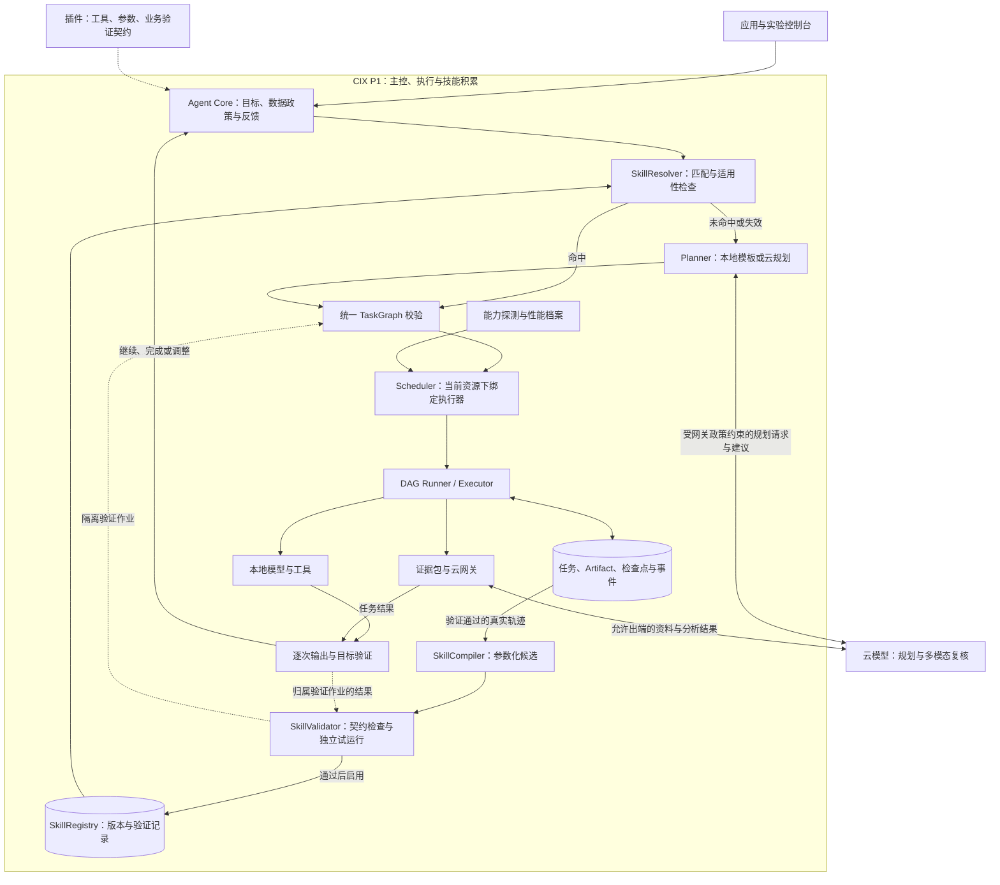

# 通用端云协同 Agent Runtime：作品设计 V2（协作评审版）

更新日期：2026-09-17。状态：已整合本轮确定的设计方向，供入围申请与协作评审使用；设计确认不等于功能实现。当前无 P1 开发板，板端模型与性能均待验证。

端侧程序、端侧模型与云端模型的具体分工，以及模块架构图和任务接力图，见 [27-端云模型分工与项目架构图](27-端云模型分工与项目架构图.md)。

本版以“面向设备能力的端云技能编译”为主创新；证据驱动验证、规则化证据包与实验控制台作为支撑机制。本文与 27 号架构文档是协作者的主阅读材料；[28 号文档](28-参赛亮点取舍与落地验证.md)保留方案取舍过程，[29 号文档](29-创新点建议-面向P1的端云技能编译.md)为技能编译专题补充。范围、优先级和验收口径以本版及 27 号文档为准。

V2 主要变化：新增技能提取、验证、存储和匹配模块；将“首次云规划—验证入库—后续端侧复用—失效退回规划”纳入主流程；同步更新架构图、示例、排期、对照实验和申请摘要。

用户已确认：目前没有 CIX P1，需先凭设计争取开发板；作品主体是通用端云调度框架，购物仅为示例。团队规模、截止时间、已可用模型与数据源尚未确认，因此本文使用阶段里程碑，不虚构交付日期。

## 1. 作品定位与入围主张

作品描述名：**面向 CIX P1 的端云技能编译与协同执行框架**。技术定位仍为通用 Agent Runtime，品牌名另定。

一句话：将云端规划成果转化为经过 P1 能力约束和样例验证的本地执行技能，让端侧在适用范围内复用流程，并在条件不满足时重新规划。

交付物是“Runtime 与插件契约 + P1 节点服务 + 技能编译与版本化技能库 + 实验控制台 + 参考插件”。框架的直接用户是端侧 AI 应用开发者；购物应用的消费者是间接用户。

要解决的具体问题：开发者已有本地模型、云模型和业务工具，却通常需要为每个应用重复编写调用链、端云切换、超时重试、状态保存和日志。固定调用链也难以处理云端超时、端侧资源不足、结果置信不足等变化。

参赛主张分为一项主创新和三项支撑能力：

1. **主创新：面向设备能力的端云技能编译**。从验证过的图与执行轨迹生成参数化技能候选，检查工具、模型和索引依赖，经独立样例验证后启用。新任务重新绑定参数和执行器；失效时停止复用并回到规划。
2. **证据驱动的执行验证与有限重规划**。区分推理不足、输入缺失和数据源不可用，选择云复核、补充信息或追问；同样用于技能执行中的失效判断。
3. **任务证据包与端云调度**。按当前步骤整理被允许出端的必要资料，再结合能力、网络和资源选择执行路径。
4. **可追溯的状态与实验控制台**。P1 保存任务、技能版本、输入输出引用、检查点与真实遥测，通过对照运行和故障实验验证收益。

“技能编译”指将任务图转为受限的可执行流程描述，不训练模型、不迁移模型权重，也不让端侧凭空获得云端推理能力。若技能仍需云视觉复核，则仅减少重复规划，不代表整次任务离线。

这些是拟实现和拟验证的工程差异点，不是已经证明的算法创新，也不应未经调研声称“首创”。

[Agent Workflow Memory](https://arxiv.org/abs/2409.07429) 和 [ReUseIt](https://arxiv.org/abs/2510.14308) 已研究流程复用。本项目拟贡献的是 P1 能力约束、模型／索引兼容性、参数化执行与失效回退的具体实现及实测。不能仅凭“技能库”声称原创。

“通用”应限定为：符合工具契约、结果契约和平台能力契约的应用可以复用核心。首版不承诺读懂任意 App 源码、自动迁移任意模型、支持任意操作系统，或任意时刻迁移正在运行的推理进程。

## 2. 比赛要求与证据边界

用户提供的赛题截图明确要求：CIX P1 为系统主控和端侧运行平台；具备多步规划、任务拆解或策略调整能力；调用至少一种工具；记录任务状态并根据结果继续推进。赛道二还要求端云有明确分工，并说明如何按任务类型、复杂度、网络或端侧资源进行调度。

官方网页指向的技术指南给出了 P1 基础环境、端侧推理和云模型接入路线。具体赛程、评分权重、申请表字段以及其他未在可读取正文或用户截图中确认的要求，本文不作推断。下表是设计映射，不是官方评分表。

| 赛题要求 | 本作品如何落实 | 应提交的证明 |
|---|---|---|
| P1 主控与端侧运行 | Runtime API、调度器、任务状态库和本地工具运行于 P1 | 部署图、板端进程信息、实际日志 |
| 多步规划／调整 | 工具目录约束下生成任务图，验证结果触发图修订 | 不同目标的任务图、一次真实图变化 |
| 工具调用 | 本地模型、索引、文件与云模型均通过执行器调用 | 工具输入输出摘要与耗时 |
| 状态和上下文 | Run、Node、Attempt、Artifact、Event、Checkpoint 持久化 | 重启后恢复与重放 |
| 明确端云拆分 | 本地预处理与执行，云端复杂理解／规划建议 | 每个节点的位置、原因与数据流量 |
| 动态协同 | 本地／云端可行性过滤、选择、超时降级和结果汇合 | 相同任务在不同网络条件下的对照 |

初选时提交设计、接口原型和桌面验证证据，清楚标注“桌面开发环境”；获板后补充 P1 实测。桌面指标不能冒充 P1 指标。

## 3. 仓库现状：已有资产与真实缺口

检查基线：本地 Git HEAD 为 `d9abe23`（2026-09-08）。远程配置为 `https://github.com/fangluyang7-debug/Cixin.git`。本次 `git ls-remote` 因 Windows TLS 凭据错误失败，网页读取也未成功，未确认远程 HEAD。本次为文档和代码静态审阅，没有运行项目测试、真实模型或板端基准。

| 部分 | 静态检查所见 | 在参赛方案中的处理 |
|---|---|---|
| 工具注册 | `core/runtime/shopping-plugin.ts` 注册七个业务工具描述 | 保留接口，补输入输出 schema 与真实 handler 绑定 |
| 任务图与调度 | 拓扑检查、候选过滤、性能评分和滞回已有代码 | 保留并收敛调度维度，增加阶段级执行决策 |
| Agent | `agent-runtime.service.ts` 使用可选 `AGENT_PLANNER`；RuntimeModule 未注册真实规划器 | 接入受工具目录约束的规划器 |
| 重规划 | `observeAndReplan` 记录遥测后，对传入原图重新调度 | 目前更接近重新分配；新增修改任务图的业务重规划 |
| 搜索与 Runtime | `search-debug.controller.ts` 挂接图后直接调用业务搜索，再回填时间线 | 改为 Executor 根据实际 assignment 调用工具 |
| 状态 | `runtime-run.service.ts` 使用进程内 Map，最多保留最近 20 个 Run | 持久化；区分计划完成、执行完成和目标完成 |
| 云端／P1 | 云端探测未实现；P1 为不可用占位适配器 | 分别实现真实 provider probe 与板端 adapter |
| 图像 Worker | PyTorch、YOLO-World、OpenCLIP；auto 选择 CUDA 或 CPU | 复用 HTTP 边界，新增 P1 推理后端，不直接照搬 CUDA 路线 |
| 前端与业务 | Web、Flutter、商品池、搜索、多轮交互、SSE 轨迹已有代码资产 | Web 为首要演示面，购物保持为插件样例 |
| 技能编译与复用 | 本轮新增设计，尚无已验证实现 | 新增 Compiler、Validator、Registry、Resolver；先完成真实 Runner |

优先解决四个架构矛盾：

- `docs/19-本地GPU图像处理链路.md` 规定用户实时链路全部走云；这与本次 P1 本地处理设计不一致，应在实施时标记为历史部署方案。
- 操作文档允许主 API 继续留在电脑；最终参赛部署应让 P1 持有主控、调度与状态，电脑只作为浏览器终端。
- 现有 Scheduler 将远端内存信息缺失、峰值内存缺失、能耗缺失等列为淘汰条件。托管云 API 往往不提供这些指标，不能用无法观测的物理指标阻断所有云调用。
- 无性能样本不允许调度、又只能运行后获得样本，会形成冷启动循环。应有独立受控校准通道，而不是伪造遥测或取消全部检查。

## 4. 目标系统架构



首版采用一个 NestJS 主进程、一个本地推理 Worker 和一个 SQLite 数据库。沿用 TypeScript/Python 技术栈，不引入 Kubernetes、多机共识或完整分布式消息平台。

建议分层：

| 层 | 职责 | 明确边界 |
|---|---|---|
| Plugin SDK | 注册工具、schema、输出验证器、业务策略 | 不负责读取 GPU 温度或选云供应商 |
| Agent Core | 目标理解、选择工具、修订任务图、决定是否追问 | 不直接执行系统命令或操作设备 |
| SkillResolver / Registry | 匹配技能、绑定参数、保存版本及启用状态 | 不凭语义相似度跳过适用性检查 |
| SkillCompiler / Validator | 提取参数化候选、检查依赖并试运行 | 不训练模型；一次成功不等于可泛化 |
| Scheduler | 对可执行节点选择位置、模型实现、并发与预算 | 不硬编码鞋类筛选条件 |
| DAG Runner | 执行依赖就绪节点、传递结果、保存状态、处理取消 | 不用“计划已生成”代替“任务已完成” |
| Executor | 真实调用 CPU、NOE Worker、云 API 或业务工具 | 不自行改变用户目标 |
| Platform Adapter | 发现设备／服务能力与当前可用性 | 设备指标与 SaaS 能力分别建模 |
| State / Telemetry | 保存事实、性能档案与事件，支持回放 | 不把模拟值当硬件测量值 |

物理目录可在闭环跑通后抽取为 `packages/runtime-core`、`packages/plugin-sdk`、`plugins/shopping`。初选前不应为了目录漂亮先做大规模搬迁。

## 5. 框架可复用所需的最小契约

### 5.1 工具语义与具体实现分开

同一个逻辑工具可以有不同实现，但只有输入输出、质量要求和数据政策兼容的实现才可互换。

```text
ToolSpec
  toolId, version, inputSchema, outputSchema
  dataPolicy, sideEffectType, idempotency, validatorId

ImplementationSpec
  implementationId, toolId, placement, runtime, modelRevision
  supportedInputLimits, outputCompatibility, capabilityProbe

TaskNode
  nodeId, toolId, inputBindings, dependsOn
  deadline, qualityPolicy, retryPolicy, budget

ExecutionAttempt
  runId, graphVersion, nodeId, attemptId, implementationId
  inputArtifactRefs, outputArtifactRefs, status, timestamps, error
```

不要只用模型名称或向量维度判断兼容性。图像检索必须记录模型 revision、预处理版本、归一化方式、维度和 indexVersion；模型切换可能需要另一份索引。

### 5.2 Agent 规划与资源调度分开

- 普通已知目标可由明确声明的本地规则／模板生成合法图，输出 `plannerKind=local_template`。
- 有已启用技能时，先检查任务范围和参数，再实例化图，记录 `plannerKind=skill_reuse`、skillId 与版本；不得伪装成此次模型生成。
- 复杂目标由云模型根据工具目录和输出 schema 提出计划，P1 校验后才执行。
- 本地规则不得冒充模型规划；首版至少展示一次真实模型生成的合法多步计划。
- 资源重调度保持任务语义，如云端超时后选择本地兼容实现。
- 业务重规划修改后续任务，如候选冲突时加入 OCR／云端复核或请求补拍。

规划调用本身也经过云适配器，记录超时和成本。首次规划使用可运行的引导策略，避免“必须先有任务图才能调用生成任务图的工具”的循环。

### 5.3 持久化与恢复

建议表：`runs`、`task_nodes`、`attempts`、`artifacts`、`events`、`checkpoints`、`performance_profiles`，以及 `skills`、`skill_versions`、`skill_validations`。

节点状态：`pending → ready → running → succeeded / failed / waiting_input / blocked / cancelled`。Run 可进入 `completed` 或 `completed_degraded`；推荐结果只是缓存数据时应保留降级标记。

首版恢复粒度是工具调用之间的检查点。进程重启后对过期运行尝试进行核对：纯计算可重试；外部副作用须检查幂等键／外部结果，不盲目重复。

用户追加条件增加 goalVersion；重规划增加 graphVersion。保留仍然有效的上游输出，失效相关下游节点。旧版本云结果迟到时保存审计记录，但不得覆盖新条件下的结果。

预算建议起点：单节点最多 2 次尝试、每个 Run 最多 2 次业务重规划，再进入追问或明确失败；具体值经验证调整。

### 5.4 技能编译与生命周期

最小流程：`云规划与真实执行 → 目标验证通过 → 技能候选 → 静态检查 → 独立样例试运行 → 启用 → 新任务复用 → 失效或重新验证`。

技能状态：`candidate → validating → active`；检查失败进入 `rejected`，已启用版本不再兼容或验证失败时进入 `suspended`；旧版本替换后为 `retired`。试运行使用标记为 `skill_validation` 的 Run，隔离测试输入、预算与指标，不生成新的技能候选，避免递归提取。

```text
SkillSpec
  skillId, version, sourceRunIds, status
  intentType, parameterSchema, preconditions
  taskGraphTemplate, outputValidators, fallbackPolicy
  toolCompatibility, modelRevision, preprocessingVersion, indexCompatibility
  dataPolicy, validationSuiteVersion, validationRecordRefs
```

SkillCompiler 是端侧程序：根据插件声明的参数位置和工具 schema，把运行图转换为受限 JSON 图。可选的云端参数化建议必须经过同样检查；首版不依赖额外模型。只允许注册工具、有限分支与有界重试，不允许生成任意 Shell/Python。

SkillResolver 首版识别 2～3 类任务，支持可明确解析的表达和结构化参数；陌生表达退回云理解或请求用户选技能，不能宣称通用离线语言理解。命中后仍进入原 TaskGraph 校验、当前 Scheduler 和同一个 Runner。

工具契约、模型／预处理与索引发生不兼容变化时暂停技能。数据内容的正常更新按兼容契约处理，不必一律重编译。技能保存流程，Scheduler 每次重新绑定执行器；不固化一次运行的硬件分配。

成功轨迹只能产生候选，验证集必须含变化参数、未见图片和越界反例。证据不足引发的正常复核分支不必停用整项技能；契约不兼容、错误匹配或违反输出要求才触发暂停／重新验证。

### 5.5 支撑机制：证据验证与出端数据

插件验证器输出 `status`（sufficient / insufficient / conflict / unavailable）、未满足要求、证据引用和建议工具。框架据此决定继续、有限重规划或追问；不能将模型 confidence 当正确率。

EvidencePackBuilder 以字段白名单、允许的商品区域图和少量候选资料构造请求，保留来源及变换版本。裁剪不等于匿名化；缺失必要资料时应补充允许出端的内容或报告限制。该机制服务于规划与复核，不另建一套压缩模型。

## 6. 端云调度策略：先做可解释且能验证的版本

### 6.1 第一级：先判断能否执行

检查工具契约、数据是否允许出端、模型／索引是否兼容、健康探测、输入尺寸、deadline、调用预算。对于本地执行，再检查可用内存、执行槽和运行时；对于云 API，检查实际请求能力、配额、429、超时和网络。

敏感数据策略是硬约束，不参与可交易评分。原图不出端不意味着脱敏后的文本一定不可出端；数据政策必须作用到每一份派生 Artifact，继承后仅经显式转换放宽。

### 6.2 第二级：对可行路径排序

MVP 优先使用决策表和测得的延迟／成功率，不急于引入强化学习。

| 条件 | 策略 | 应记录的原因 |
|---|---|---|
| 常见、短输入、本地质量达标 | 本地执行 | 满足质量且端到端代价较低 |
| 长输入、复杂推理、本地不支持 | 云端执行，前提是政策允许 | 本地能力边界／质量要求 |
| 本地输出不满足验证条件 | 加入补充证据任务或云复核 | `quality_gate_failed` |
| 云超时或网络不可用 | 已验证本地替代，或等待／部分结果 | 不把降级输出当同等质量 |
| 本地内存不足／设备忙 | 排队、降低兼容输入规格，或转云 | `local_resource_pressure` |
| 用户禁止相关数据出端 | 仅本地候选，否则追问／阻断 | `data_policy_local_only` |

候选端到端耗时应包含排队、模型加载、预处理、上传、服务响应和下游数据传输。缓存命中与冷启动单独分组。MVP 采用依赖就绪时的贪心调度和节点边界切换，不宣称求得全局最优。

可后续在可行候选内使用归一化的延迟、费用、失败风险评分，并设置滞回。只有任务确有同语义的多个执行实现时才比较它们；向量检索与云端视觉理解不能因为都“处理图片”而直接互换。

### 6.3 冷启动与不可测指标

新实现先运行独立 calibration 作业：在经过能力探测的环境执行固定小样本，限制次数与资源，记录真实性能再启用常规调度。未经校准的生产调用保持明确限制。

能耗暂不进入 MVP 必选目标。现有 `energyMah` 表示电荷量，不等同于能量；不同电压下不可直接比较。若后续测能耗，建议记录 J／Wh、仪器和采样窗口；未知就是未知。云服务内部功耗不可观测时，不能宣称优化了全系统能耗。

质量应按工具定义：Embedding 用离线检索评估，分类用标注准确率，JSON 工具用 schema／业务约束验证，生成答案用证据一致性评估。余弦相似度和模型自报 confidence 不应被统一当作正确率。

## 7. CIX P1 技术路径与获板验证

官方技术指南说明赛事平台预装 Debian 12、GO 图形引擎、NeuralONE（NOE）及多媒体 SDK；其端侧路线包含 CV／Embedding 走 NOE NPU，LLM 使用 llama.cpp 或 MNN 的 CPU／GPU 路线。[基础环境](https://2026agentic-ai.readthedocs.io/en/latest/environment/index.html)、[端侧 AI](https://2026agentic-ai.readthedocs.io/en/latest/edge-ai/index.html)

推荐顺序：

1. P1 上验证 Node.js／NestJS、SQLite／Prisma 及 Python Worker 的 ARM64 安装、文件权限和进程恢复。
2. 运行官方已适配的一个 CV／Embedding 示例，确认模型、SDK、算子与输入规格，再接入统一 Worker HTTP 接口。
3. 以这个模型建立查询端与商品库一致的独立小索引。保留已知可运行的 CPU 路径用于对照。
4. 通过一次真实请求验证云模型的结构化输出／工具调用能力，再接入 Planner 和复杂复核工具。
5. 最后评估本地小语言模型是否带来收益。它是增强项，不是整个框架启动的前置条件。

赛事指南提供 AnyInt 云模型 API 接入路线；具体账号、模型、配额和响应协议需要实际验证。无需为了演示先建云数据库、对象存储和完整云后端。[云端接入](https://2026agentic-ai.readthedocs.io/en/latest/cloud-models/index.html)

P1 的 CPU／GPU／NPU 并不意味着现有 CUDA Worker 可直接使用。保留 `extract-subject`、`embed` 等服务接口，替换底层实现；若检测模型适配困难，可先用人工框选加 CPU 裁剪，集中验证一个可用的 NPU 模型。不得把候选模型直接写成“已适配”。

获板请求应具体表述为：需要一台官方支持的 CIX P1 开发平台及匹配 SDK，验证 ARM64 主控部署、NOE 本地推理、端云调度和中断恢复。额外加速卡不作为首版前提。板型／内存以赛事实际分配为准。

P1 的必要性体现在常驻主控、本地工具执行与状态保存，以及端云联动的硬件验证。不应承诺这个通用框架只能运行在 P1；但本次正式验收必须真实运行在 P1。

## 8. 购物示例：为每个框架能力提供自然触发条件

限定示例为鞋类“找同款、满足预算与尺码约束、比较有来源的候选”。继续利用既有页面和商品池，不扩大到全品类、支付、物流预测和完整电商平台。

示例目标：“找图里这双鞋，42 码、500 元以内；不同平台结果有冲突时，告诉我哪些证据还不够。”

典型路径：

```text
目标与条件 → 图片质量／裁剪 → 本地图像特征 → 本地候选召回
         → 商品身份与条件验证
             ├─ 证据足够：价格／库存来源核对 → 结果卡片
             └─ 证据冲突：云端多模态复核／补充型号信息
                         → 更新后续计划 → 再验证 → 结果或追问
```

建议增加三个独立工具语义：`product.verify_identity`、`catalog.filter`、`offer.verify`。前两个可封装现有业务能力；最后一个只有真实来源可用时才能声称查到最新报价。

图像相似只负责召回。严格同款要有品牌、款号、配色等支持，报价还需明确尺码／SKU 与条件；未知时展示“相似款／待确认”。云端模型可整合证据，不能凭生成内容保证正品或实时有货。

数据采用清晰模式：

- 离线样例：来源许可明确、有快照日期，用于可重复验证；不得叫“实时全网价格”。
- 在线来源：明确已接入的平台及更新时间；无接口则不承诺此功能。

切换本地与云端 embedding 时，不能混用不同模型索引。更低风险的首版是本地图像检索保持一种模型，云端负责复杂复核和规划；若要展示同工具端云切换，应选择双方已验证兼容的工具。

弱网场景优先表现为“保留候选、继续本地筛选、标注报价未更新”，而不是声称离线也能获取最新价格。

技能演示贯穿同一场景：首次使用云规划，验证后提取 `image / size / maxPrice` 参数化技能；随后用未见图片、不同尺码和预算重新执行。命中时仅跳过重复规划，不复用旧商品答案。证据不足仍可调用云复核；新要求超出能力或依赖不兼容时必须拒用旧技能。

## 9. 如何证明框架通用

仅有 ShoppingPlugin 类名不足以证明通用性。建议增加一个极小的第二插件作为架构测试，不建设第二套完整产品：

**本地文件清单整理插件**：扫描指定测试目录 → 本地提取元数据／规则分类 → 可选云端分析脱敏标题 → 输出整理建议报告。

复用同一个 Planner、Scheduler、Runner、技能生命周期、持久化与控制台；只新增工具描述、参数契约、handler 和验证器，不改核心中的业务分支。先只生成报告，不移动或删除用户文件。

验收证据是插件接入变更清单、运行轨迹及“核心无购物条件判断”的代码审查。若时间不足，第二插件先做集成验证，不做专门 UI。

## 10. 控制台与演示脚本

在现有左右布局上，左侧保留购物应用，右侧作为框架主展示。提供六类证据：

1. 当前目标、约束与版本化任务图。
2. 每个节点的实际执行位置、模型版本、输入输出引用。
3. 候选为何被选择／淘汰；明确区分“已计划”与“已执行”。
4. 云请求时延、调用次数、流量与本地资源；未知指标显示不可测。
5. 异常、重规划、恢复记录及最终质量验证。
6. 技能来源 Run、版本、适用条件、验证样例、命中／拒用原因；规划调用与复核调用分开计数。

建议 4 分钟演示：

| 时间 | 操作 | 证明什么 |
|---|---|---|
| 0:00–0:30 | 展示 P1 主控、空技能库、首个目标 | 系统边界与无预存答案 |
| 0:30–1:20 | 真实云规划，本地模型和工具执行 | 首次端云协同闭环 |
| 1:20–2:00 | 展示候选提取、检查与独立样例验证 | 技能启用有明确依据 |
| 2:00–2:50 | 换未见图片及参数，复用技能重新执行 | 跳过重复规划，结果重新计算 |
| 2:50–3:30 | 输入越界要求或注入依赖不兼容 | 正确拒用技能并退回规划 |
| 3:30–4:00 | 展示三组基线和第二插件证据 | 收益边界与通用性 |

4 分钟是叙事节奏，不是性能承诺；耗时验证可展示有时间戳的预先录制记录并明确标注。云超时、服务重启和证据包详情作为扩展演示，不把所有功能挤进主片段。

初选无板时，用同样脚本的架构讲解／桌面原型片段，醒目标注尚未完成部分。故障注入应标注实验设置，不能当作自然测得的设备状态。

## 11. 验证与验收指标

以下数值为团队建议验收目标，不是官方要求或现有成绩；绝对时延目标应在 P1 首轮测量后定稿。

准备固定数据集：购物查询至少 30 项，覆盖明确同款、相似但不同款、低质量图、无匹配、条件冲突；关键执行配置进行至少 30 次性能采样并注明样本数。区分冷启动与热运行；小样本 P95 仅作初步观察。

对照三种策略：固定本地、固定云端、自适应端云。保持任务集、数据版本与目标质量标准一致；不支持的任务记录为失败／未完成，不能只比较完成子集。额外比较固定任务图与启用结果反馈后的成功率，避免把模型本身优势误归因于调度。

主创新必须另做三组对照：**每次云规划、人工预设同等能力模板、从执行轨迹提取的技能**。工具与数据版本保持一致；技能生成、调试、最终评估样例分离，用新图片和参数测试，不以相同输入重跑证明泛化。端云路由和证据包消融作为补充，避免一次实验同时改变所有变量。

| 维度 | 指标与方法 | 初步验收条件 |
|---|---|---|
| 目标完成 | 满足条件且有证据的任务数／总任务数 | 比较基线，报告失败原因，不只统计 HTTP 200 |
| 调度真实生效 | assignment 与实际 handler、placement 对照 | 所有已执行节点均一致 |
| 质量 | 同款判断精确率、Recall@K、约束满足率 | 独立标注集；拒答与未确认单列 |
| 延迟 | 首个有用结果、完整结果 P50/P95 | 固定网络条件下与基线比较 |
| 云依赖 | 每任务云调用次数、请求字节、token／费用 | 在质量相当条件下评估是否减少 |
| 故障恢复 | 云超时、限流、进程重启的恢复结果 | 每类至少 10 次，记录成功率与重复执行 |
| 数据政策 | local_only 样例的出端请求检查 | 禁止出端数据泄露为 0 |
| 规划有效性 | 图合法率、重规划后完成率、循环次数 | 超预算可终止；非法图不执行 |
| 可移植性 | 第二插件接入 | 不改 Runtime 核心业务逻辑 |
| 技能复用 | 未见输入上的完成率、错误匹配率、越界拒用和失效检出 | 保留所有失败与回退；历史成功不代替本次检查 |
| 技能收益 | 规划调用／token、时延、人工配置与审核工作量 | 与三组基线比较，不预设优于人工模板 |
| 累计成本 | 初次提取、验证、匹配、复用与失败回退总开销 | 说明累计何时可能抵消前期开销，无收益则如实报告 |

可以将“达到相同质量下减少云调用／降低首结果延迟”作为待验证假设，不在初选书中填写未经实验的 50%、毫秒级或能耗收益。

## 12. 分阶段推进与停止扩张条件

### A. 当前初选设计阶段

交付：定位摘要、架构图、需求映射、工具与技能契约、首次规划／技能复用／失效流程、原型截图、资源申请理由、获板验证计划。桌面原型先接通真实 Runner 和持久化，再验证一项技能，不把桌面结果宣称为板端能力。

准出：评审可理解“框架用户是谁、端云何时切换、P1 负责什么、已有基础是什么、拿板要验证什么”。无板不是伪造板端能力的理由，也不是停止设计的理由。

### B. 获板后的平台打通阶段

交付：P1 上的 API、状态库、一个本地模型工具、一条真实云调用、可重复启动脚本与版本清单。

准出：同一 Run 能关联本地结果和云端结果；真实执行事件能回放。若模型转换受阻，选择官方已适配模型并缩小输入范围。

### C. 执行闭环阶段

交付：受约束 Planner、DAG Runner、输出验证器、两类重规划、检查点与预算终止。

准出：目标能完成；至少一个失败路径改变后续执行；重启不会丢失任务或盲目重复副作用。

### D. 技能编译与复用阶段

交付：Compiler、Validator、Registry、Resolver，至少一条完整提取与复用路径，再扩展至 2～3 类支持任务。

准出：变化输入能重新执行；越界／不兼容输入能拒用；技能验证与业务运行隔离；失败可回到规划。时间不足时减少任务种类，不能省略启用验证或以预置模板冒充自动提取。

### E. 对照与提交阶段

交付：技能三组对照、端云与证据包补充实验、第二插件、主演示和故障补充录屏。报告收益与局限，不掩饰负结果。

分工按工作包而非假设人数安排：

| 工作包 | 负责内容 | 对外接口／验收交付 |
|---|---|---|
| Runtime 与状态 | 真实 Runner、任务状态、检查点、Scheduler | TaskGraph、Attempt、Artifact、Event 契约及闭环日志 |
| 技能编译 | 四个技能模块、参数化、兼容性与失效 | SkillSpec、验证集与复用／拒用轨迹；依赖 Runtime |
| P1 与云适配 | ARM64 部署、本地模型、云请求与能力探测 | 工具实现描述、健康检查和真实性能样本 |
| 插件与展示评测 | 购物验证器、参数声明、证据包、控制台、对照集 | 业务质量标注、演示、第二插件及实验报告 |

可由同一成员兼任多个工作包。首轮协作先对齐工具输入输出、SkillSpec、事件字段和测试样例，再进入并行开发。团队人数不足时顺序推进。

冻结范围：一个本地模型和一个具备所需能力的云模型服务；2～3 类受限技能；只读检索／报告；参数化 JSON 图与有限分支；确定性证据包。自由表达无法本地解析时允许云理解或结构化输入。本地小语言模型、额外模型与在线学习留到后续。

本次不做：HarmonyOS 适配、多板集群、任意模型自动迁移、强化学习调度、全品类电商、支付、长期价格预测、完整插件市场。它们可以进入路线图，不进入首版验收。

## 13. 代码落地优先队列

| 优先级 | 修改对象 | 目的 |
|---|---|---|
| P0 | 新增 ToolHandlerRegistry / DAG Runner | 计划真实驱动执行，替换业务旁路 |
| P0 | RuntimeRunService + Prisma schema | 持久化执行状态与尝试，准确完成语义 |
| P0 | AgentRuntimeService + AGENT_PLANNER provider | 真实规划与基于结果修订后续图 |
| P0 | CloudPlatformAdapter / Scheduler | 服务型执行器独立探测；不要求云厂商提供内部内存与功耗 |
| P0 | PerformanceRegistry + calibration | 解开无样本冷启动，持久化版本化性能档案 |
| P1 | P1 Adapter / image-worker backend | 接入官方运行时和真实模型 |
| P1 | ShoppingPlugin + 业务 Adapter | 工具描述绑定 handler；补身份／条件验证 |
| P1 | 新增 SkillCompiler / Validator / Registry / Resolver | 从真实轨迹提取、验证并启用技能，完成复用与失效回退 |
| P1 | 新增技能持久化与验证 Run 类型 | 版本、来源、兼容性、验证记录可追溯；避免递归技能生成 |
| P1 | EvidencePackBuilder | 按规则形成允许出端的最小必要资料 |
| P1 | Runtime 控制台 | 区分计划、执行、技能生命周期和真实基线；展示因果链 |
| P1 | 故障实验与小插件 | 证明恢复能力和业务解耦 |

以上为后续实施建议，本次不直接重构现有业务代码。

## 14. 可用于初选申请的项目摘要草稿

本项目拟构建面向 CIX P1 的端云技能编译与协同执行框架，将云端规划成果转化为受设备能力与工具契约约束、经过样例验证的参数化执行技能。P1 持有主控、任务状态及技能库；新任务优先检查已有技能，命中后重新绑定参数与执行器，超出范围或依赖失效时回到规划。框架以证据驱动验证、受控出端数据和检查点支撑可靠执行，以购物插件展示本地图像检索与云端复杂复核，以最小文件整理插件验证业务解耦。现有仓库已有工具注册、调度评估和控制台基础，真实执行与技能模块、板端适配仍待完成。项目将对比每次云规划、人工模板和提取技能，评估新输入上的完成率、错误匹配、规划开销及人工维护成本，并计入技能生成与验证的前期开销。

## 15. 资料与待确认项

官方资料（2026-09-17 读取）：

- [赛事主页](https://developer.cixtech.com/EcoCompetition)
- [官方技术指南](https://2026agentic-ai.readthedocs.io/en/latest/)
- [平台概览](https://2026agentic-ai.readthedocs.io/en/latest/overview.html)
- [基础环境](https://2026agentic-ai.readthedocs.io/en/latest/environment/index.html)
- [端侧 AI 路线](https://2026agentic-ai.readthedocs.io/en/latest/edge-ai/index.html)
- [云端模型接入](https://2026agentic-ai.readthedocs.io/en/latest/cloud-models/index.html)

本地主要依据：README、`docs/runtime-resource-gaps.md`、`docs/06-Agentic-AI与应用解耦架构设计.md`、`docs/agentic-runtime-operation-guide.md`、`docs/19-本地GPU图像处理链路.md`，以及本文列出的 Runtime、搜索控制器和 Worker 源码。旧文档中的要求是历史设计资料，不自动视为本轮用户指令。

下一轮应补齐：初选表格和评分细则、申请截止日期、团队规模与强项、目前实际可调用的模型服务、样例数据许可与更新时间，以及远程仓库最新提交。它们影响排期和材料表达，不改变已确认的“通用框架为主、购物为例”定位。
