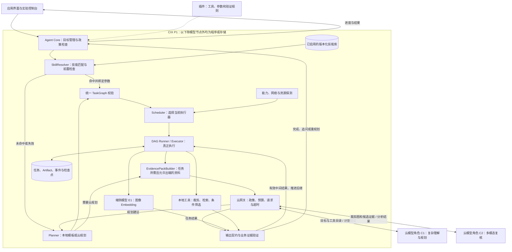
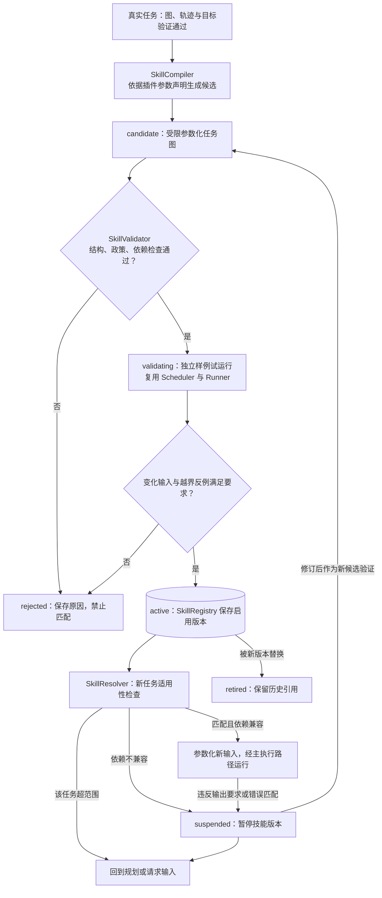
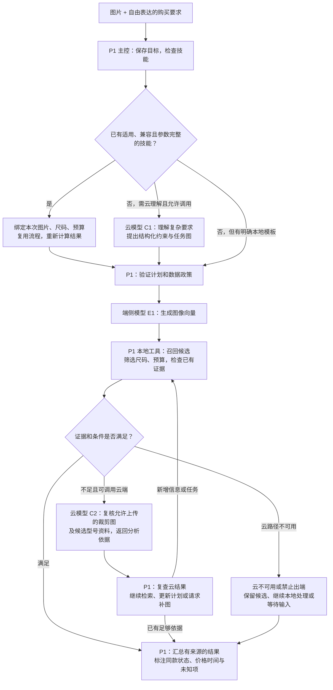

# 端云模型分工与项目架构 V2（协作评审版）

更新日期：2026-09-17。性质：与作品设计 V2 同步的目标架构，已纳入端云技能编译；不表示模型、技能模块、开发板或云接口已完成接入。

配套阅读：[作品设计 V2](26-参赛作品设计-通用端云协同Runtime.md)。框架是主体，购物是示例；主创新为面向设备能力的端云技能编译。本文说明模块、契约、数据流及首次规划、技能积累、后续复用三条路径，协作者无需阅读此前讨论即可使用。

## 1. 端云协同到底体现在哪里

同一任务由 P1 上的 Runtime 持有和推进：先使用本地工具／模型形成中间结果，必要时调用云模型获得复杂规划或判断，再由 P1 验证云结果、执行后续步骤并保存状态。端云交换的是目标、受允许的上下文、计划与中间结果。

跨任务还形成能力积累：云规划与真实执行产出可验证的任务图，P1 将其参数化为技能候选，经过契约检查与独立样例试运行后启用。后续同类任务可跳过重复规划；技能不适用时重新规划。技能命中不代表必然全程离线，流程中的云复核仍按需执行。

三个层次要分开：

- **模块运行位置**：Agent 主控、Scheduler、执行器、状态库在 P1 上。
- **模型推理位置**：本地图像特征模型在 P1 推理；复杂规划和视觉复核模型通过云 API 推理。
- **调度决定**：何时调用哪种能力、是否允许出端、是否有足够资源、失败后如何继续，由 P1 程序执行政策和控制逻辑。

因此，“Agent 主控在本地”不等于“所有智能推理都在本地”，“云模型生成计划”也不等于“系统主控在云端”。云模型输出的计划是建议，必须由本地验证并执行。

## 2. 首版模型与程序的具体分工

| 编号 | 能力 | 是否模型 | 运行位置 | 购物例子 | 首版定位 |
|---|---|---|---|---|---|
| E1 | 图像特征提取模型（Embedding） | 是 | P1，优先验证 NOE NPU，保留 CPU 基线 | 将鞋图变为检索向量 | 必做的端侧模型 |
| E2 | 目标检测／OCR 模型 | 是 | P1，按适配情况选用 | 找到鞋主体、读取款号 | 增强；裁剪可先用人工框选 |
| E3 | 本地小语言模型 | 是 | P1 CPU／GPU，待测 | 解析短指令、简单工具选择 | 后续增强，不作为首版前提 |
| C1 | 云端规划／语言理解 | 是 | 云模型 API | 将自由表达转成结构化约束与工具任务图 | 必做的云端模型角色 |
| C2 | 云端多模态复核 | 是 | 云模型 API | 对比裁剪图和候选资料，找出型号冲突 | 购物协同演示重点 |
| P1 | Agent 主控、图校验、任务调度 | 否，属于程序 | P1 CPU | 校验计划、选择执行器、限制重规划次数 | 框架核心 |
| P2 | 裁剪、向量检索、条件筛选、规则验证 | 通常不是模型 | P1 CPU／本地存储 | 用向量找候选、按预算和尺码过滤 | 本地工具 |
| P3 | 状态保存、监控、检查点恢复 | 否 | P1 | 断网不丢任务，重启后继续 | 框架核心 |
| K1 | SkillCompiler：技能候选提取与参数化 | 否，首版为程序 | P1 CPU | 从已验证图提取图片、尺码、预算参数 | 主创新模块 |
| K2 | SkillValidator：契约与试运行检查 | 否 | P1，经原 Runner 调工具 | 测试新输入、越界条件与设备兼容性 | 技能启用前置条件 |
| K3 | SkillRegistry / SkillResolver | 否 | P1 CPU／SQLite | 保存版本、匹配任务、绑定参数、拒用失效技能 | 主创新模块 |
| P4 | EvidencePackBuilder | 否，规则程序 | P1 CPU | 按需整理裁剪图、候选资料和冲突点 | 云调用支撑 |
| S1 | 商品价格／库存来源 | 业务 API 或数据集，不是模型 | 本地快照／远程接口 | 核对报价来源与更新时间 | 与模型推理解耦 |

C1、C2 是两个职责，不强制采购或部署两个不同大模型。若同一云端多模态模型经过验证同时支持规划输出与图像分析，可以复用一个服务，分别记录调用目的。

首版最小模型组合为 **一个本地 Embedding 模型 + 一个具备所需能力的云端多模态大模型服务**。本地小语言模型不是必要条件。模型名称和版本要经过授权、SDK 兼容性与质量验证后锁定。

现有 Worker 的 OpenCLIP 可作为桌面基线候选，但不能宣称已在 P1 NPU 适配。优先验证官方模型资源中适用的 Embedding 路线；本地查询图和商品库必须使用兼容的编码及预处理版本。

“本地技能”是可执行流程，不是新增模型，也不是本地小语言模型的替代权重。首次规划由云模型 C1 提供建议，技能参数化优先由工具 schema 和插件参数声明完成；可选云端辅助不改变校验要求。

## 3. 项目规划架构图

为便于协作者阅读，分为主执行架构和技能生命周期两张图。第一张回答“新任务怎么运行”，第二张回答“技能如何产生、启用和失效”。箭头为主要控制与结果流，不穷举所有存储调用。

读图顺序：目标进入主控 → 查找可用技能 → 命中则实例化图，未命中则规划 → 所有图统一校验 → 当前 Scheduler 绑定执行器 → Runner 调用真实模型／工具 → 验证后继续或反馈。技能复用没有第二套执行引擎，也不绕过调度。

首次复杂规划尚无业务任务图时，走受政策和预算约束的引导调用；云规划不是无约束旁路。每个中间工具结果先通过该工具的输出契约检查，由执行器继续推进依赖节点。只有需要改变任务语义或最终结果不满足目标时，才触发业务重规划。

Scheduler 控制执行决策，但无需用另一个大模型实现 Scheduler。首版用可解释的规则和真实观测即可。不要为了“多 Agent”名称，把所有程序都改成模型调用。

### 3.1 技能编译与生命周期图

试运行必须标记 `runKind=skill_validation`，隔离测试资料和指标；不再从验证 Run 提取技能，避免递归生成。一次正常云复核或网络故障不等于整个技能有错：数据不足进入原有补证据分支，临时网络错误按重试策略处理；依赖不兼容或技能输出契约失败才触发暂停和重验证。

### 3.2 模块交接契约

| 模块 | 输入 | 输出 | 核心边界 |
|---|---|---|---|
| SkillCompiler | 已验证图、真实轨迹、插件参数声明 | SkillSpec 候选 | 不缓存答案，不把任意字段自由参数化 |
| SkillValidator | 候选、能力契约、独立验证集 | 验证记录、是否启用及原因 | 不凭模型自评决定启用 |
| SkillRegistry | 版本、来源、验证记录、状态 | 不可变版本与当前启用指针 | Run 固定引用具体版本 |
| SkillResolver | TaskIntent、参数、启用技能、当前依赖 | 实例化图或拒用原因 | 首版只匹配 2～3 类可明确解析任务 |
| Scheduler / Runner | 统一校验后的图、当前资源 | 执行尝试和 Artifact | 技能图与云规划图走同一执行路径 |
| EvidencePackBuilder | 当前节点需求、Artifact 与政策 | 云请求资料及来源映射 | 限定字段／数量／尺寸，不声称裁剪必然匿名 |

SkillSpec 至少包含：`skillId/version/sourceRunIds/status`、`intentType/parameterSchema/preconditions`、`taskGraphTemplate/outputValidators/fallbackPolicy`、工具／模型／预处理／索引兼容约束、数据政策与验证记录。只允许注册工具、有限分支和有界重试，不执行任意生成代码。

建议事件：`skill_candidate_created`、`skill_validation_finished`、`skill_activated`、`skill_matched`、`skill_rejected_for_run`、`skill_suspended`。按 runId、skillId、skillVersion 关联。plannerKind 分别记录 `cloud_planner`、`local_template`、`skill_reuse`，规划调用与视觉复核调用分别计数。

启用、暂停和版本替换需持久化；新 Run 只能选择当前启用版本。运行中的版本若发现依赖或政策不兼容，在下一节点派发前停止并检查，不继续使用已失效配置。

## 4. 购物任务中的端云接力图

示例输入：“找图中同款鞋，42 码，预算 500 元以内；如果不能确认同款，请说明原因。”

首次任务完成后进入图 3.1 的候选提取和验证。后续用未见图片及不同参数演示技能复用，保留中间计算证据；不得只换页面文字、实际返回上次结果。

图中最后的降级输出可能是“部分结果／待确认”，不等于购买目标已经完成；Runtime 应保留相应状态。云规划阶段也有超时限制，无法本地理解的新复杂目标应等待或追问，不能假装已经理解。

需要上云的内容：规划请求通常是用户允许出端的目标、约束、工具描述与必要摘要；视觉复核请求才发送允许上传的商品区域和候选资料。原图、个人偏好等数据是否出端由政策单独控制，不能宣称“绝不传图”又依赖云 VLM 分析图片。

## 5. 动态调度具体改变什么

| 触发条件 | 改变的任务／执行路径 | 不能作出的承诺 |
|---|---|---|
| 用户只修改明确预算 | 本地规则更新约束，仅重跑筛选与排序 | 不需要每轮都调用 LLM |
| 新输入匹配已启用技能 | 绑定参数并重新执行，跳过重复规划 | 不等于省去全部云调用；仍可能需要云复核 |
| 技能超范围或依赖不兼容 | 拒用；依赖不兼容时暂停版本，回到规划 | 不能仅因文本相似就复用 |
| 新复杂目标 | 调用云规划，P1 校验并运行任务图 | 不允许云模型直接执行任意工具 |
| 本地候选证据不够 | 增加云复核或补充证据步骤 | 相似度高不等于严格同款 |
| 网络中断／云超时 | 停止相应云尝试，利用已有候选继续本地步骤 | 本地不必具备与云模型同等能力 |
| P1 推理资源紧张 | 排队、使用已验证 CPU 实现；有兼容云实现才转云 | 不保证每个本地模型都可自动迁移 |
| 输入禁止出端 | 排除涉及受限数据的云路径，本地处理或请求补充 | 数据政策不因超时／低质量自动放宽 |

首版包括“同一任务的端云接力”和“跨任务的验证技能复用”。同一个模型在端云之间迁移是另一类能力，不是首版必须实现的前提。

若要额外演示同一工具的本地／云端替代，必须注册经过验证的两个实现，具有明确输入输出和质量兼容关系。本地 embedding 向量不能直接给另一个模型构建的索引使用。

## 6. 模块与仓库对应关系

| 图中模块 | 对应现有位置或新增工作 |
|---|---|
| 交互层 | `apps/test-entry-web`，现有调度盘与购物页面 |
| 插件 | `core/runtime/shopping-plugin.ts`，需补 schema 和 handler 绑定 |
| Agent 主控 | `core/runtime/agent-runtime.service.ts`，需接入云规划并支持图修订 |
| SkillCompiler / Validator | 拟新增 `core/runtime/skills/`，从真实图和轨迹生成候选、检查并发起验证 Run |
| SkillRegistry / Resolver | 拟新增技能服务及 Prisma 持久化模型，管理版本、参数绑定与拒用原因 |
| Scheduler | `core/runtime/scheduler.service.ts`，补服务型能力判定与阶段执行选择 |
| 执行器 | 新增 DAG Runner / ToolHandlerRegistry，移除搜索直接绕过计划执行的路径 |
| 端侧模型 | `services/image-worker`，新增 P1 模型后端并验证 SDK |
| 云调用网关与证据包 | 基于现有模型 Adapter，补 EvidencePackBuilder、请求政策、真实探测和统一结果映射 |
| 结果验证 | 通用 schema 验证 + 插件业务验证器 |
| 状态 | `runtime-run.service.ts` 从内存 Map 迁移到持久化存储；增加 skillId/version/plannerKind/runKind |
| 资源探测 | Platform Adapter + Telemetry，缺失指标保持未知 |

框架本身不绑定“鞋”“商品”等概念。替换插件后，端侧模型和云端任务可以改为 OCR、文本理解等，仍复用相同的主控、调度、执行、状态与反馈路径。

## 7. 首版验收边界

必做基础：P1 本地实际运行一个模型；云端实际完成一次复杂规划和一次任务分析（可由同一模型服务完成）；P1 驱动多步工具执行，状态持久化。

必做主创新：至少一条“真实云规划与执行 → 提取候选 → 独立验证 → 启用 → 新输入复用 → 越界或不兼容时拒用”的完整链路，随后按资源扩展到 2～3 类支持任务。减少任务类别可以，省略验证或以人工模板冒充生成技能不可以。

验证三组基线：每次云规划、人工模板、提取技能。记录质量、错误匹配／拒用、规划调用量、时延和人工工作量；技能提取、验证及失败回退开销全部纳入累计成本。证据包和网络故障作为补充实验，与主创新分别验证。

实施依赖：统一工具契约 → 真实 Runner 与状态 → 本地／云模型闭环 → 技能四模块 → 新输入与失效验证 → 控制台及对照实验。无板期间可做桌面原型，板端结果待获板后补齐。

增强：本地小语言模型、更多 NPU 模型、同语义工具的多执行器优化。先验证主闭环，再扩大模型数量。

资料依据：已读取的[端侧 AI 指南](https://2026agentic-ai.readthedocs.io/en/latest/edge-ai/index.html)包含 NOE NPU 的 CV／Embedding 路线及 CPU／GPU 的语言模型路线；[云模型指南](https://2026agentic-ai.readthedocs.io/en/latest/cloud-models/index.html)说明云模型可用于规划、理解与多模态任务。具体模型和 SDK 版本须获板后核实。技能复用的相关研究与创新边界见作品设计 V2 第 1 节及 [29 号专题文档](29-创新点建议-面向P1的端云技能编译.md)。
