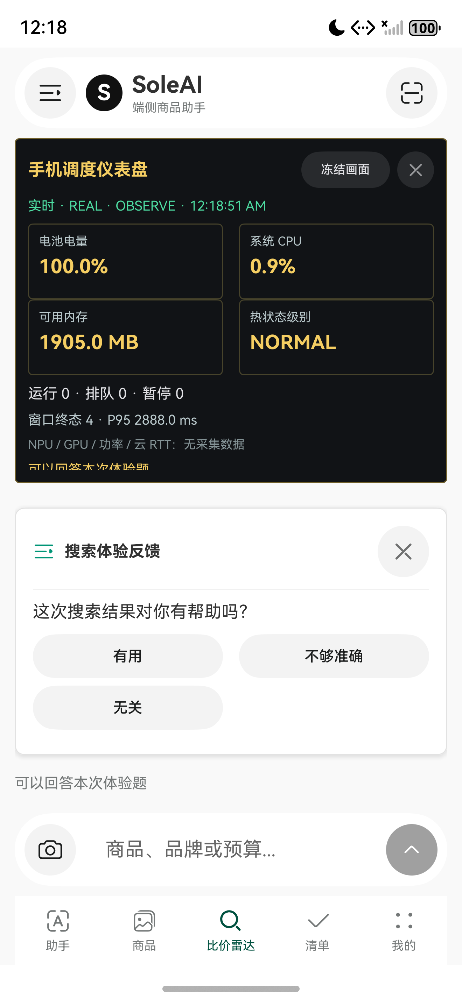
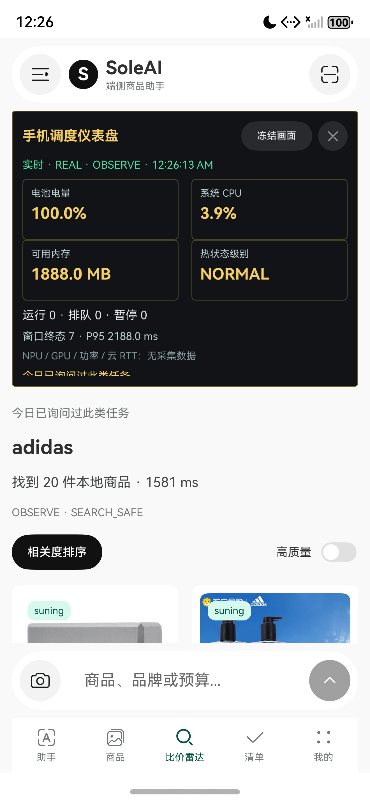

# 实时仪表盘与提问链路验收

日期：2026-09-22。分支：harmony/mobile-scheduler。范围：harmony-agent，未提交或推送。

## 电脑监控改动前的主机基线

下列自动化与构建结果来自本轮之前的手机内仪表盘版本；电脑端监控新增代码后的构建状态在本节更新，不把旧产物误作新版本证据。

用户最终要求：客观温度、内存和卡顿不询问用户。当前版本只在应用/任务信息显示有必要时，低频询问主观等待容忍度或结果是否符合需求；首次内部参数题已撤销。

| 项目 | 结果 |
|---|---|
| test-semantic-scheduler.ps1 | scheduler 160 / entry 26，Failure=0、Error=0、Ignore=0 |
| 门禁 | 用例声明/实际计数一致、报告新鲜、业务依赖扫描通过 |
| test-phone-summary.py | 9/9 通过 |
| assembleHap | 成功，未签名；保留旧数据库/模型异常提示与旧调试页 API 弃用警告 |
| assembleHar | 成功，最终哈希见下方 |
| git diff --check | 通过；LF/CRLF 提示不是空白错误 |
| hdc list targets | [Empty]，本轮电脑推送链路尚无设备联调 |

原始报告：[调度测试](semantic-test-result.txt)、[应用测试](entry-test-result.txt)。

## 电脑监控实现构建复核

- 本轮运行 `scripts/native-check.ps1 -Task build`，HAP（entry）与 HAR（scheduler）均构建成功；未配置签名，HAP 为未签名包。
- 新增 `SchedulerMonitorPublisher.ets` 与 Index 连接设置通过 ArkTS 编译。工具链提示的异常处理、弃用 API 警告中包含既有代码，也包含 preferences API 的可抛异常提示；没有编译错误。
- Node 监控服务与页面脚本通过 `node --check` 语法检查。
- 本轮没有运行测试套件，也没有设备可用于手机到电脑的真实网络配对、推送/断连验收；下方步骤仍是待设备复测清单。

新增或调整的自动化覆盖：

- 应用结果准备耗时与 SDK 耗时分开保存；应用观测经过数值、类型和拷贝校验。
- 已知超时时询问的是等待容忍度，优先于应用明确报告的质量疑点。
- 高温、热状态未知和缺少客观指标不会生成发热/卡顿/内存问题。
- 正常完成、已有判断或不需要提问时不创建邀请，不消耗额度；结果消费不冒充正面训练标签。
- 只读诊断、工作流所有权、运行/失败/后台限制、日/能力配额、间隔和邀请过期；高优先级也不能越过频控。
- 活动任务快照不含输入、修改拷贝不改变运行状态、观察排队不派发/取消、监听解除、断连/未知/延迟初始化。
- 普通用户问题和回执不显示内部权重、目标毫秒数或模型档位。

## 历史模拟器证据

以下来自本轮较早的 156/26 测试基线，不是最终改题后的设备验收。

当时目标为 127.0.0.1:5555，型号 emulator，1320x2856。曾覆盖安装未签名 HAP、启动 Micro.12.myapplication/EntryAbility，未卸载或清数据。验证了同页观察不取消搜索、真实本地商品结果、授权后的旧版体验单题和日配额。连续搜索复现并修复程序清空输入框误取消新任务的问题，nike、adidas 均返回商品。没有提交虚构满意度，也没有重置频控。

这些截图仅保留任务执行及频控的历史证据；标题、入口与问题文案不能当作当前 UI：

误导用户的首次参数题截图 scheduler-question.png 已删除。最终改题后的 hdc 返回空设备列表，因此没有新的原生截图，不以旧图替代验证。

## 最终版设备复测清单

1. 输入商品直接搜索，不出现内部参数题；手机页面不再内嵌实时调度仪表盘。
2. 开启可选体验反馈；正常快速完成且无质量疑点时不弹题。体验题不依赖电脑监控连接。
3. 实际等待超过任务软截止、成功展示且符合频控时，只问“刚才等待结果的时间可以接受吗”；同类任务当天已询问后不再出题。
4. 高温、低内存或未知指标继续自动保护，不问用户指标值或卡顿情况。质量疑点题目前仅在公共接口合成测试中验证，当前购物 App 不伪造结果置信度来触发它。
5. 回答后的回执对应同一输出 taskRunId；跳过不计样本，详情页不被题目覆盖，撤销授权/离页/替换输入/过期后旧邀请不可复用。
6. 电脑浏览器打开 `http://localhost:8765`，输入监控服务终端配对码；手机和电脑连同一可信局域网，在“我的 -> 电脑实时监控”填写电脑 IPv4、端口和配对码并开启推送。随后做搜索，确认电脑网页显示真实任务和事件。
7. 验证电脑服务关闭/重启、断网恢复、App 后台/前台时的连接状态。验证小屏、键盘和大字体下手机连接设置可用；不改系统时钟、不重置反馈配额、不提交虚构体验。

## 产物

| 路径（相对 harmony-agent） | SHA256 |
|---|---|
| apps/harmony/scheduler/build/default/outputs/default/scheduler.har | `82A8D0917F1FB13A54E5D8515837CE0E65A49937BD7DE6828BA9D923F6435F2B` |
| apps/harmony/entry/build/default/outputs/default/entry-default-unsigned.hap | `DFA06A2AFDEA7D507C28A1D94AF507B5E58ABF6BC3C3367CCD8897619E7C89CA` |

## 未完成边界

没有验收真机传感器、热保护效果、功耗、完整大小屏/横屏/大字体/手势组合及严格质量/性能对照。内存占用不等于卡顿，完整帧耗时/掉帧采集尚未接入。当前主观反馈是有界规则校准，不是新训练的语义调度模型；没有跨启动持续学习。

电脑网页监控读取手机 SDK 快照，原始 `调度盘/code.html` 仍是开发板设计原型。配对服务使用本地 HTTP，仅可在可信私有网络演示，停止服务清除内存快照。
