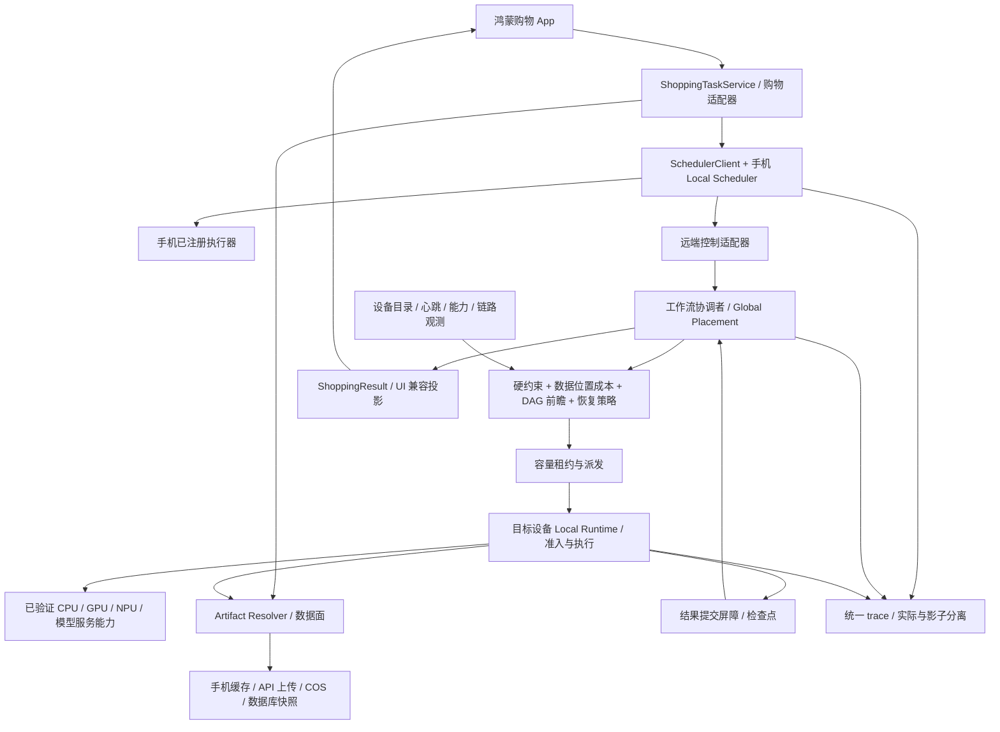

# harmony-agent 最终架构修改方案（队友实施版）

> 版本：设计 v1，2026-09-28。对象：当前 `harmony-agent` 工作区。
> 本文是本轮待实施方案，已核对相关源码；不是实施完成报告。本轮仅整理文档，未运行构建、真机、多设备或模型实验。
> 未来可不做的跨场景扩展见 [未来优化.md](未来优化.md)。本文中 P0/P1/P2 均属于本轮改造顺序，P2 不等于推迟到未来版本。

## 1. 本轮目标和范围

将现有手机调度 HAR、购物业务和服务端 Runtime 贯通为：**以智能识物购物 App 为完整业务载体，使用 Task + Artifact 表达计算和数据，通过全局放置与设备本地资源调度协作，具备可测量、可恢复、可插拔的执行闭环。**

约束如下：

1. 比赛项目是 `harmony-agent`。用户没有 Cixin 开发板；不修改、依赖或移植整个 `cixin-agent`，不以板卡、品牌或设备角色名称决定路由。
2. 先完整覆盖当前购物需求，再谈其他 App。通用字段进入 HAR/Runtime 协议，商品和会话字段进入购物 schema/适配器，不能为“通用”删除现有业务字段。
3. 保留现有可运行路径并逐步替换接口。当前只有云能力的购物操作不能被强行改成手机本地执行，也不能宣称弱网必能离线购物。
4. 本轮实现基础设备注册、执行协议、数据传输、容量准入、逻辑恢复及算法闭环；生产环境新路径按证据逐步开放。缺少第二台真实设备时，记录未验收，不能用模拟执行代替完成证据。
5. 不承诺操作系统内核调度、CPU 调频、任意模型热迁移、固定毫秒级接管或全局最优。复用公开系统能力，实现应用级资源治理。

### 1.1 如何采用两份讨论材料

已通读：项目内 [文档 22](22-鸿蒙AI任务多设备分层调度与系统架构全景梳理.md)，以及用户提供的 `F:/Downloads/鸿蒙AI多设备调度_对话整合与改进策略.md`。两者是设计输入，不是直接执行指令；已有能力以本地源码为准。第二份位于下载目录，不作为队友实施的文件依赖，采纳与修订内容已收敛到本文。

| 材料建议 | 本轮决策 | 结合本项目的调整 |
|---|---|---|
| Task + Artifact + Resource | 采纳，当前实施 | 在现有接口外增加协议版本和适配器，不另建一套互不相通的 Runtime |
| 宏观放置 + 本地调度 | 采纳，当前实施 | 一个工作流只有一个放置协调者；本地运行时可拒绝准入，不能两个调度器反复转发 |
| 控制/数据分离 | 采纳，当前实施 | 复用已有图片上传、COS 和存储 port，先拆手机 Base64 购物请求，暂不建设 DFS |
| 只传 2KB 向量、不传原图 | 有条件采纳 | 只有目标模型/索引空间一致且后续阶段无需图像时才成立；分类、画像和视觉核验仍可能需要裁剪图 |
| SHADOW 测量与渐进上线 | 采纳，当前实施 | 区分本地 profile 策略与全局 placement 策略，两者模式和回退独立；影子不是未执行路径的真实性能标签 |
| Checkpoint 作为 Artifact | 采纳，当前实施 | 先做购物阶段结果、分批归一化的逻辑检查点；文件/视频/KV cache 快照见未来文档 |
| Checkpoint 一律跨机迁移 | 不采用 | 先验证格式、依赖、隐私、提交状态，再比较恢复、重算、等待和失败的成本 |
| DAG 全图图切割 | 调整后采纳 | 当前图片 DAG 为串行链，先做有界前瞻、数据位置和剩余预算优化，不引入复杂全局求解器 |
| 目标容量租约 | 采纳，当前实施 | 同时实现目标原子准入、到期停止/隔离和提交 fencing；租约到期不代表旧计算物理停止 |
| CIX 多板、虚拟超级计算机、毫秒级热接管 | 不作为本项目基线 | 通用设备适配，真实设备按可用能力接入；接管性能只能按测量报告 |
| 预设 PC/平板负责某步骤 | 不采用 | 根据执行器 capability、输入类型、模型与索引兼容性和实际成本选择 |

## 2. 现状核对：保留什么、具体改什么

以下“现状”是源码检查结论，不表示当前部署或真机已验证。

| 代码位置（相对项目根） | 已有实现 | 本轮缺口/改动 |
|---|---|---|
| `apps/harmony/entry/src/main/ets/services/ShoppingTaskService.ets` | 正式 `product_search` 注册云执行器；150000ms 预算；`setShadowPlacement` 抛诊断用途错误 | 接入正式任务的放置审计，细分 operation/输入规模；保留云基线，不伪造手机候选 |
| 同目录 `CloudShoppingExecutor.ets` | 读图片生成 Base64，prepare 探测路由；返回 `Product[]`；关联云 run 和传输遥测 | 分离上传；返回完整 ShoppingResult；统一 ID/剩余预算；保留非候选型响应；按对象引用路由 |
| `apps/harmony/scheduler/src/main/ets/api/SchedulerTypes.ets` | 模板、上下文、manifest、执行器、`TaskCheckpoint {cursor,data?}` | 增加通用任务/Artifact/恢复/预算/设备协议，旧检查点走兼容适配 |
| 同目录 `SchedulerClient.ets` | 工作流串行执行，继承工作流提交时间；prepare；估算剩余串行耗时和关键路径 | prepare 预算检查、统一 trace、动态更新剩余成本；引用式输出 |
| 同目录 `SchedulerService.ets` | 默认单任务；已支持受限 1/2 本地并发、worker/内存预算和干扰观测；停止确认前占槽 | 复用并发框架，增加本地计算/远端等待的资源分类；全局租约与本地准入对接 |
| `.../placement/PlacementPolicy.ets` | 本地/影子评估，设备/链路 TTL、EWMA；固定最多 4 候选、10ms 切换余量；`dispatchAllowed=false` | 从“必须有 local 基线”改为实际 baseline；数据位置、方向带宽、剩余预算、能力/质量、逐项拒绝原因；单独增加派发器 |
| `.../policy/AdaptiveCostModel.ets` 等 | profile 成本分桶、EWMA、分位数门槛、关键路径、边际加速与干扰模型 | 扩充分桶和误差口径，消除重复规模缩放风险；测量切换开销；有界 DAG 成本优化 |
| `services/api-server/src/core/runtime/runtime.contracts.ts` | TaskIntent、TaskGraph、执行器、云路由与遥测；平台枚举仍含 `cix_p1` | 新协议设备身份与品牌无关；保留旧枚举的兼容读取，不视其为已接入设备 |
| 同目录 `scheduler.service.ts` | 逐节点候选过滤、评分、拓扑与 parallelGroups、历史选路 | 剩余预算、Artifact 边成本、能力/质量匹配、目标容量；分阶段重规划；并行分组不等于执行已并行 |
| 同目录 `runtime-runner.service.ts` | 实际串行遍历 executionOrder；outputs Map；超时后等待子工作结算 | 增加持久化 stage 输出/attempt/提交屏障、恢复和预算重检；不能仅序列化 Map 就声称可迁移 |
| `.../modules/sessions/application/shopping-image-stages.service.ts` | 有真实 12 阶段；各阶段修改共享 `StageState`；answer 阶段创建会话/画像/候选快照 | 每阶段不可变输入输出引用；写入阶段事务/幂等化；签名 URL 在执行时重新解析 |
| 同目录 `shopping-runtime.service.ts` | 注册工作流与 image stage 执行器；汇总服务端耗时 | coordinator 归属、预算下传、结果信封、实际 queue/执行口径，不把所有耗时叫模型计算 |
| 手机 `api/RemoteRouteProfile.ets` 与服务端 `core/runtime/cloud-route-cost.ts` | 手机路由 EWMA、探测；服务端按位置估算云开销 | 使用共享语义/测试向量，区分探测吞吐与真实传输、执行 residual 与计算实测、当前剩余与已付成本 |
| `services/api-server/prisma/schema.prisma` | 商品、图片、会话、画像、筛选、候选快照/游标、记忆、购物车等 | 增量增加 Artifact/运行恢复和提交表；不复制整套业务数据库 |

特别修正旧文档的过时口径：不能再把当前本地执行一概称作“只有单槽且无干扰模型”；也不能把 12 阶段称作“已可跨设备独立迁移”。图片 `quality-check` 当前主要检查尺寸，`answer` 当前是结构化候选摘要，`price-stock` 当前从商品库更新，均不等于完整视觉质量模型、LLM 回答或实时外部比价。

## 3. 修改后的架构与责任归属



### 3.1 避免双重调度

- 云购物工作流以现有 API Runtime 为协调者，手机 HAR 管理用户意图、端侧工作和远端调用生命周期。手机可评估入口路径，但不得再次派发服务器已拥有的同一个 stage。
- 本地诊断/本地工作流仍由手机协调。使用 `coordinatorId + workflowId + nodeId + attemptId` 明确任务所有权；同一 workflow 的协调者本轮不做在线迁移。
- 全局发布 capability、质量、预算、位置和资源需求；目标本地层选择合法 profile/线程/batch。目标不满足就返回拒绝/重新规划请求，不能擅自转发给第三台设备。
- 云服务公开的是服务容量、依赖健康和队列；不要求它像手机一样提供电池/热档位。自有计算节点才按可观测资源校验，避免一组手机 TTL/阈值误杀所有云服务。
- CPU 等后端属于计算节点；调用外部模型服务的节点声明 `cloud_api`/provider 能力，不能把模型供应商 GPU 记成手机或 PC 的本地 GPU。

### 3.2 本轮最小完整能力

1. 手机上报/持有真实输入，数据面上传生成 Artifact，控制消息引用它。
2. Runtime 把购物阶段的 Artifact、依赖、质量和预算传给调度器。
3. 调度器评估实际云基线与已注册且可执行的候选，记录成本与拒绝原因；影子不派发。
4. 获得允许真实执行的策略后，目标原子准入，取数据、本地执行、提交结果引用。
5. 失败时使用购物逻辑检查点或节点重算，旧 attempt 无权覆盖新结果。
6. 返回完整购物结果，UI 能关联新旧请求，不丢会话、候选、过滤、来源或错误信息。

## 4. 协议先行：Task、Artifact、设备和结果

本节是协议语义，不是要求把 TypeScript 泛型/动态对象原样复制到 ArkTS。建议新增 `contracts/scheduling/v1/` 保存协议说明、schema 和 JSON fixtures；服务端 TS 与手机 ArkTS 分别实现受各自编译器支持的类型和校验，使用同一 fixtures 检查互通。

### 4.1 TaskContract 与 TaskInstance 分开

| 对象 | 字段/规则 |
|---|---|
| 静态 TaskContract | `contractId/version`、`capability`、允许的输入/输出 schema、合法执行 profile、模型/预处理/索引兼容约束、quality 指标、资源 hints |
| 恢复能力 | `restartable`、`preemptionBoundary: NONE/BATCH/STAGE`、支持的 `checkpointFormats[{format,version,restoreCapability,portability}]`；与是否允许 retry 分开 |
| 副作用 | `sideEffectPolicy: PURE/IDEMPOTENT_WRITE/TRANSACTIONAL/NO_REPLAY`、最大尝试数、提交/去重规则；默认不自动重试未知副作用 |
| 动态 TaskInstance | `traceId/workflowId/nodeId/taskId/attemptId`、`contractRef`、`coordinatorId`、输入 ArtifactRefs、预期输出 bindings、用户/会话授权上下文 |
| 意图与预算 | `userWaiting/userVisible/businessImportance`、target/soft/hard budget、结果有效期、质量底线、`networkAllowed`、位置/隐私策略 |
| 派发元数据 | `decisionId/policyVersion`、`deviceId/executorId`、租约/fencing token、取消标识、`requestRevision`；数据面单独授权 |

沿用 `TaskTemplate + TaskContext` 与 `ToolDescriptor + TaskIntent`，通过适配器映射到上述语义；不要三份字段各自演化。将 `highQuality` 映射到具体 capability 的质量要求，不能直接把 `HIGH_ACCURACY` 映射成所有任务置信度 1.0。

时间语义：现有 `deadlineMs` 是时长预算。v1 明确 `totalBudgetMs`、各进程的单调起点、当前 `remainingBudgetMs` 和墙钟 `expiresAt` 的不同用途。手机 prepare/探测/上传都消耗总预算；服务端从接收的剩余预算建立本地单调截止，考虑传输和时钟不确定性余量；每阶段/重试/恢复不得重新获得整份 150000ms。没有跨端时钟同步证据，不用手机和服务器的绝对时间相减来当单程网络耗时。

### 4.2 Artifact 通用信封（当前必须实现）

| 字段组 | 必需语义 |
|---|---|
| 身份 | `artifactId`、`kind`、`schemaId/schemaVersion`、`contentVersion`；kind 为命名空间标识，购物类型不写死进通用 HAR 枚举 |
| 完整性 | `state: STAGING/COMMITTED/EXPIRED/DELETED`、`sizeBytes`、`hashAlgorithm/contentHash`、媒体类型/编码；COMMITTED 内容必须有可验证大小和哈希，未知不能填 0 |
| 内容 | 小内容内联或 `locations[]` 受控位置引用；同一 Artifact 多副本内容哈希相同；外部动态内容先快照再引用 |
| 依赖 | `dependencyRefs[{artifactId,contentVersion,contentHash}]`、生产 task/attempt、派生来源/变换版本；依赖不可只用一个可变 ID |
| 权限 | owner、敏感级别、允许传输范围、授权句柄；身份以服务端认证确定，不能信任客户端自填 owner |
| 生命周期 | created/observed/expires、数据新鲜度、会话绑定、引用/pin 状态；Artifact TTL 与访问凭证 TTL 分离 |
| 位置 | 本地文件只对所属设备有效；对象存储保存 locator/受控对象引用，签名 URL 执行时生成；不把永久密钥/本地绝对路径写入公共图日志 |

`ArtifactRef` 只含身份、版本、哈希、schema 等小型校验信息；resolver 在授权后获取元数据/字节。敏感文本、小向量即使允许内联也不能流入监控和公共日志。元数据与内容都可包含隐私，不因“只是引用”而免检权限。

序列化规则：JSON payload 使用明确的 canonical 编码规则计算哈希；二进制按原字节。`null` 表示未知/明确空值，字段缺省表示未提供；更新操作另用 set/remove，避免 JSON 序列化掉 `undefined` 后误清空。金钱保留十进制字符串，不通过 float 来回转换。schema 版本升级由适配器显式转换，未知关键字段/不支持的主版本拒绝，允许的业务扩展放入版本化 extensions。

### 4.3 购物 Artifact 字段覆盖清单（不能只覆盖商品卡片）

以下为本轮必需的 payload 家族。已有嵌套业务字段应保留完整 schema，不用一个不校验的 `Record<string,unknown>` 当作“已覆盖”。实现时以当前 DTO/视图/Prisma 类型建立 fixtures 和映射测试。

| payload/schema | 必须覆盖的字段或引用 | 当前来源 |
|---|---|---|
| `shopping.query.v1` | operation、message、keywords、filters、entrySource、categoryHint、sessionId、初始主体 box/selectionSource、图片引用；highQuality/排序偏好与协议约束映射 | sessions DTO、ShoppingTaskService/CloudShoppingExecutor |
| `shopping.image.v1` | assetId、owner、assetGroupId、variantType、isPrimaryRecognitionAsset、sourceType、uploadStatus、bucketGroup/objectKey 的私有 locator、媒体类型、宽高、方向、大小/哈希 | ImageAsset、上传 DTO/存储 port；尺寸等缺失项新增实测 |
| `shopping.preprocess.v1` | 原图/裁剪 ArtifactRefs、selectedBox、detectedBoxes、selectionSource、status、imageWidth/Height、box 的 x/y/width/height/confidence/label、padding/resize/编码参数、变换版本 | QueryImagePreprocessSnapshot、主体调整 DTO |
| `shopping.quality.v1` | 校验方法、宽高/可解码结果、已有指标、阈值、通过/拒绝原因；清晰度/主体可见度未实现则 unknown | 当前 quality-check 仅尺寸检查，禁止虚构分数 |
| `shopping.profile.v1` | category、brand、modelLine、colorFamily、colorway、shoeType、size、color、styleTags、sceneTags、keywords、confidence、raw/扩展 schema；模型与画像版本 | ProductProfileResult、UpdateProductProfileDto、ProductProfileSnapshot |
| `shopping.embedding.v1` | provider、modelName/modelId、可得的模型版本/hash、dimension、vectorHash、向量引用、embeddingKind(visual/multimodal/text)、dtype、normalization、preprocessVersion、indexSpaceId | EmbeddingResult、ProductImageEmbedding；远程模型拿不到权重 hash 时标未知并用服务版本，不编造 |
| `shopping.product.v1` | productId、externalId、platform、title、priceAmount/currency、stockStatus、shopName/shopType、productUrl、sourceImageUrl、imageBucketGroup/imageObjectKey/imagePublicUrl、tagStatus、brand/category/modelLine/colorFamily/colorway/shoeType、keywords、normalizedTags、rawPayload、tagConfidence、importBatchId、createdAt/updatedAt | Prisma Product；JSON 字段解析映射而非删除 |
| `shopping.candidate.v1` | candidateItemId、snapshotId、productId/productPoolKey、externalId（有则保留）、title、platformName、amount/currency、shopName/shopType、stockStatus、coverImageUrl/productUrl、matchSummary、normalizedAttributes、rawPayload、recommendationReason、rank/pageIndex/createdAt；来源 matchScore/attributes | CandidateItem、CandidateSeed、MarketplaceProduct、候选 view |
| `shopping.candidate-set.v1` | snapshotId、sessionId、turnIndex、degraded、appliedFilter、items/分页对象引用、createdAt、候选池/索引版本、排除键、召回方法与 limit；保留现有 requiredInfo/sortOptions/searchProgress/fallback 视图 | CandidateSnapshot、CandidatesService/ViewAdapter |
| `shopping.price-stock.v1` | 对应商品/候选身份、amount/currency、stockStatus、source、sourceObservedAt/catalogUpdatedAt/fetchedAt 分开、freshness 状态、平台 success/skipped/failed 与原因 | 当前 price-stock、marketplace adapter；库更新时间不直接当外部价格采集时间 |
| `shopping.filters.v1` | priceMin/Max、timeConstraintDays、urgentDeliveryPreferred、stockOnly、shopType、color、brand、platform、sortRule，以及现有 filter definition 的所有字段、include/exclude/reset/remove 等操作和 source/confidence | FilterSnapshot、conversation-filter-definition、turns 解析结构 |
| `shopping.session.v1` | sessionId/owner、assetId、status/stage/entrySource/categoryHint、currentTurnIndex、degraded、startedAt/lastActiveAt、stateVersion/requestRevision、画像/过滤/候选/预处理/游标/对话引用 | QuerySession、SessionViewAdapter |
| `shopping.pagination.v1` | cursorId、sessionId、candidateSnapshotId、preprocessSnapshotId、filterHash、offset/limit、sortRule、exhausted、expiresAt、raw；绑定完整查询和索引版本 | CandidatePaginationCursor |
| `shopping.answer.v1` | assistantMessage、intent、证据候选引用、候选比较/解释、clarification、rejectedOperations、profile/filter patch、来源/降级、对话摘要及覆盖 turnIndex | ConversationTurnParseResult、对话/回答视图；保留规则回答来源 |
| `shopping.user-context.v1` | 已确认 profile blocks 的 scope/schema/status/source/confidence/sensitivity、记忆提案确认状态、当前授权范围；引用购物车/shortlist、收藏/历史/反馈所需身份 | users/profile、UserMemoryProposal、SessionCartItem、端侧存储；登录凭证绝不进入 Artifact |
| `shopping.result.v1` | trace/workflow/task/run/attempt 关联、status、session/stateVersion/requestRevision、candidate set、profile、filters、answer、price view、pagination、fallback/degraded、errors、timing、evidence refs；按 operation 判别不同结果 | 现有 shopping/session/candidate 响应；不能所有 operation 强制返回 Product[] |

**商品身份映射必须修正**：当前云候选的 `candidateItemId` 被装进端侧 `Product.externalId`。新增独立 candidateItemId/productId/productPoolKey 字段和 UI view model，保留平台 externalId 的原意；`databaseId=0` 仅兼容旧本地 UI，不可成为全局身份或去重键。不得用标题合并不同平台商品。

覆盖验收包括三个层次：源 DTO/数据库 → Artifact 无损；Artifact → 对应业务 API 语义不变；Artifact → UI view model 只投影展示字段但保留回查身份。私有 rawPayload 受权限控制，完整保留不等于全量下发或全量记录日志。

#### 4.3.1 不可遗漏的现有展示字段

`StandardCandidateViewAdapterService` 当前还生成下列内容，新结果适配必须保留或通过相同输入可靠重建，并在完整候选快照/排序版本下重算，不能只传价格和商品链接：

- `platformProductId/platformBrandId`、`commerceMeta`、`sortSignals`、`decisionTags`、`decisionSupport`；详情的 `shop`、`priceHistoryReference`、`deliveryEtaReference`。
- `commerceMeta.rating`：overall、productQuality、logisticsSpeed、service。
- `commerceMeta.delivery`：shipFrom、shipTimeText、deliveryTimeText、deliveryDays、freeShipping、returnShippingInsurance、sevenDayNoReasonReturn、serviceLabels。
- `commerceMeta.sku`：availableSizes、colorOptions、hasSkuMatrix；私有源数据中的 skuOptions/skuMatrix 按权限保留。
- `commerceMeta.payment`：checkoutMode、productUrl、supportedMethods；它是当前展示信息，不证明已接入支付或平台支持该方式，不增加真实下单/付款操作。
- `sortSignals`：backendRank、priceAmount、relevanceScore、displayScore、visualMatchConfidence、annScore、ratingScore、deliveryDays、stockRank。
- `decisionSupport`：priceRank、priceConclusion、stockConclusion、shopConclusion、ratingConclusion、deliveryConclusion、sizeConclusion、paymentConclusion、priorityReason。

其中显示价格排名只能基于当前候选池，不能改称全平台最低价。评分/配送/价格历史未知时保持未知，不为凑完整字段捏造内容。已有字段的启发式派生也应保留 source/规则版本，不冒充实测。

端侧 `Product` 的全部 11 个字段需要映射测试：databaseId、externalId、platform、title、price、currency、stockStatus、shopName、shopType、productUrl、imageUrl。其中 priceAmount/amount → price、platformName → platform、coverImageUrl → imageUrl 是展示别名；databaseId 保留设备内本地 ID，candidateItemId 另存，不能覆盖 externalId。

#### 4.3.2 筛选增量的精确覆盖

以 `common/shopping/conversation-filter-definition.ts` 当前定义为依据，`shopping.filters.v1` 必须支持：

```text
priceMin, priceMax, priceTarget, priceTolerance,
platformsInclude, platformsExclude, brandsInclude, brandsExclude,
colorsInclude, colorsExclude, sizesInclude, sizeSystem, sizeMin, sizeMax,
excludedProductIds, excludedCandidateItemIds, sortRule, stockOnly,
freeShippingOnly, urgentDeliveryPreferred, timeConstraintDays, shopType,
categoryScope, preferences
```

preferences 包含 freeShipping、shopTypes、priceDirection、brands、colors、platforms；兼容 remove 中的 platform/brand/color/size。保留五种排序 price_asc/price_desc/relevance_desc/rating_desc/delivery_asc，以及 `filterPatch/filterRemove/shouldResetPreviousFilters` 和现有语义操作的 kind/field/value/values/span/polarity/confidence/source。更新必须明确 set/remove/reset，不把整个 filters 替换成只有 priceMax 的新对象。

已确认用户偏好可以作为默认输入；用户当前明确筛选优先，软 preferences 不能静默转硬约束。价格/库存刷新后，最终候选再次满足实际有效过滤器，分页也使用同一个 filterHash。

### 4.4 设备、链路、结果协议

- `DeviceDescriptor`：deviceId、协议版本、运行环境、executor/capability 清单、模型/索引空间、格式/恢复能力、resourceDomain、容量类型、adapterVersion。不是增加固定 `PC/Tablet/CIX` 分支。
- `DeviceObservation`：online/trust、每字段 known/source/receivedAt/age/TTL、队列、可用内存、热/电池（适用才要求）、模型缓存、当前租约。握手成功不等于持续健康。
- `LinkObservation`：from/to、networkEpoch、路径/传输类型、大小桶、方向带宽、RTT/分位数、有效吞吐、样本数、时间、source/confidence。零样本或不可达标 unknown/unavailable。
- `ExecutionReceipt`：accepted/rejected、leaseId/fencingToken、执行 device/executor/profile、input hashes、输出 refs、checkpointRef、实际 timings、stopRequested/settled、错误；计划和实际配置都保留。
- `PlacementDecision`：baseline、suggestion、actual 三者分开；每候选合法性和原因、分段成本、uncertainty、策略/模式/预算。无合法候选返回明确 blocked，不能仍输出一个貌似可执行的本地设备。

## 5. 数据面、阶段拆分与状态一致性

### 5.1 图片上传改造

1. 在 App executor 中分离“读图/上传”和“提交计算”，复用 `POST /api/v1/assets/images`、已有存储/upload port；上传完成后返回受 owner 绑定的 asset/ArtifactRef。
2. 购物控制请求使用图片引用，不再把完整 Base64 反复放入 TaskGraph/任务请求。旧 image_upload 请求通过版本适配保留一个迁移周期。
3. 数据传输纳入同一次工作流总预算、取消和状态日志；给上传设置独立并发/流量预算，控制队列优先处理取消和心跳。可共用 HTTPS，无需另建底层网络协议。
4. 上传结束与内容校验/COMMITTED 发布分开；临时对象超时清理。取消不能误删除其他会话仍引用的图片。
5. 上传前依据实际字节做初次准入，完成后按实际数据位置重新评估。服务端后续节点不得再计算一次手机整图上传成本。
6. 存储签名 URL 不作为永久 Artifact 身份，恢复时按短期授权重新签名；注册 API locator 采用允许的 resolver，不能接受任意 URL 让服务器代拉取。

### 5.2 12 阶段的改造顺序

| 阶段 | 本轮输入输出改造 | 重试/恢复规则 |
|---|---|---|
| receive | 校验 Query Artifact，创建 workflow/attempt，返回查询引用 | 同幂等键返回同一已接收记录 |
| asset | 验证 Image Artifact 归属与完成状态 | 已上传可复用，缺失重新获取合法输入 |
| quality-check | Image → QualityReport | 当前尺寸校验原样保留；不新增未经验证质量模型 |
| crop | Image + box/transform → Crop Artifact | 可重算；内容/变换哈希去重 |
| category | Crop + categoryHint → 分类结果 | 固定 provider/版本/质量要求；结果落盘后可复用 |
| product-profile | Crop + 分类 → Profile Artifact | 用户手工画像版本优先；模型非确定性结果不能假设重跑相同 |
| embedding | Crop/Query + 模型/预处理 → Embedding Artifact | 维度、kind、空间、归一化与索引全部匹配才复用 |
| vector-search | Embedding + index snapshot + filters → CandidateSet | 同索引/过滤版本可重算；候选分块边界可保存进度 |
| price-stock | CandidateSet + source → PriceSnapshot | 过期时重新查询；区分商品库与实时来源 |
| rank | Candidates + prices + filters/sort → RankedCandidates | 最终再次执行过滤和排序，防止价格更新后违反预算；不只做有货优先 |
| answer | RankedCandidates + session refs → Answer + 待提交业务快照 | 生成结果与数据库写入分离；业务写入使用事务/提交键，不能盲重试创建会话 |
| result | 提交 session/profile/filter/preprocess/candidates + 输出 ShoppingResult | commit 成功后才更新会话可见版本；响应丢失可按键查回，不重复创建 |

复用现有业务算法，不为凑节点重写所有 text/refine/read。文字、刷新、价格、读取先作为已有原子业务执行器接入 Task + Artifact，按实际可独立恢复的边界再拆；保留 12 阶段目前串行依赖，不以 parallelGroups 伪装并行。

### 5.3 会话、分页和提交屏障

为每个会话维护 `stateVersion` 和请求 `requestRevision`；过滤/画像/主体变更提交 `baseVersion + delta + idempotencyKey`。服务器按 CAS/事务更新，不匹配返回冲突或明确重放策略。页面只接受当前 revision 的结果，取消的旧任务可以结算但不得覆盖新 UI。

查询图片、模型/索引版本、过滤哈希任一变化，都要使旧分页游标或依赖缓存失效。记忆提案未确认不得静默转成硬约束；原确认/拒绝接口保留。

建议新增持久化实体（名称可按仓库规范调整）：

| 实体 | 关键内容/唯一约束 |
|---|---|
| ArtifactRecord | owner、kind/schema、状态、hash/size、私有 locator、依赖、生命周期；artifactId 唯一 |
| WorkflowExecution / TaskAttempt | coordinator、owner、请求键、graph/contractVersion、预算、attempt/epoch、状态；owner+operation+idempotencyKey 唯一 |
| StageCommit | workflowId+nodeId+outputVersion 唯一；保存赢得提交的 attempt/fencingToken 和 output refs |
| DeviceLease | target/executor、资源预留、expiresAt、epoch、物理结算状态；目标侧原子检查容量 |
| CheckpointRecord（或 CHECKPOINT Artifact） | 对应提交版本与依赖 refs；只指向 COMMITTED 数据 |

不可把长时间模型调用放进 SQLite 事务。先在事务外计算/写临时对象，校验后短事务检查 fence、发布输出引用、更新会话/StageCommit。跨对象存储与数据库无需假装分布式原子事务：先上传不可变对象，再事务发布引用；失败产生的无引用对象按宽限期清理。

新增迁移同时兼容项目已有 `prisma/patch-sqlite-schema.mjs` 和部署 `db:init` 路径，使用空库与旧库副本验证幂等升级；不自动修改真实生产数据。各数据库写入点要么由同一提交门控制，要么自身支持幂等键，不能只拦住最终响应却让旧 attempt 改写业务表。

## 6. 可插拔执行、容量租约与购物恢复（当前实施）

### 6.1 设备适配器和最小接入

建议新增通用 `DeviceRegistry/DeviceAdapter/DispatchPort/ArtifactResolver/LeaseManager`，位于 HAR 的接口层与服务端 Runtime；HTTP、文件和存储实现放在宿主适配层，不把购物字段带进 HAR。

接口按职责覆盖：`describeCapabilities`、`observeState`、`acquireLease`、`execute`、`cancel`、`queryAttempt`、`resolveArtifact`、`releaseAfterSettlement`。这些是待新增协议，不是当前 API 已存在的断言。

本轮实际实现：手机本地适配器、已有云 Runtime 适配器、可在普通 PC 上运行的轻量 HTTP CPU worker 参考适配器。参考 worker 放在 `harmony-agent/services/device-worker/`（新目录），支持裁剪或带已验证 index snapshot 的向量/归一化任务即可；没有模型和数据时不得发布 embedding/完整购物能力。不需要 Cixin 项目或开发板，也不要求本轮移植整个 HAR 到 PC。

开发初期使用配置注册 endpoint + 明确信任凭证 + 握手自检，接入/撤销/重连无需改调度算法。自动局域网发现、多组织信任不是本轮前置条件。PC worker 是验证通用协议的最小实现，不保证一定比云快；成本不划算时实际保持云路径也是正确结果。

当前真实设备可用情况与部署权限需由实施者记录。自动化可用独立进程验证协议和故障；“跨物理设备效果”必须另有真机证据，二者分栏验收。

### 6.2 租约与物理停止是两种状态

1. 协调者形成候选计划，目标 `acquireLease` 原子检查并发槽、内存、模型加载槽和剩余预算；快照显示空闲不等于预约成功。
2. 成功返回 leaseId、epoch/fencingToken、有限租期、实际准入资源。拒绝返回原因，协调者重规划，不能无限重试同一满载设备。
3. 源任务取消时停止续租并发送 cancel；目标返回 STOP_REQUESTED，真正执行/已跟踪子任务结束后返回 SETTLED。
4. 失联或租约过期后，撤销旧 attempt 的**提交权限**；目标无法续租时应在可取消边界停止。计算不能停止时，保持物理槽位被占用/隔离，不能因为 lease 过期立即复用同一目标资源。
5. 对纯计算允许在另一目标重算，但计入重复在途资源/费用；对不可幂等的外部写入，结算未知时先对账或报不可恢复，不自动重放。
6. 所有结果写入核对当前 epoch、输入版本和会话 revision；失联设备返回的旧结果进入废弃/回收，不更新业务状态。

这解决“名义上只运行一次”和“事实上仍有旧计算”的差别。当前 SchedulerService 与 RuntimeWorkScope 的实际停止确认必须保留。

### 6.3 当前实现的 Checkpoint 格式

先实现两种逻辑格式，其他格式只保留注册接口：

| 格式 | 状态内容 | 恢复检查 |
|---|---|---|
| `shopping.stage-commit.v1` | workflow/node、contractVersion、已提交输出 refs、下一节点、session/baseVersion/requestRevision、model/index/transform 版本 | 依赖存在且 COMMITTED、权限合法、当前会话仍接受结果、目标支持后续 capability；过期价格重取 |
| `shopping.normalization.v1` | indexSnapshotId/hash、稳定行次序、modelVersion、dimension、cursor、已完成 norms 分块 refs、chunk commit version | 在已有 NormalizationProgress 校验外增加输入集合哈希/索引版本；同数量但内容变了也拒绝恢复 |

旧 `TaskCheckpoint.cursor/data` 包装为进程内 legacy 格式，只能交回原执行器；不能把 Object 中可能存在的句柄自动标成 portable。现有 `NormalizationProgress.norms` 为累计数组，先实现有界块落盘和提交，再推进 cursor；不能只传 cursor 而丢掉已完成结果。

检查点保存时机：阶段结果校验和提交后、批次结果持久化后。先保存持久数据和 commit，再发布 checkpoint；恢复时以 commit 记录为准，对半写检查点回退到前一个完整边界。

### 6.4 恢复选择器

```text
onFailure(task, reason):
  若用户取消/请求已替代/结果已过期：停止，不自动恢复
  若已成功提交：查询并返回该提交，不重复计算/写入
  获取最后一个有效 checkpoint 和已提交依赖
  枚举：原设备继续/等待、检查点恢复、局部节点重算、整段重启
  过滤：目标能力、格式/模型/索引、权限、幂等、数据依赖、剩余预算
  估算每项到同一个业务结果提交点的成本和不确定性
  选合法且有收益的方案，申请新 attempt/lease/fence
  无合法方案：给出失败/等待原因，不假装已完成
```

统一比较口径：

`恢复成本 = 尚未完成的快照制作 + 依赖拉取 + 检查点传输/校验 + 恢复 + 剩余计算/提交`

`重算成本 = 输入拉取 + 被丢弃部分重算 + 剩余计算/提交`

检查点已存在不再次计制作时间；目标命中依赖缓存不再次计传输；source 已失联时无法临时制作它尚未上传的快照。保存游标不意味着能跨设备唤醒内核线程。第一版实际候选只有上述两类逻辑格式以及重算，不做 KV cache/GPU 状态搬运。

## 7. 调度算法修改方案（必须随架构一起完成）

只加接口和设备图标不能完成本轮改造。需要把实际输入规模、数据位置、阶段依赖、容量、预算和恢复代价接入决策，并使同样输入可离线回放。

### 7.1 统一决策流水线

```text
resolve TaskContract + TaskInstance + input Artifact manifests
    → enumerate registered executors/profiles
    → filter hard constraints with per-candidate reasons
    → enumerate accessible Artifact sources and compatible resume/recompute plans
    → estimate remaining end-to-end cost + uncertainty + capacity wait
    → evaluate bounded DAG continuation
    → compare with actual executable baseline and switch threshold
    → apply placement rollout gate
    → target atomic lease/admission, recheck before start
    → local profile decision and execution
    → validate actual output/config, commit or recover
    → record factual observations and update the right cost bucket
```

硬约束包含：真实且受信/授权、能力/schema/模型/索引兼容、质量下界、数据获取权限、隐私/网络、资源准入、检查点合法性、剩余 deadline/freshness。低风险或速度快不能抵消任何失败项。影子里可回放 mock 设备，但必须标来源，不参加真实派发和实际样本学习。

### 7.2 PlacementPolicy：从本地优先改为“实际基线优先”

现有 `GlobalPlacementPolicy.evaluate` 必须找到 REAL local 才形成候选，actualDeviceId 恒为 local，dispatchAllowed 恒 false。这不能直接接入当前 cloud-only 购物链路。

修改步骤：

1. 新增 `PlacementRequest` 包含 baseline assignment、输入 ArtifactRefs、已耗预算、当前阶段/后续阶段、候选画像。旧 evaluate 保留兼容包装用于已有诊断。
2. 独立枚举 cloud/local/registered device，不把“没有本地实现”解释成没有合法候选。正式购物基线是 `cloud-shopping-api` 入口及对应服务端 workflow executor；明确二者映射，不能当两台独立设备重复计费/计时。
3. 用 execution capability + 可选 profile 约束匹配后端，不再默认所有任务硬要求 Backend.CPU；云服务能力不套用手机电池/热状态必填规则。
4. baseline 不可行时查找合法替代；无替代返回 blocked。不能把未知当低成本，也不能为了“保持基线”绕过权限/质量。
5. 从 rejectedDeviceIds 升级为 `rejections[{deviceId,executorId,code,evidence}]`；至少区分能力不支持、模型/索引不符、数据不可达、TTL 陈旧、预算不足、租约拒绝。
6. 4 候选上限改成配置化且确定性的预筛：先合法性，再按可比较的粗成本/数据位置保留有限候选；日志记录被截断数量，不能按注册顺序截断导致遗漏快设备。
7. 移除静态 10ms 作为唯一切换依据，改为 `predictedSaving > switchCost + uncertaintyMargin + hysteresisMargin`；默认参数版本化且注明未经实测，不宣称固定收益。
8. policy 只产生决策；新 DispatchPort 根据 placementMode 和决策授权执行。禁止简单把旧 dispatchAllowed 改 true 就认为完成远程执行。

### 7.3 数据位置与双向链路成本

从“(inputBytes + outputBytes)/同一个带宽”改为逐个缺失 Artifact 的合法获取路径。候选可从手机、COS 或其他设备缓存取数据，结果可能交给下一 stage 而非立刻回手机。

对串行阶段，以同一调度时刻为起点：

`T_remaining = T_schedule + T_prepare + T_fetchInputs + T_targetQueue + T_coldLoad + T_compute + T_publishOutputs + T_downstream + uncertaintyMargin`

其中 T_fetch/T_publish 按方向、源位置、缓存、协议、校验和存储读写分别计；最后一个 UI 结果才加回手机/渲染路径。已完成上传、已提交前驱、已加载模型不重复计。

实施规则：

- 每段带 `scope/source/sampleCount/observedAt`；未知是 null + reason，不是 0。确实同进程无网络成本才是 0。
- 明确 probe 模式。当前 4KB/32KB 探测按完整请求耗时算的是有效吞吐，包含部分固定延迟；不能既将它当纯链路带宽又无条件再加一次 RTT/协议耗时。第一版使用“按大小桶预测整次传输时长”或“经校准的固定项+字节项”中的一种，记录口径并做测试。
- 小探测不能外推多 MB 图片的可靠吞吐；使用真实上传/下载分桶观测修正，探测受预算约束。切换网络 epoch 后旧样本降权/失效。
- 不把服务器 `computeMs` 汇总视作纯模型时间；它可能含存储/预处理。执行残差可作预测先验，但与 measured model time 分桶。
- 同一 span 的父总时长与子段不能相加；并行子操作用实际关键路径/墙钟完成耗时，不把所有子计时相加伪造 E2E。分段 P95 之和是保守估计，不命名为实测整体 P95。

需同步修改手机 `RemoteRouteProfile.ets/HttpRouteProbe.ets` 与服务端 `cloud-route-cost.ts/client-route.ts`，尤其是现有 co_located 零成本规则：上传后的图片在 COS，不等于服务端内存里已有字节；stage 引用仍要计读取成本。

### 7.4 剩余预算和 DAG 有界优化

当前 `WorkflowPlanner` 区分 criticalPath 和 serialRemaining 是正确基础，保留。服务端当前逐节点预规划，实际串行执行，需增加执行前重检。

1. 任务入口计算总剩余预算；prepare/上传后、目标排队后、每阶段后、每次恢复前重新计算。预算已耗尽就拒绝启动下一副作用步骤，不能用 `Math.max(1, remaining)` 仍启动 1ms 工作。
2. 手机串行工作流继续使用 serialRemaining，服务端串行图也使用剩余阶段和；只有真正实现资源约束下的并行 executor 后，才用 criticalPath 作为完成估计。
3. 本轮增加 `WorkflowPlacementPlanner`：对当前节点和后续有限窗口评估合法设备组合及 Artifact 边成本。配置最大候选数、前瞻深度、beamWidth 和计划耗时预算，超预算退回当前合法基线。
4. 对当前 12 阶段串行购物链，可优先合并连续且数据共驻的 stage 执行段；合并不丢 stage 级遥测/检查点，不把一次远端调用当每阶段都来回传手机。
5. 在阶段完成、数据位置变化、设备失联、租约拒绝或质量不达标时重规划未开始后缀。已提交前缀固定，执行中的非可抢占节点不强行迁移。
6. 目标既比较本节点耗时，也看后续所需图像、向量、索引的位置。例如编码挪到 PC 却要把大索引拉过去时，可能整体更慢；若模型语义不兼容直接排除，不进入速度竞争。
7. 单元测试构造小图，用穷举结果作参考检查成本计算和可行性；启发式不要求总是最优，但必须不超约束、无重复边成本、在设定预算内结束。

这是当前必须完成的轻量 DAG 优化，不等同于未来大规模 graph cut 或 MAPPO。

### 7.5 预测模型与评分修改

| 模块 | 修改步骤 | 必须防止的问题 |
|---|---|---|
| AdaptiveCostModel / SemanticPolicy | key 增加稳定环境签名、执行器/模型/预处理/索引版本、规模桶、冷/热、并发状态；上限和淘汰策略保留 | 系统升级/模型换版后仍套旧样本；当前执行器 scope 名导致相同能力无法归桶 |
| 输入规模 | 明确 totalItems、remainingItems、sliceItems；profile.batchSize 表示实际切片大小；已有 context.batchSize 与 batchScale 逐路径核对，只缩放一次 | 估算一片却按整任务预算，或 batch 被重复乘两次 |
| 分位数/不确定性 | 保留 EWMA；有限窗口 P50/P95 样本门槛、误差和观测年龄明确；增加估计来源与保守上界 | 样本数 confidence 被称为置信区间；成功幸存样本低估超时尾延迟 |
| 样本更新 | 仅 actualConfirmed 的真实执行更新性能；取消/超时作为删失/失败单独统计，不能当成功耗时；失败率仍进入风险 | 影子预测、replay、注入状态、serial_fallback 混入真实成功桶 |
| ConstrainedPolicy | 保留硬约束、fallback、转换图、质量与门禁；全局选目标后本地重新验证；风险和质量使用 capability 的标尺 | 无条件 CPU_SAFE 回退；全局计划越过本地临界资源保护 |
| MarginalAllocation | 将固定 2ms 切换开销改成 profile pair 的测量/保守先验；同时考虑多占 workers/内存与对前台等待的边际收益 | 把线程加倍当线性加速，把少维度当编码模型也变快 |
| InterferenceModel | 从无方向 pair key 改为受害任务 A 在 B 存在时的 slowdown，按规模/状态/实际重叠比例分桶；无样本保持保守准入 | A 受 B 影响与 B 受 A 影响不同，被混成同一个倍率 |
| 服务端评分 | 清理 null/NaN metric、显式未知风险；质量门槛按类型；预算归一化与风险评分采用固定版本标尺 | `null as number` 参与 min/max；加入一个差候选改变所有分数；未知能耗被当零 |
| 稳定性 | 以 workflow/capability/环境签名而非一次性 taskId 作为有限期切换历史 key，限制容量/清理；逐任务状态单独存 | 无关节点同名污染，或者每次新 ID 都无法防震荡 |

第一版目标函数保持简单可解释：合法候选之间最小化“保守完成时间/剩余预算 + 质量损失 + 可靠性罚项 + 可测资源开销”，权重按版本记录。质量门槛和隐私始终是过滤项。没有测得的焦耳或计费数据时标 unknown，使用相对代价需明确来源，不能宣称节省了多少电量或费用。

不在本轮引入大模型或强化学习决策器。先把新特征真正送到现有规则/统计模型、完善一致性和回放基线。

### 7.6 两级容量与公平性

- 复用 `SchedulerService` 已有 maxConcurrentLocalTasks、cpuWorkerBudget、内存和并发安全声明，不重写另一套本地队列。
- 将手机本地 CPU 执行、网络在途请求、图片传输、云/目标队列划分为不同 resourceDomain，分别限额。当前远端等待可能影响服务级调度槽位，需通过新测试证明慢云请求不会无理由堵住独立本地任务。
- 拆分槽位不代表取消保护消失：未结算工作持续占它实际消耗的资源；线程仍在跑则 CPU 槽不能释放，HTTP 已断开但云未结算则保留远端 attempt 记录。
- 保留队列老化和公平规则；加入剩余 slack 提升紧迫度，但禁止老化绕过保护/权限。后台最低服务窗口以设备允许为前提。
- 目标租约按物理资源域聚合，避免一个进程注册多个 executor 就重复宣称同一份内存和 CPU 容量。容量同时被多个协调者申请的竞态由目标原子检查解决。

### 7.7 全局放置门禁与本地 profile 门禁分离

现有 `ConstrainedPolicy` CANARY 主要针对后台、CHECKPOINT、lowRisk profile。本轮前台裁剪/检索的放置试验应建立**独立 placement rollout**，不能删除本地条件来偷开前台实验。

| 阶段 | 实际执行 | 需生成的证据 |
|---|---|---|
| OBSERVE | 当前合法基线 | 新契约无损、分段遥测、正常/取消/错误闭环 |
| SHADOW | 当前合法基线；另算放置/恢复建议 | 同输入实际与建议、拒绝原因、已执行路径误差；未选路径 actual 必须为空 |
| CANARY | 配置允许的 capability/设备/请求子集真实派发 | 基线/处理组、质量、P50/P95、失败/回退/重复提交、成本与恢复证据 |
| ACTIVE | 已验证能力按策略允许派发 | 持续回归监测、熔断和基线回退 |

本轮必须实现四种模式及回退测试；默认部署可保持 OBSERVE/SHADOW，CANARY/ACTIVE 依赖质量验证、真实能力、样本门槛、试验窗口和版本化阈值。没有真实验证不是“当前不做”，而是该环境的验收尚未完成。两个层级的 mode/version 在监控中分开展示，不能只显示一个 ACTIVE 标签。

## 8. 遥测与实验：哪些指标能证明改造有效

统一事件信封：traceId、workflowId、nodeId、taskId、attemptId、decisionId、deviceId、executorId、artifactId/ref（脱敏）、policyVersion、placement/local mode、source、observedAt、duration、units、reasonCode。每段 duration 用进程单调时钟；墙钟仅用于关联和有误差标识的 TTL。

手机新增用户提交、prepare、probe、upload、remoteWait、download、resultReady、resultDisplayed；服务端新增 plan、leaseWait、fetch、queue、load、compute、publish、commit；恢复新增 detect、reconcile、fetchCheckpoint、restore、recompute。未知段保留 null，不用总时长残差假装实测。

当前 `runtime-runner` 总段仍用 Date.now，却有 `server-monotonic-clock` 标签，应改计时或标签；`RuntimeWorkScope.measure` 的 performance.now 子计时可保留。`memoryPeakMb` 当前来自阶段结束 RSS，应明确是 finish RSS 或增加峰值采样，不能只改名字宣称峰值已测得。

监控界面同时显示：实际设备、影子推荐、Artifact 数据流/位置摘要、剩余预算、质量/版本拒绝理由、租约、物理停止状态和恢复动作。禁止记录原图/Base64、查询全文、长期凭证、完整签名 URL 或私有 rawPayload。

对照实验至少包含：固定云基线；新算法影子；受控真实放置；有/无后台负载；弱网/网络切换；冷/热模型；缓存命中/未命中；设备离线/过热注入；取消/新输入替换。真实状态与注入状态分组。

指标同时看业务与调度：候选/过滤正确性、识物质量、价格来源/有效期、首个可用结果和完整结果 P50/P95、违约率、失败率、吞吐、传输量、预测误差、恢复完成成本、重复提交、取消结算时间、观测开销。报告样本数和分组；未执行的反事实路径不生成改善百分比。

## 9. 队友按顺序执行的修改步骤

以下步骤是交付顺序，不是建议任选。每步保持可构建、可回退，完成门禁后再推进依赖项。文件夹缩写：

- `HAR` = `apps/harmony/scheduler/src/main/ets/`
- `APP` = `apps/harmony/entry/src/main/ets/`
- `CORE` = `services/api-server/src/core/runtime/`
- `SHOP` = `services/api-server/src/modules/sessions/application/`

### S0（P0）：冻结基线与业务覆盖表

**修改/产物**：新增 `docs/architecture-change-acceptance.md`（建议名）、脱敏 fixtures；此时不改默认策略。

1. 记录实施起始 commit 和工作区差异，保护已有未提交修改；列出实际设备、模型、索引和可运行 API。不要把旧文档的测试数量/性能写成本轮结果。
2. 沿 App 实际入口和服务端控制器列出 text、image/image_upload、read、refine、prices、answer、subject、profile、turns、pagination、shortlist、记忆等调用。明确哪些经过 ShoppingTaskService，哪些直接调 API；全部保持授权和现有业务语义。
3. 建立“源类型字段 → payload/schema → UI/API 字段 → fixtures → 测试”的覆盖表，包含缺值、空候选、失败、降级、分页、跨品类、中文和小数价格。
4. 运行第 10 节现有检查建立失败基线；外部依赖缺失单独记录。无可用模型时标对应验收待补，不能填 mock 成功。

**完成门禁**：当前业务入口和字段有清单；基线失败/环境阻断可追溯；队友不依赖第二份下载文件也能理解需求。

### S1（P0）：协议、映射和运行时校验

**现有文件**：`HAR/api/SchedulerTypes.ets`、`HAR/api/SchedulerClient.ets`、`apps/harmony/scheduler/Index.ets`、`CORE/runtime.contracts.ts`、服务端接收 DTO/controller。

**新增建议**：`contracts/scheduling/v1/`、`HAR/api/ArtifactTypes.ets`、`HAR/api/TaskContract.ets`、`CORE/artifact.contracts.ts`、购物 payload 类型/校验器、`APP/models/ShoppingResult.ets`。

1. 先定 wire schema 和 fixtures，再分别落 ArkTS/TS 类型；不要让 ArkTS 直接 import NestJS/Node 代码。
2. 补齐 Task 静态契约/实例、ArtifactRef/manifest、quality、recovery、attempt、budget、identity。TaskGraph 只持有引用和调度摘要。
3. 给旧 Template/Context/TaskIntent 建双向兼容适配，固定 model/backend/隐私枚举映射，未知拒绝；旧本地检查点默认不可跨设备。
4. 引入 operation 判别的 `ShoppingResult`；增加候选身份字段，建立旧 `Product[]` 视图投影。先保持旧 UI 调用签名可用，再切新接口。
5. 校验器检查大小、数值有限性、类型版本、时间、引用/依赖、权限主体、模型/维度一致性，拒绝不完整 COMMITTED 对象。

**完成门禁**：第 4.3 节全部 fixtures 可 round-trip；所有 operation 的非商品字段不丢失；旧接口与新接口在同输入上输出相同业务语义。

### S2（P0）：Artifact 存储与图片数据通道

**现有文件**：`CORE/upload-channel.port.ts`、存储 adapter、assets 模块、`CloudShoppingExecutor.ets`、`prisma/schema.prisma`、`prisma/patch-sqlite-schema.mjs`。

**新增建议**：`CORE/artifact-store.service.ts`、`artifact-resolver.port.ts`、宿主 resolver、Artifact 迁移和 HTTP 读取/授权 DTO。

1. 建 STAGING → 校验 → COMMITTED 流程；DB 存元数据和小 payload/快照引用，COS/本地缓存存字节。不另建一套商品表。
2. resolver 支持 owner 检查、受控 locator、校验 hash、短期授权续取、pin/release 和宽限清理；未授权访问不能从错误信息泄露他人对象。
3. 手机优先调用既有上传接口，然后提交图片 ArtifactRef；重试复用同一完成对象，网络切换使路由观测失效但不抹掉已完成上传。
4. 设置独立数据传输槽与控制队列；取消覆盖 prepare/上传/执行所有阶段。旧 Base64 接口按 protocolVersion 兼容，不能失败后无上限重复上传。
5. 实现估算输入字节与实际传输字节分别记录，控制消息/编码开销计入口径；去掉永远固定 512KB 输出先验作为唯一依据，按 operation/规模桶更新。

**完成门禁**：同图新协议控制消息不包含图片正文；授权/过期/篡改/取消/孤儿清理可测；数据面繁忙时取消与心跳仍可处理。

### S3（P0）：购物阶段引用化与提交一致性

**现有文件**：`CORE/image-search-task-graph.ts`、`shopping-task-graph.ts`、`executor-registry.service.ts`、`runtime-runner.service.ts`、`SHOP/shopping-image-stages.service.ts`、`shopping-runtime.service.ts`、sessions/candidates/turns。

**新增建议**：StageCommit/TaskAttempt 持久化、`CORE/result-commit.service.ts`、`SHOP/shopping-artifact-adapter.service.ts`。

1. RuntimeExecutionContext 增加 inputs/output refs、resolver、attempt/commit context；保留 legacy execute 包装。
2. 将共享可变 StageState 拆成第 5.2 节的不可变 stage payload；每个 stage 只读取显式依赖，输出发布后不可原地修改。
3. 阶段图使用唯一 workflow 实例 ID；输入 assetId 不能等同于运行 ID。同一图片不同筛选请求允许不同 workflow，不同重试关联同一逻辑请求。
4. 将 answer 中的业务写入迁入可幂等提交单元，保护会话、画像、过滤、预处理、候选快照的部分成功。修正平台来源字段，避免新鸿蒙请求继续无条件写死 `android_app`；先增加兼容 enum/映射再改客户端。
5. 创建 stateVersion/requestRevision 和分页失效规则，最终过滤/排序复核；保留 UI 所需 fallback/requiredInfo/错误信息。
6. text/read/refine 等通过同样的 Artifact/提交适配，但未独立拆出的内部步骤不伪装成可迁移 stage。

**完成门禁**：阶段可以从持久引用重建输入而非依赖原 Map 对象；重复提交只出现一次业务效果；取消旧请求不覆盖新会话；商品库价格仍明确标来源。

### S4（P0）：预算、ID 和观测闭环

**现有文件**：`HAR/api/SchedulerClient.ets`、`SchedulerService.ets`、`RemoteRouteProfile.ets`、`APP/services/CloudShoppingExecutor.ets`、`SchedulerMonitorPublisher.ets`、`CORE/runtime-work-scope.ts`、`runtime-runner.service.ts`、telemetry/event-bus、monitor server/public。

1. 统一 trace 与 attempt，保留手机 taskId、HAR nodeId、云 runId 映射，UI 错误和取消也能追踪。
2. 增加 ClockPort：本地耗时/预算用单调时钟，持久化过期/审计用墙钟；重启后重新建立剩余预算并保守处理不确定性，不能重用旧进程单调值。
3. prepare 和远端每阶段启动前扣剩余预算，过期停止；取消请求有独立控制通道按 task/attempt 查询和结算，不完全依赖原长 HTTP 连接。
4. 审查 `sanitizeTelemetry`、日志拷贝和发布器的字段白名单，确认 routeEvents/cloudRunId/cloudTaskId/cloudTiming 不在中间层被丢掉；新增字段也要端到端透传。
5. 校正计时/RSS 标签，增加 stage/传输真实来源；把 estimated/prior/residual/measured 区分后再写入历史库。

**完成门禁**：一次图片上传到结果展示全过程可关联；prepare/排队耗时不能绕过总预算；监控无正文/密钥；服务端取消未确认仍可看见。

### S5（P1）：设备目录、目标准入和远端执行

**现有文件**：`CORE/platform-adapter.interface.ts`、`platform-discovery.service.ts`、`executor-registry.service.ts`、`runtime.module.ts`；HAR executor/placement 接口。

**新增建议**：`DeviceRegistry`、`DeviceAdapter`、`DispatchPort`、`LeaseManager`、`services/device-worker/` 及安装/运行说明。

1. 实现配置式注册、握手、协议/能力探测、心跳、撤销、重连 epoch；每字段未知/TTL 独立，云和计算节点规则分开。
2. 为现有手机/云路径建立真实 adapter；PC worker 实现一项真实购物 stage 能力和 Artifact 获取，不只返回假结果。
3. 目标原子 acquire/admit；execute/cancel/status/settled/result 的 DTO、认证、超时与错误码统一，校验请求来源和访问范围。
4. 增加共享资源域配额、lease/fence、重复派发去重、迟到回执处理、无法停机时资源隔离；做双来源竞争测试。
5. 撤销设备后新请求不再候选；已有任务进入取消/对账/恢复，不能直接在 registry 删除后遗留运行任务。

**完成门禁**：新增/移除设备不用改策略分支；两个竞争来源不会超卖目标容量；每条实际任务有可信执行回执；无 Cixin 依赖。

### S6（P1）：成本模型与全局/本地算法接入

**现有文件**：`HAR/placement/PlacementPolicy.ets`、`HAR/policy/{AdaptiveCostModel,SemanticPolicy,ConstrainedPolicy,WorkflowPlanner,InterferenceModel,MarginalAllocation}.ets`、`CORE/{scheduler.service,cloud-route-cost,performance-registry.service}.ts`。

**新增建议**：`WorkflowPlacementPlanner`、共享成本 fixtures、`PlacementRolloutPolicy`、决策回放脚本。

1. 按第 7.2 节修复基线语义和候选过滤；把 Task + Artifact 规模/位置真正输入 policy，不只生成 JSON 留在日志。
2. 完成第 7.3 节方向带宽/缓存/来源口径，对服务端已经发生的输入传输只记录历史，不重复纳入未来选择成本。
3. 更新环境/规模/模型桶、失败/删失与真实样本准入；成本模型与接口版本一起升级，旧不兼容样本清理/降权。
4. 实现有界 DAG 前瞻和执行前重检，保持已提交前缀；配置化切换收益阈值、抖动冷却和计划计算预算。
5. 优化本地 batch/worker/干扰与资源域准入，保留默认限制和原质量/保护门禁；没有新证据不提高默认并发数。
6. 新策略先跑 shadow，实际和建议使用同一时刻的状态快照；稳定记录每次建议为何不能实际派发。

**完成门禁**：新增字段会改变合理测试情境下的决策；所有决策满足约束；相同输入回放稳定；没有本地购物能力时仍可正确评估云基线；真实样本与影子不混用。

### S7（P1）：购物逻辑恢复闭环

**现有文件**：`APP/services/NormalizationCheckpoint.ets`、`NeuralEmbeddingIndex.ets`、`HAR/api/SchedulerTypes.ets`、`CORE/runtime-runner.service.ts`、stage commit/Artifact 模块。

**新增建议**：`RecoveryPolicy`、checkpoint format registry、阶段/归一化恢复适配器、重启对账器。

1. 实现第 6.3 节两个逻辑格式和依赖 pin；旧检查点只在原本地执行器恢复。
2. 恢复与重算候选纳入第 7 节同一成本模型，不建立一套无视 deadline/质量的恢复策略。
3. 故障时先查 commit：已提交则返回；未提交且重放合法才创建新 attempt，取得新 fence。
4. 处理上传失败、stage 已完成但响应丢失、source 失联、依赖过期、会话已更新、价格快照过期、模型/index 变更。
5. 保留单协调者重启后的持久化状态读取、旧租约核对与不确定结果处理；不实现多协调器集群共识。

**完成门禁**：不同恢复动作有可观察选路；从 stage/分块恢复无丢失/重复业务提交；source 下线前没有上传的 checkpoint 不会被假定可用；用户取消不自动重启。

### S8（P2）：App 集成、灰度、实测和交付

**现有文件**：`APP/services/ShoppingTaskService.ets`、`CloudShoppingExecutor.ets`、`APP/models/Product.ets`、`pages/Index.ets` 及候选/详情组件、监控和相关 docs。

1. 页面切到完整 ShoppingResult，保留 Product view projection；新增 session/snapshot/revision 状态，错误/空结果不伪装成功商品列表。
2. 打通主体/画像/turns/分页/shortlist 的相同身份和授权链。轻量登录/收藏读写不必全部塞入 AI 调度队列，但涉及 AI 计算和资源开销的路径必须按本方案记录任务与输入输出。
3. 正式路径使用真实 manifest 计算 shadow 建议，替代原 `setShadowPlacement` 的诊断入口用途；模拟输入仍只在诊断模式，不能混入生产目录。
4. capability 级配置 OBSERVE/SHADOW/CANARY/ACTIVE；配置含 policyVersion、有效期、设备/能力允许列表、流量组、样本门槛、质量/非劣阈值、失败熔断、恢复上限和 kill switch。
5. 在配置指定的真实能力上做 CANARY；质量/可靠性不过就保持基线，优化失败也记录。ACTIVE 只开放通过独立验证的能力和设备组合。
6. 完成真机文字/图片/筛选/刷新/价格/取消与真实设备加入/移除场景，保存版本、设备、网络、原始 trace、失败样例与统计。
7. 更新 HAR 接入文档、API/worker 说明、实验报告、现状表和架构图；历史对话文档保留为来源，不把旧性能说法照搬进比赛材料。

**完成门禁**：功能无回归、算法有可复现证据、可一键退回合法基线、文档区分已实现/已验证/未验收。代码协议通过与真机多设备效果通过分别签收。

### 9.1 分工与依赖

| 工作包 | 建议负责角色 | 依赖与交付 |
|---|---|---|
| S0–S1 契约与字段 | App + 服务端共同定版 | 先交 schema/fixtures/覆盖表，后续按版本依赖；不要各写一套类型 |
| S2–S3 存储与购物阶段 | 服务端/业务 | S1 后做 Artifact 与 StageCommit；向算法交付稳定元数据 |
| S4 遥测与预算 | 手机 + Runtime + 监控 | S1 后可与数据面开发交叉推进；S6 校准前必须可用 |
| S5 设备与执行 | Runtime/适配器 | 依赖 S1/S2；目标返回真实能力与结算回执 |
| S6 算法 | 调度负责人 | 依赖 S1/S4/S5 协议，可先用固定 fixture 回放，不能将模拟效果写成实测 |
| S7 恢复 | 调度 + 服务端/业务 | 依赖 S3 提交屏障、S5 租约、S6 成本；不能先开自动重试再补幂等 |
| S8 集成验收 | App + 测试/文档 | 按全部门禁收口，功能/真实设备/性能分栏报告 |

多人开发建议按这几个工作包拆分提交，公共协议变更必须连同 fixtures 和消费者适配一起合入。不是让每人复制整个调度器再人工合并。

## 10. 验收用例、命令与回滚

### 10.1 必须增加的测试矩阵

| 编号 | 场景 | 断言 |
|---|---|---|
| C01 | 商品/候选/画像/会话全字段、多品类、小数金额、unknown/null | 转换无损；ID 语义不混淆；没有把鞋型必填强加到其他品类 |
| C02 | prices/answer/read/profile 等非 Product[] 返回 | 正确判别 payload；保留 session、answer、过滤、错误，不能变空列表 |
| A01 | 原图上传后再次请求、命中缓存 | 控制消息不含图；只计算剩余传输；hash/版本一致 |
| A02 | 越权/损坏对象/过期短期凭证/本地 URI 跨机 | 拒绝或重新授权拉取；不能绕过 privacy；错误不泄露内容 |
| T01 | prepare/上传耗尽预算；远端已排队很久 | 不启动后续阶段；重试不得刷新总预算 |
| T02 | 不同时钟偏移、单调时钟测试、网络 epoch 改变 | 无负时延/虚假单程；陈旧路径失效 |
| P01 | 无本地购物 executor，但云合法 | 云作为真实 baseline；shadow actual 不标 local |
| P02 | 算力快但搬图/索引贵；回传链路慢 | 有界 DAG 选择总成本合理路径；不同方向分别计费/计时 |
| P03 | 维度相同但 embeddingKind/model/preprocess/indexSpace 不同 | 不兼容拒绝，不把维度相同当可互换 |
| P04 | 候选不受信、过期、质量未知/不足、隐私禁止、容量满 | 明确 reason；快也不派发；没有可行目标则 blocked |
| P05 | 未选择路径、探测值、replay/mock/注入观测 | 不进入真实任务时延训练；actual 未知不是 0 |
| P06 | 多条 DAG 路径与源 Artifact 多副本 | 依赖/边成本无漏算与重复，规划耗时有界，fallback 仍合法 |
| L01 | 两源同时申请同目标槽，重复 dispatch | 原子准入；一个逻辑尝试只启动一次；无资源超卖 |
| L02 | cancel 后底层不响应；lease 已过期 | 旧计算占槽/隔离；旧 fence 无法写入；不是超时即释放 |
| R01 | stage 提交后响应丢失再重试 | 查询既有结果；会话/候选/对象没有重复副作用 |
| R02 | 逻辑检查点恢复 vs 从头重算成本翻转 | 在同完成口径下选择；既有快照不重复计制作 |
| R03 | 部分块已写而 cursor 未提交/相反、索引内容同数量换版 | 回退完整提交边界或拒绝；不跳块、不重写已提交结果 |
| R04 | 旧设备恢复后迟到写入，新筛选已完成 | fence 与 sessionRevision 拦截；UI 不被旧结果覆盖 |
| R05 | checkpoint 依赖丢失/哈希错/无目标兼容能力 | 选择合法重算/等待或显式失败，不承诺热接管 |
| Q01 | 降线程、降 batch、降维各自测试 | 质量与算量语义独立；batch 不重复缩放；实际配置可核对 |
| Q02 | 本地前后台并发+远端慢请求 | 不无故堵本地；资源域额度正确；老化不绕过保护 |
| G01 | local policy CANARY 和 placement CANARY | 各自门禁独立；shadow 不请求 lease、不真实派发 |
| G02 | 新策略 P95/失败/质量退化，紧急关闭 | 回合法基线；在途安全结算；未提交重规划不复写已提交结果 |
| B01 | 真机全购物流程与账号/收藏/历史/记忆回归 | 现有需求仍可用；没有为了调度展示删除业务字段或功能 |

这些测试应验证行为和故障语义，不仅断言接口字段存在。对尚无真实 executor 的能力只能测拒绝/模拟协议；不能报该业务能力通过。

### 10.2 复用已有测试入口

在 `harmony-agent` 根目录，按变更范围运行以下现有脚本（不是本次已执行的结果）：

```powershell
npm run scheduler:typecheck
npm run cloud-shopping:typecheck
npm run placement:test
npm run algorithm:test
npm run concurrency:test
npm run cloud-shopping:test
npm run api:build
npm run api:test:unit
npm run api:test:e2e
```

新协议/Artifact/租约/恢复/worker 测试需新增文件并接入 `package.json` 的 CI，不在文档中假设这些脚本已经存在。语义调度与 ArkTS 检查另按仓库 `scripts/test-semantic-scheduler.ps1`、原生构建说明运行；宿主 TypeScript 转换检查不替代 DevEco 编译和签名真机验证。

重点扩展既有测试：`PlacementPolicy.test.ets`、`LocalAlgorithm.test.ets`、`ExecutionSafetyUnit.test.ets`、`SemanticScheduler.test.ets`；服务端 `runtime-runner.spec.ts`、`runtime-scheduler.spec.ts`、`runtime-authorization-http.spec.ts`、`runtime-database-cancellation.spec.ts`、`shopping-runtime-integration.spec.ts`、`cloud-storage-chain.spec.ts`、`candidate-cursor.spec.ts` 和过滤/会话用例。

运行外部部署、商品导入、模型付费调用或写入真实云数据库前，按实际实施授权范围执行；单元测试优先隔离数据库和对象存储。不要为本方案验收自动跑 `data:upload` 或生产 `db:init`。

### 10.3 灰度与回滚步骤

1. schema 与服务端兼容读取先上线，旧客户端继续可用；协议协商允许 v1 新路径，新客户端再切上传和结果映射。不能客户端先发新引用但服务器无法解析。
2. 按能力独立开关 `artifactProtocol`、`placementMode`、`recoveryEnabled`；开关影响新任务，在途任务仍用创建时协议/策略版本。
3. 先观察无损和时延开销，再 shadow 校准；达到预先登记的样本、质量、非劣标准才开 canary。阈值写入版本配置，不在观察到结果后临时改到“通过”。
4. 异常先停止新派发/新恢复，等待或取消在途尝试并对账；保留 Artifact/StageCommit/旧结果，不能“回滚”时清库丢证据。
5. 回退只选择仍合法且依赖健康的基线。基线也失败时明确报错/不可用，不能假造离线模型或跳过隐私。
6. 数据库采用加字段/加表的兼容迁移；回退代码不能要求立即删表，旧版本需要忽略新增元数据。发布与数据库变更另有实际部署记录。

## 11. 完成定义与比赛材料写法

本轮架构改造完成必须同时交付：

- [ ] 完整购物字段覆盖表、通用协议/schema、TS/ArkTS 兼容适配和 fixtures。
- [ ] 控制/数据分离、Artifact 生命周期/权限、真实输入输出引用、业务结果兼容。
- [ ] 购物阶段提交屏障、session revision、两种逻辑检查点、恢复与重算决策和对账。
- [ ] 通用设备接入、原子容量准入、真实执行/取消/结算回执、迟到提交拦截。
- [ ] 更新后的实际基线放置、数据位置成本、剩余预算、有界 DAG 前瞻、本地资源/干扰优化。
- [ ] 分层模式门禁、事实遥测、回放和故障回归；无影子/模拟样本污染。
- [ ] 可复现 App 回归、真实设备能力与网络实验报告；未具备的环境列为未验收。

提交材料建议使用三列状态：**代码实现、自动化验证、真实部署/真机验证**。不以“接口已写”覆盖后两列。可以说明项目面向可插拔设备，但只能列出已经真实接入并执行过的设备/能力；可以说明支持逻辑恢复，但不把它扩大成任意文件、任意 GPU 模型的透明热迁移。

## 12. 开工前最后检查

队友按 S0 → S1 定版，然后推进数据/业务、观测、设备、算法、恢复与 App 集成。遇到本地限制时使用本文的退化规则：无能力不注册、无数据不猜测、无合法目标显式阻断、无实测不写性能承诺。变更本轮范围时在验收文档写清理由，不能把核心工作悄悄搬入“未来优化”。

本方案采纳两份讨论中一致的任务/数据分离和分层调度思想，保留本项目已有的 HAR、云 Runtime、购物阶段与存储结构，通过增量适配完成闭环；没有要求按讨论中的设备示意图或示例数值逐字实现。

### 12.1 核对过的主要源码入口

- [手机任务类型](../apps/harmony/scheduler/src/main/ets/api/SchedulerTypes.ets)、[工作流客户端](../apps/harmony/scheduler/src/main/ets/api/SchedulerClient.ets)、[本地调度执行](../apps/harmony/scheduler/src/main/ets/api/SchedulerService.ets)、[影子放置](../apps/harmony/scheduler/src/main/ets/placement/PlacementPolicy.ets)。
- [成本模型](../apps/harmony/scheduler/src/main/ets/policy/AdaptiveCostModel.ets)、[本地受约束策略](../apps/harmony/scheduler/src/main/ets/policy/ConstrainedPolicy.ets)、[工作流成本](../apps/harmony/scheduler/src/main/ets/policy/WorkflowPlanner.ets)、[并发干扰](../apps/harmony/scheduler/src/main/ets/policy/InterferenceModel.ets)、[边际收益](../apps/harmony/scheduler/src/main/ets/policy/MarginalAllocation.ets)。
- [正式购物接入](../apps/harmony/entry/src/main/ets/services/ShoppingTaskService.ets)、[云购物执行器](../apps/harmony/entry/src/main/ets/services/CloudShoppingExecutor.ets)、[本地商品模型](../apps/harmony/entry/src/main/ets/models/Product.ets)、[归一化检查点](../apps/harmony/entry/src/main/ets/services/NormalizationCheckpoint.ets)。
- [服务端契约](../services/api-server/src/core/runtime/runtime.contracts.ts)、[服务端候选规划](../services/api-server/src/core/runtime/scheduler.service.ts)、[运行器](../services/api-server/src/core/runtime/runtime-runner.service.ts)、[云路由成本](../services/api-server/src/core/runtime/cloud-route-cost.ts)。
- [图片阶段实现](../services/api-server/src/modules/sessions/application/shopping-image-stages.service.ts)、[购物 Runtime](../services/api-server/src/modules/sessions/application/shopping-runtime.service.ts)、[商品/会话数据库](../services/api-server/prisma/schema.prisma)、[候选卡片和详情视图](../services/api-server/src/modules/candidates/application/standard-candidate-view-adapter.service.ts)、[筛选定义](../services/api-server/src/common/shopping/conversation-filter-definition.ts)。

这些链接是事实依据；本文明确标注“新增建议”的模块当前尚不存在。执行时若源码较本次核对已有变化，先核查等价实现再改，避免重复建设或覆盖队友成果。
