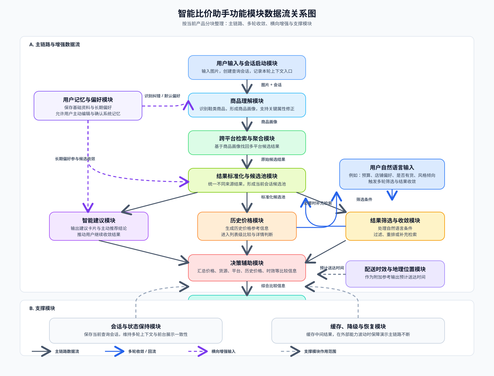

# 功能模块分块与数据流（V0 讨论稿）

## 1. 文档目的

本文档用于在产品层和系统能力层之间，建立一套清晰的功能模块分块，并说明这些模块之间的数据如何流动。

这里的目标不是直接决定技术实现，而是先回答以下问题：

- 这个项目应该被拆成哪些功能块
- 每个功能块各自负责什么
- 各功能块之间交换什么类型的数据
- 哪些数据是主链路必需的，哪些数据属于扩展链路

本文档为讨论稿，模块边界是否最终成立，以你的确认为准。

## 2. 分块原则

当前模块划分遵循以下原则：

1. 以用户主链路为中心，而不是以代码目录为中心
2. 把“用户能感知到的功能”和“系统在后台完成的能力”区分开
3. 把首版必需能力和后续扩展能力放在同一整体结构下，但不混淆优先级
4. 模块之间尽量通过清晰的数据对象协作，而不是隐式耦合

## 3. 功能模块总览

基于当前项目定义与当前已确认边界，建议先拆成 11 个一级功能模块。

### 3.1 用户输入与会话启动模块

负责内容：

- 接收用户拍照或上传图片
- 作为一次购物查询的起点
- 建立当前查询会话
- 记录本轮查询的上下文入口

它回答的问题是：

- 用户这次想查什么
- 本轮查询从哪张图片开始
- 本次后续筛选应归属于哪一个会话

### 3.2 商品理解模块

负责内容：

- 对输入的鞋类商品进行识别和理解
- 形成结构化商品画像
- 支持用户修正关键属性

它输出的不是最终结果，而是“系统认为用户正在找什么”。

### 3.3 跨平台检索与聚合模块

负责内容：

- 基于商品画像发起多平台检索
- 获取多个平台的候选商品
- 汇总价格、货源和基础来源信息

它负责解决“去哪里找”和“搜回来什么”。

### 3.4 结果标准化与候选池模块

负责内容：

- 将不同来源的结果统一成同一内部表示
- 形成当前会话下的候选商品池
- 为后续排序、筛选、展示提供稳定输入

这个模块的作用是把“来自不同平台的结果”变成“可以在同一规则下继续处理的候选集合”。

### 3.5 结果筛选与收敛模块

负责内容：

- 接收用户的自然语言进一步要求
- 将要求转化为当前会话下的新筛选条件
- 在已有候选池上继续过滤、重排或补充检索

这个模块是多轮连续交互的核心，它负责让结果不断收敛，而不是每次重新开始。

### 3.6 智能建议模块

负责内容：

- 生成推荐理由或建议卡片
- 输出主动推荐结论，帮助用户更快聚焦更值得看的候选商品
- 结合当前候选结果，提示用户下一步可继续收敛的方向
- 让系统在交互中主动帮助用户少想一步、少点一步、少筛一步

这个模块是核心模块之一，它的价值不在于扩大结果，而在于推动用户更快完成决策。

### 3.7 历史价格模块

负责内容：

- 提供候选商品的历史价格相关信息
- 帮助用户理解当前价格处于什么位置
- 将历史价格参考信息带入列表级比较，而不只存在于详情页
- 为“现在买是否划算”提供独立参考

历史价格在产品中单独成立，而不是简单并入其他辅助信息。

### 3.8 决策辅助模块

负责内容：

- 汇总价格、货源、平台、历史价格、送达时效等决策信息
- 帮助用户理解为什么某些商品更值得优先考虑
- 承接多个增强能力的综合比较输出

这个模块的目标不是扩大结果，而是帮助用户在多个维度之间更快完成判断。

### 3.9 商品详情模块

负责内容：

- 展示单个候选商品的更完整信息
- 承接用户从列表进入具体商品判断的动作
- 为后续跳转购买提供决策落点

商品详情是独立一级模块，对应的是“从候选比较到具体下单前判断”的阶段。

### 3.10 用户记忆与偏好模块

负责内容：

- 记录用户基础信息，例如身高、体重、常用尺码
- 记录用户长期偏好，例如预算区间、品牌偏好、平台偏好、店铺偏好
- 允许用户主动编辑和确认系统记住的信息
- 为后续检索、筛选、排序和识别纠错提供辅助上下文

这个模块的目标是减少重复输入，并让当前查询与下一次查询都更贴近用户。

### 3.11 配送时效与地理位置模块

负责内容：

- 获取或读取用户地理位置
- 结合商家发货地和发货信息估算预计送达时间
- 让用户在价格之外也能对时效做权衡

这个模块属于附加参考模块，不是核心比较模块，但因为它的输入来源和判断逻辑独立，单独拆出更清楚。

## 4. 支撑性模块

除上述直接面向用户价值的一级功能模块外，还存在两类支撑性模块。它们不单独构成用户功能，但会横向服务多个功能块。

### 4.1 会话与状态保持模块

负责内容：

- 保存当前查询会话
- 维护多轮交互上下文
- 保持识别结果、筛选条件、候选池和当前展示状态之间的一致性

### 4.2 缓存、降级与恢复模块

负责内容：

- 缓存历史结果和中间结果
- 在外部能力波动时提供降级结果
- 保证主链路在演示场景下尽量不断

## 5. 核心数据对象

为了说明模块之间如何协作，当前先抽象出 10 类核心数据对象。这里先定义“数据是什么”，不定义字段细节。

### 5.1 用户基础资料

表示用户长期稳定信息，例如身高、体重、常用尺码等。

### 5.2 用户长期偏好

表示用户相对长期的购物倾向，例如预算范围、品牌偏好、店铺偏好、平台偏好等。

### 5.3 查询会话

表示用户围绕某一次拍照或上传开始的完整查询过程。

### 5.4 原始输入内容

表示用户本轮提供的图片，以及后续补充输入。

### 5.5 商品画像

表示系统对目标商品形成的结构化理解结果，是检索和筛选的基础。

### 5.6 检索请求

表示系统准备发送给检索侧的目标描述和筛选约束。

### 5.7 原始候选结果

表示从不同平台返回的未统一结果。

### 5.8 标准化候选池

表示清洗和统一后的候选商品集合，是所有后续处理的中心数据对象。

### 5.9 当前筛选条件

表示用户在本轮会话中通过自然语言或其他交互追加的约束条件。

### 5.10 决策辅助信息

表示用于帮助用户比较和判断的附加信息，例如推荐理由、货源判断、价格参考、预计送达时间等。

## 6. 模块间主数据流

### 6.1 主链路数据流

主链路的数据流建议如下：

`用户输入与会话启动模块`
-> `原始输入内容`
-> `商品理解模块`
-> `商品画像`
-> `跨平台检索与聚合模块`
-> `原始候选结果`
-> `结果标准化与候选池模块`
-> `标准化候选池`
-> `智能建议模块`
-> `决策辅助模块`
-> `前台结果展示与商品详情`

这是第一轮查询的主路径。

### 6.2 多轮收敛数据流

当用户继续追加要求时，数据流建议如下：

`用户自然语言输入`
-> `结果筛选与收敛模块`
-> `当前筛选条件`
-> 与 `查询会话`、`商品画像`、`标准化候选池` 共同作用
-> 输出新的 `候选结果排序/过滤结果`
-> 进入 `智能建议模块`
-> 进入 `决策辅助模块`
-> 刷新前台展示

这条链路的重点不是重新识别图片，而是在原有上下文上继续推进。

### 6.3 用户记忆参与的数据流

用户记忆与偏好模块不直接替代当前查询，而是作为辅助上下文参与下列环节：

- 参与商品理解阶段，帮助修正对目标商品的判断和识别纠错
- 参与检索请求生成阶段，帮助默认筛选更贴近用户
- 参与结果筛选与收敛阶段，减少重复表达
- 参与决策辅助阶段，提升推荐解释的贴合度

因此它更像一条横向输入流：

`用户基础资料 / 用户长期偏好`
-> `商品理解模块`
-> `结果筛选与收敛模块`
-> `智能建议模块`
-> `决策辅助模块`

### 6.4 配送时效参与的数据流

配送时效与地理位置模块的输入依赖于三部分：

- 用户地理位置
- 候选商品所属商家或平台信息
- 商家发货地、发货时效或可推断的配送信息

它的输出进入：

`配送时效与地理位置模块`
-> `预计送达时间`
-> `决策辅助模块`
-> `前台结果展示 / 商品详情`

也就是说，它本质上不是单独的主链路，而是附着在候选结果上的附加参考流。

### 6.5 历史价格参与的数据流

历史价格模块的输入依赖于候选商品及其价格相关信息，它的输出进入：

`标准化候选池 / 候选商品`
-> `历史价格模块`
-> `历史价格参考信息`
-> `决策辅助模块`
-> `前台列表展示 / 商品详情`

历史价格是独立模块，但它主要通过决策辅助与详情展示影响用户判断。

## 7. 数据流关系图

上图用于把主链路、多轮收敛、横向增强输入和支撑模块放在同一张图里展示。为了便于后续继续讨论，下面保留对应的文字版解释。

### 7.0 图示说明

- 深色实线：主链路数据流
- 蓝色实线：多轮收敛和回流
- 紫色虚线：横向增强输入
- 灰色虚线：支撑模块的作用范围

### 7.1 初始查询阶段

`用户`
-> `拍照/上传`
-> `查询会话建立`
-> `商品理解`
-> `商品画像`
-> `跨平台检索`
-> `候选结果聚合`
-> `候选池标准化`
-> `智能建议生成`
-> `历史价格参考补充`
-> `推荐/比较信息生成`
-> `列表展示`

### 7.2 多轮筛选阶段

`用户自然语言要求`
-> `筛选条件提取`
-> `更新当前会话条件`
-> `作用于候选池`
-> `结果过滤/重排/必要时补充检索`
-> `重新生成智能建议`
-> `重新生成推荐信息`
-> `刷新列表与详情`

### 7.3 用户记忆参与阶段

`用户基础资料/偏好`
-> `默认筛选与理解增强及识别纠错`
-> `更贴合用户的候选结果`

### 7.4 时效估算参与阶段

`用户位置 + 商家发货信息 + 候选商品`
-> `预计送达时间估算`
-> `进入比较与决策信息`

## 8. 模块边界

为避免后续混乱，明确以下边界：

1. 商品理解模块只负责“理解用户想买什么”，不负责决定展示顺序
2. 检索与聚合模块只负责“尽可能找回候选”，不负责最终决策解释
3. 标准化与候选池模块只负责统一结果，不直接承载用户交互逻辑
4. 筛选与收敛模块只负责在会话上下文中持续缩小范围
5. 智能建议模块是核心模块，既负责输出建议卡片，也负责输出主动推荐结论，但不替代检索与筛选模块
6. 历史价格模块独立存在，并进入列表级比较与详情判断，但不单独承担主链路控制
7. 决策辅助模块只负责帮助用户做判断，不替代检索模块
8. 用户记忆与偏好模块是横向增强模块，不应反客为主压过用户当前明确输入，但可以参与识别纠错，且允许用户主动编辑和确认系统记忆
9. 配送时效模块是附加参考模块，不应在没有可靠信息时伪造强结论
