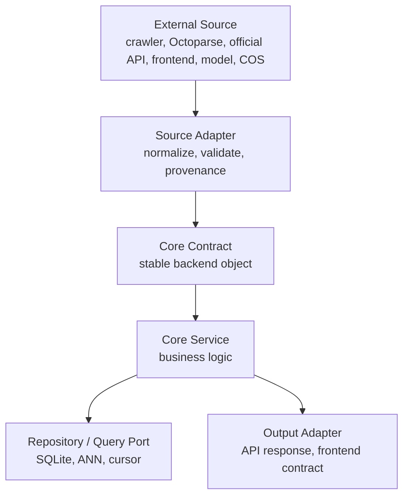

# Adapter 分层与数据功能解耦方案

## 1. 结论

当前项目不能继续按“已有数据长什么样，就围绕它写功能”的方式推进。后端必须改成：

```text
外部数据 / 外部模型 / 外部平台
-> Adapter
-> 标准 Contract
-> Core Service
-> Repository / Output Adapter
-> API Response
```

也就是说，所有功能模块只消费后端定义好的标准数据契约，不直接依赖淘宝、天猫、八爪鱼、COS、豆包、DeepSeek、SQLite、前端表单或某批测试数据的原始格式。

本方案采用非破坏式推进：先补权威文档和核心契约骨架，再按模块逐步把现有逻辑包进 adapter。已有 API 路径、数据库主表、前端联调字段保持兼容。

## 2. 为什么必须改

目前已经暴露的问题：

- 商品数据一变，导入、搜索、候选展示都容易被迫跟着改。
- 八爪鱼、爬虫、人工样本、未来官方 API 的字段格式不同，但后端最终要得到同一类商品对象。
- 用户图、商品图、裁剪图、embedding 图各有用途，但搜索模块只应该关心标准化后的图像向量和元数据。
- ANN、标签召回、视觉复核、候选分页应该与“商品来自哪个平台、哪个采集工具”无关。
- 用户画像、多轮对话、商品详情、评论洞察也不能直接读取某个来源的 raw 字段。

正确方向是先定义功能模块需要什么数据，再由 adapter 负责把不同来源转换进去。

## 3. 核心原则

### 3.1 Core 不碰原始数据

Core Service 不允许直接解析：

- 八爪鱼中文字段
- 淘宝/天猫原始页面字段
- 京东/得物/拼多多的原始响应
- COS 返回对象
- 豆包/DeepSeek 原始模型输出
- 前端上传表单原始字段

这些都必须先经过 adapter，转换成标准 Contract。

### 3.2 Adapter 只做转换和边界校验

Adapter 负责：

- 字段映射
- 默认值填充
- 类型转换
- 数据裁剪和归一化
- 来源记录
- 能力缺失标记
- 非法数据拒绝

Adapter 不负责：

- 业务排序
- 是否推荐给用户
- 是否同款的最终判断
- 多轮状态合并
- 用户长期记忆写入

### 3.3 功能入口必须有 Port

每个核心功能都要通过 Port 调用外部能力。

示例：

- 图片存储通过 `StoragePort`
- 商品导入通过 `ProductImportPort`
- 商品搜索通过 `ProductSearchPort`
- 图片向量通过 `ImageEmbeddingPort`
- 视觉识别通过 `VisionProfilePort`
- ANN 检索通过 `AnnSearchPort`
- 用户画像读取通过 `UserMemoryPort`

Core Service 只依赖 Port，不直接依赖具体 provider。

### 3.4 缺数据不是缺功能

如果当前数据源没有 SKU、库存、服务保障、评价摘要：

- Adapter 必须输出明确的 `dataQuality` 或 `capabilities`。
- Core Service 不能伪造字段。
- 前端根据状态展示“未知”或降级提示。

功能模块仍然可以完成，只是结果的覆盖度受数据影响。

### 3.5 不破坏已有功能

迁移期间必须遵守：

- 现有 API 路径不变。
- 现有响应字段只增不删。
- 现有数据库主表不做无必要重构。
- 现有 service 先作为兼容路径保留。
- 每次抽 adapter 后跑构建和 smoke。
- 旧数据仍可通过兼容 adapter 进入标准契约。

## 4. 分层结构



## 5. 模块级解耦方案

| 模块 | 外部来源 | Adapter | Core Contract | Core Service 只关心 |
| --- | --- | --- | --- | --- |
| 图片上传 | Flutter multipart、Web 上传 | `ImageAssetAdapter` | `ImageAssetInput` | 图片类型、用途、对象引用 |
| 商品导入 | 八爪鱼、爬虫、人工样本、官方 API | `ProductImportAdapter` | `ProductImportItemV1` | 标准商品、图片、价格、来源质量 |
| 商品图预处理 | 商品主图、款式图 | `ProductImagePreprocessAdapter` | `ImagePreprocessResult` | 裁剪图、bbox、是否回退 |
| 用户图预处理 | 上传图、用户修正 bbox | `QueryImagePreprocessAdapter` | `QueryImagePreprocessResult` | 当前有效 bbox 和 embedding 输入图 |
| 视觉识别 | 豆包视觉模型 | `VisionProfileAdapter` | `ProductProfile` | 鞋类标签、置信度、subjectDetection |
| Embedding | 豆包 embedding、本地 GPU worker | `ImageEmbeddingAdapter` | `ImageEmbeddingResult` | provider、model、dimension、向量 |
| ANN | SQLite 向量、本地排序、未来向量库 | `AnnSearchAdapter` | `AnnSearchResult` | 相似度候选和分数 |
| 商品池搜索 | SQLite 商品池、未来外部商品服务 | `ProductSearchAdapter` | `CandidateSeed` | 候选商品标准字段 |
| 查看更多 | cursor 表、候选快照 | `CandidateCursorAdapter` | `CandidatePageRequest` | 继续返回全局排序候选 |
| 多轮对话 | DeepSeek、用户输入 | `ConversationIntentAdapter` | `FilterPatch` | 意图补丁和状态合并 |
| 用户画像 | 用户确认、对话提案、手动编辑 | `UserMemoryAdapter` | `UserProfileBlock` | 可用画像上下文 |
| 商品详情 | 商品池详情、平台详情补充 | `ProductDetailAdapter` | `ProductDetailView` | 前端详情页可展示字段 |
| 评论问答 | 评论页、问答页、LLM 总结 | `ReviewInsightAdapter` | `ReviewInsightInput` | 差评点、风险点、证据摘要 |

## 6. 标准契约

### 6.1 商品导入契约

`ProductImportItemV1` 是所有商品数据进入商品池的唯一标准入口。

必须包含：

- `platform`
- `title`
- `price`
- `stockStatus`
- `productUrl`
- `images.mainImageUrl`

可选包含：

- 店铺信息
- 品牌提示
- 商品参数
- SKU 结构
- 服务保障
- 数据质量
- 原始字段 rawPayload

八爪鱼、淘宝详情页、京东 API、人工 JSON 都必须先转换为这个结构。

### 6.2 商品画像契约

`ProductProfile` 是用户图识别和商品入库打标共用的标准标签对象。

约束：

- 字段来自鞋类规则池。
- 用户图识别不能新增规则池外标签。
- 商品入库可以提出新增标签，但必须进入待审核或扩展流程。
- Core 搜索只消费标准标签，不消费模型原文。

### 6.3 图像预处理契约

`ImagePreprocessResult` 必须记录：

- 原图引用
- 用于 embedding 的裁剪图引用
- bbox normalized 坐标
- bbox 像素坐标
- provider
- strategy
- confidence
- `usedOriginalImage`
- 失败原因

用户图和商品图要尽量使用一致的预处理策略，避免向量分布不一致。

### 6.4 Embedding 契约

`ImageEmbeddingResult` 必须记录：

- provider
- model
- dimension
- vector
- vectorHash
- preprocessSnapshotId 或 productImageId

不同 provider/model/dimension 的向量不能混用检索。

### 6.5 搜索候选契约

`CandidateSeed` 是搜索模块返回候选的标准对象。

必须包含：

- 商品标题
- 平台
- 店铺
- 价格
- 库存状态
- 商品链接
- 商品图
- `matchSummary`
- `rawPayload.productPoolSource`

前端按平台分组展示是前端职责，后端只做全局排序。

## 7. 当前代码映射

项目已有局部 adapter：

- `services/api-server/src/adapters/storage/`
- `services/api-server/src/adapters/model/`
- `services/api-server/src/adapters/search-provider/`
- `services/api-server/src/adapters/marketplace/`
- `services/api-server/src/modules/product-pool/application/*embedding*`
- `services/api-server/src/modules/product-pool/application/*preprocessor*`

当前仍需要继续补强：

- 八爪鱼/爬虫清洗脚本输出与 `ProductImportItemV1` 的 fixture 测试。
- 商品导入批次状态、商品标签审计、用户画像写入 payload 的进一步 adapter 化。
- 商品详情深层数据、评论问答洞察等尚未实现能力的 adapter 规则。

已完成的解耦落点：

- `services/api-server/src/core/contracts/` 已新增核心契约骨架。
- `services/api-server/src/modules/assets/application/image-asset-adapter.interface.ts` 已定义图片资产上传 adapter port。
- `StandardImageAssetAdapterService` 已负责前端 multipart DTO 和上传文件的标准化、variant/source/content-type/boolean 校验。
- `AssetsService` 不再直接解析前端上传 DTO 或文件元数据，只消费 `ImageAssetAdapter` 输出的标准图片资产输入。
- `services/api-server/src/modules/product-pool/application/product-import-adapter.interface.ts` 已定义商品导入 adapter port。
- `services/api-server/src/modules/product-pool/application/standard-product-import-adapter.service.ts` 已作为当前标准导入 adapter。
- `ProductPoolService.importProducts()` 已先通过 `ProductImportAdapter` 标准化输入，再创建异步导入批次。
- 异步批次处理也会重新经过 `ProductImportAdapter` 读取 items，避免旧批次或来源差异直接进入核心导入逻辑。
- `services/api-server/src/modules/product-pool/application/product-import-batch-state-adapter.interface.ts` 已定义商品导入批次状态 adapter port。
- `StandardProductImportBatchStateAdapterService` 已负责批次 `rawJson` 的 accepted、retry、processing、progress、completed 状态写入，以及从批次 rawJson 恢复标准导入 items。
- `ProductPoolService` 不再直接解析导入批次 `rawJson.items` 或手写批次进度 rawJson，只负责调度异步批次和执行单商品入库。
- `services/api-server/src/modules/product-pool/application/product-persistence-adapter.interface.ts` 已定义商品入库持久化 adapter port。
- `StandardProductPersistenceAdapterService` 已负责把标准导入商品、存储图引用和标签共识转换为 `Product` upsert data 与 `ProductTagAudit` create data。
- `ProductPoolService.importOneProduct()` 不再直接拼装商品表字段、标签 JSON、rawPayloadJson 或 tag audit JSON，只负责编排查重、图片存储、打标、写库和 embedding 触发。
- `services/api-server/src/modules/product-pool/application/product-update-adapter.interface.ts` 已定义商品后台编辑 adapter port。
- `StandardProductUpdateAdapterService` 已负责商品编辑请求体的字段校验、类型归一化和 Prisma update data 生成。
- `ProductPoolService.updateProduct()` 不再直接解析商品编辑原始请求，只消费 `ProductUpdateAdapter` 输出。
- `services/api-server/src/modules/product-pool/application/product-view-adapter.interface.ts` 已定义商品池后台列表与详情输出 adapter port。
- `StandardProductViewAdapterService` 已负责 `Product -> API product view` 的列表、详情、embedding、audit 输出组装。
- `ProductPoolService` 不再直接拼装商品管理列表和详情响应，只负责查询、编辑和导入编排。
- `services/api-server/src/modules/product-pool/application/product-batch-view-adapter.interface.ts` 已定义商品导入批次输出 adapter port。
- `StandardProductBatchViewAdapterService` 已负责商品池统计中的最近批次、批次摘要、rawJson 摘要和审计状态计数输出。
- `ProductPoolService` 不再直接拼装导入批次管理接口响应，只负责批次查询、统计计数、重试和异步处理编排。
- `services/api-server/src/modules/product-pool/application/product-image-content-adapter.interface.ts` 已定义商品图片内容读取 adapter port。
- `StandardProductImageContentAdapterService` 已负责商品主图和款式图的 base64、本地路径、远程 URL 读取。
- `ProductPoolService` 不再直接 `fetch(imageUrl)` 或读取本地图片文件，只消费 `ProductImageContentAdapter` 输出的图片内容。
- `services/api-server/src/modules/product-pool/application/product-image-embedding-adapter.interface.ts` 已定义商品图向量化 adapter port。
- `StandardProductImageEmbeddingAdapterService` 已负责商品图预处理、embedding provider 调用和 preprocess metadata 标准化。
- `StandardProductImageEmbeddingAdapterService` 已负责 `ProductImageEmbedding` 写库数据构造，包括 vector/preprocess JSON、provider/model/dimension 和质量分字段。
- `ProductPoolService` 不再直接把商品图 URL 转为 embedding 输入，也不再散落拼装 embedding 写库结构；只负责选择主图/款式图、触发写入和记录失败审计。
- `services/api-server/src/modules/product-pool/application/product-raw-payload-adapter.interface.ts` 已定义商品原始载荷解析 adapter port。
- `StandardProductRawPayloadAdapterService` 已负责从 `rawPayload/rawPayloadJson` 提取款式图、从 `rawPayloadJson` 生成商品属性视图。
- `ProductPoolService` 不再直接解析 `media.styleImages`、`skuOptions.styles`、`attributes`、`shop.ratings`、`fulfillment` 等来源字段来生成款式图和属性视图。
- `services/api-server/src/modules/product-pool/application/product-source-tag-adapter.interface.ts` 已定义来源属性打标 adapter port。
- `StandardProductSourceTagAdapterService` 已负责把导入商品的 `rawPayload.attributes` 标准化为 `ProductTagResult`。
- `StandardProductSourceTagAdapterService` 已负责把已有 `Product` 记录中的标签 JSON 投影回 `ProductTagResult`，供 embedding 重建等流程复用。
- `ProductPoolService` 不再直接解析来源属性或已有商品标签 JSON 来生成商品标签，只负责选择 source tag 或模型 tag、生成共识并写入商品池。
- `services/api-server/src/modules/product-pool/application/product-model-tagging-adapter.interface.ts` 已定义商品入库模型打标 adapter port。
- `StandardProductModelTaggingAdapterService` 已负责调用模型为缺少来源标签的商品生成 `ProductTagResult`。
- `ProductPoolService` 不再直接注入模型 adapter，只负责选择 source tag 或 model tag、生成共识并写入商品池。
- `services/api-server/src/modules/sessions/application/session-product-profile-adapter.interface.ts` 已定义会话商品画像识别 adapter port。
- `StandardSessionProductProfileAdapterService` 已负责把用户上传图资产识别为标准 `ProductProfileResult`，并对标签数组、置信度和 raw 做基础归一化。
- `SessionsService` 不再直接调用模型识图，只负责会话创建、画像快照、筛选快照和后续搜索编排。
- `services/api-server/src/modules/sessions/application/session-view-adapter.interface.ts` 已定义会话详情输出 adapter port。
- `StandardSessionViewAdapterService` 已负责 `GET /sessions/:id` 的 session、productProfile、queryImagePreprocess、activeFilter、candidateSummary 输出组装。
- `SessionsService.getSession()` 不再直接拼装前端响应，只负责读取会话聚合数据并委托输出 adapter。
- `services/api-server/src/modules/product-pool/application/search-query-embedding-adapter.interface.ts` 已定义搜索 query embedding adapter port。
- `StandardSearchQueryEmbeddingAdapterService` 已负责把用户上传图、关键词、商品画像和预处理结果转换为 query embedding。
- `LocalProductSearchProviderService` 不再直接决定整图、裁剪图或文本 hint 如何调用 embedding provider，只消费标准 query 向量。
- `services/api-server/src/modules/product-pool/application/product-search-signals-adapter.interface.ts` 已定义商品搜索信号 adapter port。
- `StandardProductSearchSignalsAdapterService` 已负责从 `Product` 和 `rawPayloadJson` 派生业务分、店铺评分和配送天数等搜索信号。
- `LocalProductSearchProviderService` 不再直接解析商品 `rawPayloadJson` 中的 `shop`、`ratings`、`fulfillment` 等外部来源结构。
- `services/api-server/src/modules/sessions/application/query-image-preprocess-adapter.interface.ts` 已定义用户图预处理 adapter port。
- `StandardQueryImagePreprocessAdapterService` 已负责解析模型 `subjectDetection` 和校验前端 bbox。
- `QueryImagePreprocessService` 不再直接解析模型 raw bbox，也不再直接校验前端 bbox 原始输入。
- `services/api-server/src/modules/sessions/application/query-image-content-adapter.interface.ts` 已定义用户图内容读取与裁剪 adapter port。
- `StandardQueryImageContentAdapterService` 已负责读取 COS 签名图、解析图片元数据、按 bbox 裁剪和生成 512 正方形 embedding 输入图。
- `QueryImagePreprocessService` 不再直接 `fetch` 用户图或直接使用 `sharp` 裁剪，只负责存储裁剪图、调用 embedding provider 和写入预处理快照。
- `services/api-server/src/modules/product-pool/application/ann-search-port.interface.ts` 已定义 ANN 检索 port。
- `ProductPoolService` 和 `LocalProductSearchProviderService` 已通过 `ANN_SEARCH_PORT` 使用 ANN 检索能力，而不是直接绑定具体实现类。
- `services/api-server/src/modules/product-pool/application/product-search-result-adapter.interface.ts` 已定义商品池搜索结果输出 adapter port。
- `StandardProductSearchResultAdapterService` 已负责 `Product + ANN/tag/visual verification -> CandidateSeed` 的转换，包括 `matchSummary`、`normalizedAttributes`、`rawPayload.productPoolSource` 和推荐理由。
- `LocalProductSearchProviderService` 不再直接拼装前端候选种子，只负责商品召回、ANN 融合、视觉复核和排序编排。
- `services/api-server/src/modules/product-pool/application/candidate-visual-verification-adapter.interface.ts` 已定义候选视觉复核 adapter port。
- `StandardCandidateVisualVerificationAdapterService` 已负责调用模型判断用户图与候选商品图是否同款。
- `LocalProductSearchProviderService` 不再直接调用模型视觉复核接口，只消费标准 `CandidateVisualVerificationResult`。
- `services/api-server/src/modules/candidates/application/candidate-item-adapter.interface.ts` 已定义候选写库 adapter port。
- `StandardCandidateItemAdapterService` 已负责 `CandidateSeed -> CandidateItem` 写入结构转换，以及已返回商品 key 提取。
- `SessionsService`、`TurnsService` 和 `CandidatesService` 已通过 `CANDIDATE_ITEM_ADAPTER` 写入首批候选、多轮刷新候选和追加候选，避免不同入口各自手写候选持久化映射。
- `services/api-server/src/modules/candidates/application/candidate-view-adapter.interface.ts` 已定义候选输出 adapter port。
- `StandardCandidateViewAdapterService` 已负责 `CandidateItem -> API candidate view` 输出组装，包括 `appliedFilter`、`commerceMeta`、`sortSignals`、`decisionTags`、`decisionSupport`、候选详情视图和候选列表辅助视图。
- `CandidatesService` 不再直接拼装候选展示字段，只负责快照读取、cursor 校验、候选追加和调用输出 adapter。
- `services/api-server/src/modules/candidates/application/candidate-cursor-adapter.interface.ts` 已定义候选分页 cursor adapter port。
- `StandardCandidateCursorAdapterService` 已负责 cursor 创建、筛选状态哈希、过期校验、快照绑定校验、追加后游标更新和 cursor view 输出。
- `CandidatesService` 不再直接依赖 `CandidatePaginationCursor` 表结构的哈希与有效期规则，只通过 `CANDIDATE_CURSOR_ADAPTER` 编排“查看更多”。
- `services/api-server/src/modules/sessions/application/search-event-adapter.interface.ts` 已定义搜索进度事件 adapter port。
- `StandardSearchEventAdapterService` 已负责 session/profile/preprocess/candidate 数据到 SSE replay event 的输出组装。
- `SearchEventsService` 不再直接拼装前端进度事件，只负责读取会话当前状态并委托 `SEARCH_EVENT_ADAPTER`。
- `services/api-server/src/modules/turns/application/conversation-intent-adapter.interface.ts` 已定义多轮对话意图解析 adapter port。
- `StandardConversationIntentAdapterService` 已负责调用模型解析一轮对话，并对 intent、filterPatch、filterRemove、assistantMessage、confidence、raw 做标准化。
- `TurnsService` 不再直接依赖模型解析输出格式，只消费 `ConversationIntentAdapter` 输出的标准 `ConversationTurnParseResult`。
- `services/api-server/src/modules/user-memory/application/user-memory-context-adapter.interface.ts` 已定义用户画像上下文 adapter port。
- `StandardUserMemoryContextAdapterService` 已负责把长期画像 block 解析为会话可用的 `UserMemoryContext` 和 derived 偏好。
- `UserMemoryContextService` 不再直接解析画像 payload 或派生平台、尺码、颜色、品牌等上下文字段，只负责读取 active blocks 并委托 adapter。
- `services/api-server/src/modules/user-memory/application/user-memory-payload-adapter.interface.ts` 已定义用户画像 payload adapter port。
- `StandardUserMemoryPayloadAdapterService` 已负责用户画像 block 类型校验、payloadJson 解析、索引抽取和敏感度推断。
- `UserMemoryService` 不再直接维护画像字段索引规则，只负责画像 CRUD、确认提案、审计和事务编排。
- `services/api-server/src/modules/user-memory/application/user-memory-view-adapter.interface.ts` 已定义用户画像输出 adapter port。
- `StandardUserMemoryViewAdapterService` 已负责用户画像 block、完整 profile、memory proposal 的 API 输出组装。
- `UserMemoryService` 不再直接拼装长期画像和待确认记忆提案的前端响应，只负责画像写入、索引、确认、拒绝和审计编排。
- `services/api-server/src/modules/fallback/application/fallback-candidate-adapter.interface.ts` 已定义兜底候选 adapter port。
- `StandardFallbackCandidateAdapterService` 已负责兜底候选种子和 fallback reason 的稳定输出。
- `FallbackService` 不再直接依赖 mock 商品数据，只负责对外保留原有兜底服务接口。

## 8. 非破坏式实施顺序

### 阶段 1：文档和契约先行

新增：

- `docs/21-Adapter分层与数据功能解耦方案.md`
- `services/api-server/src/core/contracts/`

只新增类型和规则，不接入现有业务路径。

验收：

- `npm run api:build` 通过。
- 现有 API 不变。

### 阶段 2：商品导入先 adapter 化

目标：

- 八爪鱼 JSONL
- 爬虫 JSONL
- 人工样本
- 未来官方 API

都通过 `ProductImportAdapter` 输出 `ProductImportItemV1`。

验收：

- 清洗脚本输出能被 verify 脚本验证。
- 导入接口只接受标准结构。
- rawPayload 只做回溯，不参与核心逻辑。

当前状态：

- 已完成第一版 `ProductImportAdapter`。
- 仍需继续把清洗脚本输出 schema 与 `ProductImportItemV1` 做更严格的 fixture 测试。
- 后续详情页 SKU、服务字段、参数字段补齐时，只应扩展 adapter 输入映射和标准 contract，不应让核心搜索直接依赖原始字段。

### 阶段 3：图像链路 adapter 化

目标：

- 用户图 subjectDetection
- 用户修正 bbox
- 商品图裁剪
- 豆包 embedding
- 本地 GPU embedding

都通过统一 `ImagePreprocessResult` 和 `ImageEmbeddingResult`。

验收：

- 用户图和商品图的 provider/model/dimension 可追踪。
- 不同模型向量不能混用。
- 裁剪失败明确记录，不静默伪造。

当前状态：

- 用户图 subjectDetection 解析已进入 `QueryImagePreprocessAdapter`。
- 用户手动 bbox 校验已进入 `QueryImagePreprocessAdapter`。
- 用户图预处理快照输出已进入 `QueryImagePreprocessAdapter`，`QueryImagePreprocessService` 不再直接解析 snapshot JSON 来拼前端响应。
- 用户图裁剪、COS 写入、embedding 生成、snapshot 落库仍由 `QueryImagePreprocessService` 编排。
- 商品图预处理已有 `ImageEmbeddingPreprocessor` port；后续需要继续统一它和用户图预处理 contract。

### 阶段 4：搜索和候选 adapter 化

目标：

- 标签召回
- ANN 召回
- 候选融合
- 查看更多

都基于标准 `CandidateSeed`、`AnnSearchResult`、`CandidatePageRequest`。

验收：

- 不按平台配额。
- cursor 与当前 query embedding、filter、snapshot 绑定。
- 数据不足时返回真实状态，不制造 fake 商品。

当前状态：

- ANN 检索已有 `ANN_SEARCH_PORT`。
- 当前实现仍是 SQLite 内部向量排序，但调用方已不再直接依赖具体类。
- 后续如果迁移到真正向量库或 sqlite-vec 虚拟表，优先替换 `ANN_SEARCH_PORT` 绑定，不改搜索核心逻辑。
- 候选写库已有 `CANDIDATE_ITEM_ADAPTER`。
- 首批候选、多轮刷新候选和“查看更多”追加候选已共用同一套 `CandidateSeed -> CandidateItem` 映射。
- 候选 API view 输出已有 `CANDIDATE_VIEW_ADAPTER`。
- 候选列表、候选详情、降级视图、搜索进度视图和 requiredInfo 视图已从 `CandidatesService` 迁出。
- 候选 cursor 请求、过期校验、筛选哈希和响应视图已有 `CANDIDATE_CURSOR_ADAPTER`。
- 后续如果要把 cursor 表迁移成 Redis、PostgreSQL 或专用分页服务，应优先替换 `CANDIDATE_CURSOR_ADAPTER` 实现，不改候选业务编排。
- 候选搜索上下文已有 `CANDIDATE_SEARCH_CONTEXT_ADAPTER`。
- 创建 session 后的 bbox 修正搜索、多轮刷新搜索和“查看更多”已共用同一套 `ProductProfileSnapshot / FilterSnapshot / QueryImagePreprocessSnapshot -> SearchProvider input` 转换，业务 service 不再各自解析画像、筛选和 query embedding。

### 阶段 5：对话和用户画像 adapter 化

目标：

- DeepSeek 只输出结构化 patch。
- 用户画像只通过 memory proposal 和确认流程写入。
- Core 状态合并不依赖 LLM 自由文本。

验收：

- 长期记忆跨 session 可用。
- 临时筛选不直接污染长期画像。
- schema/prompt 可独立修改。

当前状态：

- 多轮对话意图解析已有 `CONVERSATION_INTENT_ADAPTER`。
- 多轮上下文输出已有 `CONVERSATION_CONTEXT_VIEW_ADAPTER`。
- 会话消息、历史摘要、候选摘要、商品画像 snapshot 转 LLM context/debug view 的逻辑已从 `ConversationContextService` 迁出。
- `ConversationContextService` 只负责编排读取哪些上下文、读取多少条和何时总结，不直接解析候选 rawPayload 或商品画像 rawJson。
- 智能建议输出已有 `SUGGESTION_VIEW_ADAPTER`。
- `SuggestionsService` 只负责读取最新候选快照，建议结论、候选统计、建议卡片和下一步 refine options 的前端契约由 adapter 负责。

## 9. 红线

以下行为后续禁止：

- 在业务 service 里直接解析八爪鱼中文字段。
- 在搜索 service 里直接调用外部平台 API。
- 在 Core Service 里直接调用 COS、豆包、DeepSeek。
- 因某批商品数据缺字段就改核心数据结构。
- 用 mock/hash/fallback 伪装真实结果。
- 将平台分组逻辑写入后端排序。
- 新功能绕过 adapter 直接读 rawPayload。

## 10. 验证清单

每次改造一个模块，至少检查：

- 构建通过。
- 旧 API 路径仍可用。
- 旧响应字段未删除。
- 新 adapter 输出标准 contract。
- rawPayload 只用于回溯。
- 错误返回统一响应结构。
- 真实 provider 缺配置时 fail closed。
- 文档同步更新。

## 11. 下一步

立即执行的下一步：

1. 保留现有后端功能不动。
2. 新增 core contracts 纯类型文件。
3. 更新 `agent.soul`，把 adapter-first 作为项目硬规则。
4. 后续每个新功能先写 Port + Contract，再实现 Adapter。

完成这一步后，项目就从“数据驱动功能”改成“功能契约驱动数据接入”。
