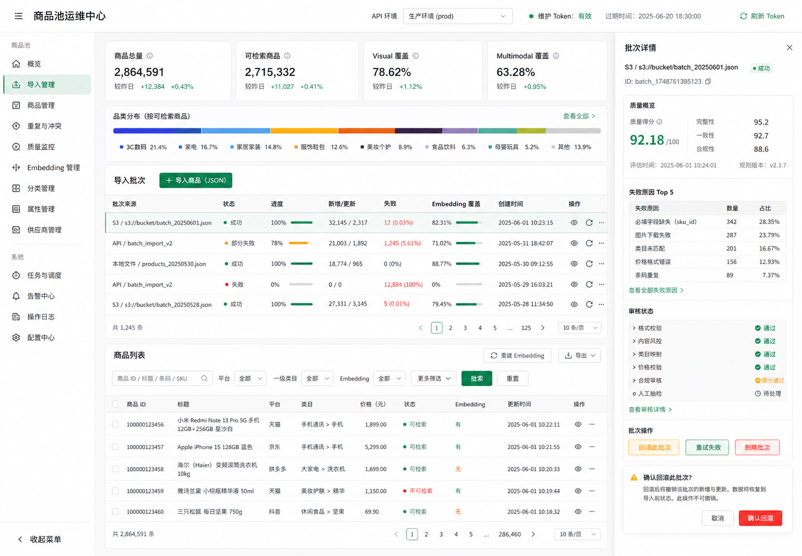

# 商品池可视化运维与批次回滚

本文档说明商品池运维页、批次质量报告和回滚能力。实现入口为：

```text
http://localhost:5173/product-pool.html
```

## 1. 运维页面

页面提供以下能力：

- 商品池总量、可检索率、visual/multimodal embedding 覆盖率和品类分布。
- 导入批次筛选、分页、进度、失败数、新增/更新数和 embedding 覆盖率。
- 批次质量详情、失败原因 Top N、审核状态分布和批次商品预览。
- 失败批次重试、批次回滚预检与执行、批次删除。
- 商品筛选、详情编辑、批量删除。
- verified JSON 文件导入和 embedding 重建。
- API Base 与维护 Token 的本地配置。

页面采用 Vite 多页面入口，不影响 Web 测试入口：

```text
apps/test-entry-web/product-pool.html
apps/test-entry-web/src/product-pool/admin.ts
apps/test-entry-web/src/product-pool/admin.css
```

## 2. 质量报告

接口：

```text
GET /api/v1/product-pool/batches/:batchId/quality
```

质量分由以下维度组成：

- 导入成功率。
- 可检索率。
- 图片可用率。
- 商品链接完整率。
- visual embedding 覆盖率。
- multimodal embedding 覆盖率。

接口同时返回质量等级、失败原因 Top N 和审核状态统计。质量计算集中在 `ProductBatchQualityAdapter`，业务服务只负责编排查询。

## 3. 批次回滚

预检：

```http
POST /api/v1/product-pool/batches/:batchId/rollback
Content-Type: application/json
x-maintenance-token: <token>

{
  "dryRun": true
}
```

执行时将 `dryRun` 改为 `false`。

回滚规则：

- 新增商品：删除该商品及其依赖数据。
- 更新商品：恢复导入前商品字段和 embedding 快照。
- 按变更发生时间逆序回滚。
- 商品已被后续批次修改时拒绝覆盖并返回冲突。
- 已执行的变更写入 `rolledBackAt`，避免重复应用。
- 批次状态更新为 `rolled_back`，并记录回滚结果。

历史批次没有变更日志，不能自动回滚。变更日志从迁移 `000008_product_import_rollback` 上线后开始记录。

## 4. 数据结构

新增 `ProductImportChange`：

```text
batchId
productId
action
beforeJson
afterJson
rolledBackAt
createdAt
```

商品和 embedding 快照的序列化、反序列化由 `ProductImportChangeAdapter` 负责，避免 Prisma 原始结构泄漏到业务编排。

## 5. 本地启动

```powershell
npm --workspace services/api-server run prisma:generate
npm --workspace services/api-server run db:init
npm run api:dev
npm run web:dev
```

生产或共享环境必须设置 `MAINTENANCE_API_TOKEN`。页面 Token 只保存在当前浏览器的 localStorage，不写入仓库。

## 6. 验收重点

- 批次详情能显示六项质量维度和失败原因。
- dry-run 能返回受影响商品数和冲突数，不修改数据。
- 执行回滚后，新增商品被删除，更新商品恢复到导入前状态。
- 旧批次和无变更日志批次的回滚按钮禁用。
- 商品详情能展示 embedding 和最近审核记录。
- 390px 宽度下无横向页面溢出。

视觉概念稿：


